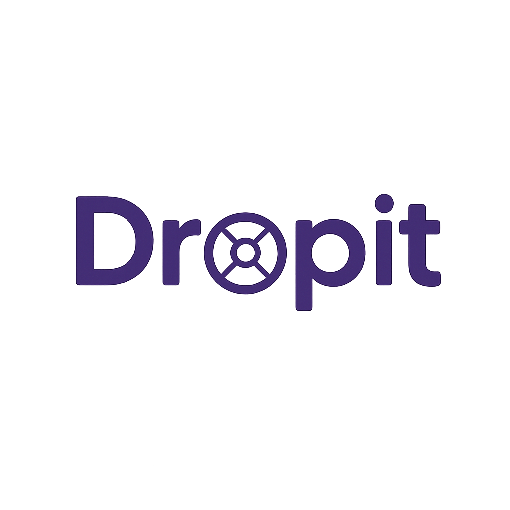

<a name="readme-top"></a>

<!-- LOGO DU PROJET -->
<br />
<div align="center">
  <a href="https://github.com/Netsbump/Dropit">
    
  </a>
<h3 align="center">DropIt : Application de Club d'Haltérophilie</h3>
  <p align="center">
    Une application web et mobile pour optimiser le suivi et la gestion de l'entraînement en haltérophilie.
    <br />
    <br />
    <a href="https://docs-dropit.pages.dev/"><strong>Découvrir le projet »</strong></a>
    <br />
    <br />
    <a href="https://dropit-app.fr">Accéder à la version Alpha</a>
    ·
    <a href="https://docs-dropit.pages.dev/introduction/presentation/">Documentation Technique</a>
    ·
    <a href="https://github.com/Netsbump/Dropit/issues">Signaler un Bug</a>
  </p>
</div>

***

<!-- TABLE DES MATIÈRES -->
<details>
  <summary>Table des Matières</summary>
  <ol>
    <li><a href="#description-du-projet">À propos du projet</a></li>
    <li><a href="#technologies-utilisees">Technologies Utilisées</a></li>
    <li><a href="#prerequis">Pré-requis et Installation</a></li>
    <li><a href="#documentation-complementaire">Documentation Complémentaire</a></li>
    <li><a href="#licence">Licence</a></li>
    <li><a href="#contact">Contact</a></li>
  </ol>
</details>

<!-- A PROPOS DU PROJET -->
<p id="description-du-projet"></p>

# À propos du Projet

DropIt est une application web et mobile conçue pour optimiser le suivi et la gestion de l'entraînement en haltérophilie. Ce projet de fin d'études vise à fournir une solution intuitive pour les coachs et athlètes, tout en démontrant la maîtrise du cycle complet de développement logiciel.

**Fonctionnalités principales** : Gestion des athlètes, création de programmes d'entraînement personnalisés, bibliothèque d'exercices, planification des séances, et application mobile pour le suivi des performances.

Pour découvrir l'ensemble des fonctionnalités en détail, consultez la [landing page](https://docs-dropit.pages.dev/) et la [documentation technique](https://docs-dropit.pages.dev/introduction/presentation/).

<p align="right">(<a href="#readme-top">retour en haut</a>)</p>

***

<!-- TECHNOLOGIES UTILISEES -->
<p id="technologies-utilisees"></p>

## Technologies Utilisées

- Front-End : React, TypeScript, TanStack (Query + Router), Shadcn + Tailwind
- Back-End : Nest.js + MikroORM 
- Base de Données : PostgreSQL
- Recherche: Typesense (à venir)
- Cache: Redis (à venir)
- CI/CD : Docker, Docker Compose, GitHub Actions
- Qualité du Code : Biome
- Monorepo: Pnpm workspaces

<p align="right">(<a href="#readme-top">retour en haut</a>)</p>

***

<!-- PRE-REQUIS -->
<p id="prerequis"></p>

## Pré-requis et Installation

### Prérequis

Assurez-vous d'avoir installé les éléments suivants avant de commencer :

- **Node.js** : Version 22 ou supérieure (requis pour better-auth et support ESM).
- **pnpm** : Gestionnaire de paquets version 9.7.1+ (installer avec `npm install -g pnpm@latest`).
- **Docker** et **Docker Compose** : Pour l'exécution des services (Redis, PostgreSQL, PgAdmin).
  - **Windows/macOS** : Docker Desktop doit être installé et **lancé** avant d'exécuter les commandes Docker.
  - **Linux** : Docker Engine et Docker Compose suffisent.

### Cloner le projet

```bash
git clone https://github.com/Netsbump/dropit.git
cd dropit
```

### Installer les dépendances

```bash
pnpm install
```

### Build initial

Pour permettre aux packages dans packages/ d'être utilisés dans les différents services, vous devez effectuer un build initial :

```bash
pnpm build
```

### Configuration des variables d'environnements

Créer les fichiers de configuration :

```bash
# Fichier .env à la racine (pour le monorepo)
cp .env.example .env

# Fichier .env pour l'API
cp apps/api/.env.example apps/api/.env

# Fichier .env pour le frontend web (configuration de l'URL API)
cp apps/web/.env.example apps/web/.env
```

### Lancer le projet (développement)

Démarrer les services via Docker Compose (PostgreSQL, PgAdmin):

```bash
docker-compose up -d
```

Vérifier que les services sont bien démarrés :

```bash
docker-compose ps
```

Attendre quelques secondes que PostgreSQL soit complètement démarré, puis lancer le monorepo (backend + frontends) en mode développement:

```bash
pnpm dev
```

Les services seront accessibles aux URLs suivantes :
- **Frontend Web** : http://localhost:5173
- **API** : http://localhost:3000
- **Documentation API (Swagger)** : http://localhost:3000/api
- **PgAdmin** : http://localhost:5050
- **Application Mobile** : Un QR code s'affichera dans le terminal pour Expo Go

### Migrations de base de données

Les migrations sont appliquées automatiquement au démarrage de l'API. Pour plus de détails sur la gestion des migrations (création, application manuelle, etc.), consultez le [README de l'API](apps/api/README.md#database-migrations).

### Données de test (Seeds)

Lors du premier lancement de l'application, des données de test sont automatiquement créées dans la base de données, incluant :
- Un super admin (Super Admin - super.admin@gmail.com)
- Un coach pour tester l'interface web (Jean Dupont - coach@example.com)
- Un club par défaut
- Des utilisateurs/athlètes générés avec Faker (15-25 athlètes)

### Connexion à l'interface Web

Pour tester l'interface web, vous pouvez vous connecter avec le coach :
- **Email** : `coach@example.com`
- **Mot de passe** : `Password123!`

### Application Mobile (React Native)

Une application mobile est disponible dans `apps/mobile/`. Elle se lance automatiquement avec `pnpm dev` (qui lance toutes les apps en parallèle). Pour la tester :

1. Installez Expo Go sur votre téléphone
2. Scannez le QR code affiché dans le terminal (l'app mobile démarre avec `pnpm dev`, si le QR code ne s'affiche pas en `pnpm dev` global, lancer la commande au niveau dossier `apps/mobile/`)

Pour vous connecter, utilisez l'un des utilisateurs générés par les seeds. Les noms et emails étant générés par Faker, consultez directement la base de données via PgAdmin pour récupérer les identifiants.

**Accès PgAdmin** :
- URL : http://localhost:5050
- Email : `admin@admin.com`
- Mot de passe : `admin`
- Mot de passe universel pour tous les utilisateurs seeds : `Password123!`

<p align="right">(<a href="#readme-top">retour en haut</a>)</p>

***

<!-- DOCUMENTATION COMPLEMENTAIRE -->
<p id="documentation-complementaire"></p>

## Documentation Complémentaire

Pour approfondir certains aspects techniques du projet, consultez les guides suivants :

### Déploiement et Infrastructure
- **[Guide de Déploiement](docs/deployment.md)** : Configuration complète de l'infrastructure de production (VPS, Dokploy, Traefik, Docker Swarm)
- **[Plan de Récupération d'Urgence](docs/emergency-recovery.md)** : Procédures de restauration en cas de défaillance majeure

### Gestion de Base de Données
- **[Guide des Migrations en Production](docs/migrations-production.md)** : Stratégies et bonnes pratiques pour gérer les migrations avec de vraies données utilisateur

<p align="right">(<a href="#readme-top">retour en haut</a>)</p>

***

<!-- LICENCE -->
<p id="licence"></p>

## Licence

Distribué sous la GNU Affero General Public License v3.0 (AGPL-3.0).

**Ce logiciel est libre et open source**, mais avec une protection forte contre l'appropriation commerciale :
- ✅ Vous pouvez librement utiliser, modifier et redistribuer ce logiciel
- ✅ Tout fork doit rester open source sous AGPL-3.0
- ✅ Les modifications sur un serveur web doivent être partagées publiquement

Voir le fichier [LICENSE.md](LICENSE.md) pour le texte complet de la licence.

<p align="right">(<a href="#readme-top">retour en haut</a>)</p>

***

<!-- CONTACT -->
<p id="contact"></p>

## Contact

**LinkedIn** : [Sten Levasseur](https://www.linkedin.com/in/sten-levasseur/)

<p align="right">(<a href="#readme-top">retour en haut</a>)</p>
