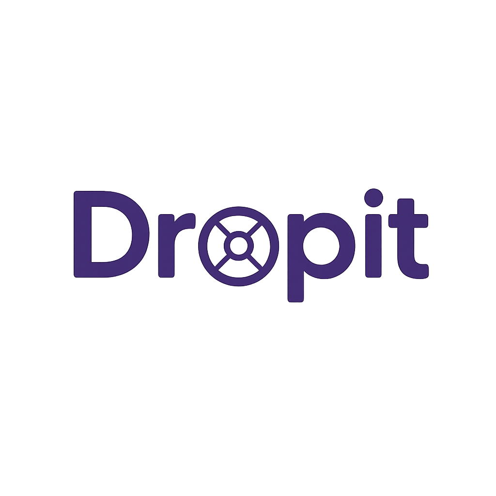

<a name="readme-top"></a>

<!-- PROJECT LOGO -->
<br />
<div align="center">
  <a href="https://github.com/Netsbump/Dropit">
    
  </a>
<h3 align="center">DropIt: Weightlifting Club Management Application</h3>
  <p align="center">
    A web and mobile application to optimize training tracking and management for weightlifting.
    <br />
    <br />
    <a href="https://docs-dropit.pages.dev/"><strong>Explore the project »</strong></a>
    <br />
    <br />
    <a href="https://dropit-app.fr">Access Alpha Version</a>
    ·
    <a href="https://docs-dropit.pages.dev/introduction/presentation/">Technical Documentation</a>
    ·
    <a href="https://github.com/Netsbump/Dropit/issues">Report Bug</a>
  </p>
</div>

---

<!-- TABLE OF CONTENTS -->
<details>
  <summary>📋 Table of Contents</summary>
  <ol>
    <li><a href="#-about-the-project">About The Project</a></li>
    <li><a href="#️-tech-stack">Tech Stack</a></li>
    <li><a href="#-prerequisites">Prerequisites</a></li>
    <li><a href="#-installation">Installation</a></li>
    <li><a href="#-docker-services">Docker Services</a></li>
    <li><a href="#️-useful-commands">Useful Commands</a></li>
    <li><a href="#-development">Development</a></li>
    <li><a href="#-additional-documentation">Additional Documentation</a></li>
    <li><a href="#-license">License</a></li>
    <li><a href="#-contact">Contact</a></li>
  </ol>
</details>

---

## 🔍 About The Project

DropIt is a web and mobile application designed to optimize training tracking and management for
weightlifting.

**Main Features**: Athlete management, personalized training program creation, exercise library, session
planning, and mobile app for performance tracking.

To discover all features in detail, check out the [landing page](https://docs-dropit.pages.dev/) and the
[technical documentation](https://docs-dropit.pages.dev/introduction/presentation/). (Documentation is in
French, as this project started as a school study project)

<p align="right">(<a href="#readme-top">back to top</a>)</p>

---

## 🛠️ Tech Stack

- **Frontend**: React, TypeScript, TanStack (Query + Router), Shadcn/ui + Tailwind CSS
- **Backend**: NestJS + MikroORM
- **Database**: PostgreSQL
- **Authentication**: Better-auth with organization plugin
- **CI/CD**: Docker, Docker Compose, GitHub Actions
- **Code Quality**: Biome
- **Monorepo**: pnpm workspaces

<p align="right">(<a href="#readme-top">back to top</a>)</p>

---

## 📋 Prerequisites

- **Node.js**: Version 22 or higher (required for better-auth and ESM support)
- **pnpm**: Package manager version 9.7.1+ (install with `npm install -g pnpm@latest`)
- **Docker** and **Docker Compose**: For running services (PostgreSQL, PgAdmin, MailDev)
  - **Windows/macOS**: Docker Desktop must be installed and **running** before executing Docker commands
  - **Linux**: Docker Engine and Docker Compose are sufficient

## 🚀 Installation

### 1. Clone the project

```bash
git clone https://github.com/Netsbump/dropit.git
cd dropit
```

### 2. Install dependencies

```bash
pnpm install
```

### 3. Initial build

To allow packages in `packages/` to be used by the different services, you need to perform an initial build:

```bash
pnpm build
```

### 4. Environment Setup

#### Automated Setup (Recommended)

The project includes an automated setup script that will:

- Detect and copy `.env.example` files to `.env` (if they don't exist)
- Check for existing `.env` files and only prompt for missing variables
- Prompt you for database configuration (user, password, name, host, port)
- Prompt you for application ports (API, MailDev, PgAdmin)
- Detect your local IP address for the mobile app
- Generate a secure `BETTER_AUTH_SECRET` automatically
- Configure all `.env` files with the correct values
- Optionally start Docker services (PostgreSQL, MailDev, PgAdmin)
- Optionally run database migrations or set up a fresh database with seed data

```bash
pnpm setup
```

The script will guide you through the configuration process interactively. After completion, you'll see a
summary of all configured services and their URLs.

#### Manual Setup (Alternative)

If you prefer to configure everything manually:

1. **Copy environment files:**

```bash
# Root .env file (for Docker Compose)
cp .env.example .env

# API .env file
cp apps/api/.env.example apps/api/.env

# Web frontend .env file (API URL configuration)
cp apps/web/.env.example apps/web/.env

# Mobile app .env file (API URL configuration with local IP)
cp apps/mobile/.env.example apps/mobile/.env

# For production mobile build, also create:
cp apps/mobile/.env.example apps/mobile/.env.production
# Then edit .env.production with your public API URL
```

2. **Configure environment variables:**

Edit each `.env` file and update the values according to your environment. Key variables to configure:

- **Database**: `DB_USER`, `DB_PASSWORD`, `DB_NAME`, `DB_PORT`, `DB_HOST`
- **API**: `API_PORT`, `BETTER_AUTH_SECRET`, `BETTER_AUTH_URL`, `TRUSTED_ORIGINS`
- **Mobile**: `EXPO_PUBLIC_API_URL` (use your local IP, e.g., `http://192.168.1.XXX:3000`)

⚠️ Make sure to update the API URL and port in all `.env` files to match your configuration.

3. **Start Docker services:**

```bash
docker compose up -d
```

4. **Set up the database:**

Wait a few seconds for PostgreSQL to fully start, then create and seed the database:

```bash
# Create database and run migrations
pnpm --filter api db:create

# Seed demo data
pnpm --filter api db:seed
```

### 5. Start development

```bash
pnpm dev
```

The services will be available at the following URLs:

- **Web Frontend**: http://localhost:5173
- **API**: http://localhost:3000
- **API Documentation (Swagger)**: http://localhost:3000/api
- **PgAdmin**: http://localhost:5050
- **MailDev**: http://localhost:1080
- **Mobile App**: A QR code will appear in the terminal for Expo Go

## 🐳 Docker Services

The project uses Docker Compose to provide the following services:

- **PostgreSQL**: Database server
- **PgAdmin**: PostgreSQL administration tool
- **MailDev**: SMTP server for development (not for production use!)

## ⌨️ Useful Commands

### Setup

- **Automated setup**: `pnpm setup`

### Docker

- **Start Docker services**: `docker compose up -d`
- **Stop Docker services**: `docker compose down`
- **View Docker logs**: `docker compose logs -f`

### Development

- **Start all apps**: `pnpm dev`
- **Start web + API only**: `pnpm dev:web-api`
- **Start mobile app only**: `pnpm dev:mobile`
- **Build applications**: `pnpm build`
- **Type checking**: `pnpm typecheck`
- **Lint code**: `pnpm lint`
- **Fix linting issues**: `pnpm lint:fix`
- **Format code**: `pnpm format`
- **React Doctor web scan for changed code**: `pnpm doctor:web`
- **React Doctor full web scan**: `pnpm doctor:web:full`

### Database (API)

- **Fresh database with seeds**: `pnpm --filter api db:fresh`
- **Run seeds only**: `pnpm --filter api db:seed`
- **Create migration**: `pnpm --filter api db:migration:create`
- **Run migrations**: `pnpm --filter api db:migration:up`
- **Rollback last migration**: `pnpm --filter api db:migration:down`
- **Check pending migrations**: `pnpm --filter api db:migration:check`

### Tests

- **Run API unit tests**: `pnpm test:api:unit`
- **Run API integration tests**: `pnpm test:api:integration`

## 💻 Development

### Test Data (Seeds)

Seed data is not created automatically. To populate development data, run:

```bash
pnpm --filter api db:seed
```

This creates test data including:

- A super admin (Super Admin - super.admin@gmail.com)
- A coach to test the web interface (Jean Dupont - coach@example.com)
- A default club
- Generated users/athletes with Faker (15-25 athletes)

### Web Interface Login

After running seeds, the web app has two login routes:

- **Admin login (email + password)**: `/login/admin` (example seeded account: `super.admin@gmail.com` / `Password123!`)
- **Member/coach login (email OTP)**: `/login` then `/login/otp` (example seeded account: `coach@example.com`)

Source of truth for seeded auth data: `apps/api/src/seeders/athlete.seeder.ts` and `apps/api/src/seeders/organization.seeder.ts`.

### Email Verification in Local Dev (MailDev)

The OTP login flow sends a verification code by email. In local development, use MailDev to read those emails:

- **MailDev UI**: http://localhost:1080
- **SMTP**: `localhost:1025`

After requesting OTP login, open MailDev to retrieve the verification email/code.

### Mobile Application (React Native)

A mobile application is available in `apps/mobile/`. It starts automatically with `pnpm dev` (which launches
all apps in parallel). To test it:

1. Install Expo Go on your phone
2. Scan the QR code displayed in the terminal (the mobile app starts with `pnpm dev`; if the QR code doesn't
   appear, run the command from the `apps/mobile/` folder)

To log in, use one of the users generated by the seeds. Since names and emails are generated by Faker, check
the database directly via PgAdmin to retrieve credentials.

**PgAdmin Access**:

- URL: http://localhost:5050
- Email: `admin@admin.com`
- Password: `admin`
- Universal password for all seeded users: `Password123!`

<p align="right">(<a href="#readme-top">back to top</a>)</p>

---

## 📚 Additional Documentation

For deeper technical aspects of the project, check out the following guides:

### Deployment and Infrastructure

- **[Deployment Guide](docs/deployment.md)**: Complete production infrastructure configuration (VPS, Dokploy,
  Traefik, Docker Swarm) _(in French)_
- **[Emergency Recovery Plan](docs/emergency-recovery.md)**: Recovery procedures in case of major failure _(in
  French)_

### Database Management

- **[Production Migration Guide](docs/migrations-production.md)**: Strategies and best practices for managing
  migrations with real user data _(in French)_

<p align="right">(<a href="#readme-top">back to top</a>)</p>

---

## 📄 License

Distributed under the GNU Affero General Public License v3.0 (AGPL-3.0).

**This software is free and open source**, but with strong protection against commercial appropriation:

- ✅ You can freely use, modify, and redistribute this software
- ✅ Any fork must remain open source under AGPL-3.0
- ✅ Modifications on a web server must be shared publicly

See the [LICENSE.md](LICENSE.md) file for the full license text.

<p align="right">(<a href="#readme-top">back to top</a>)</p>

---

## 📧 Contact

**LinkedIn**: [Sten Levasseur](https://www.linkedin.com/in/sten-levasseur/)

<p align="right">(<a href="#readme-top">back to top</a>)</p>
