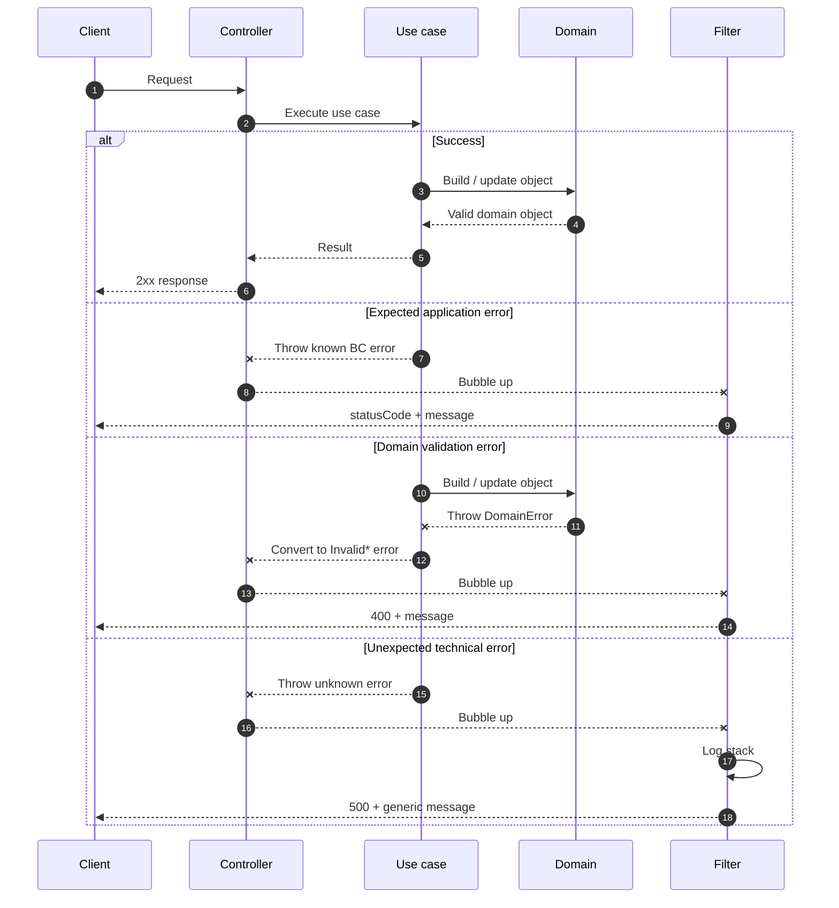
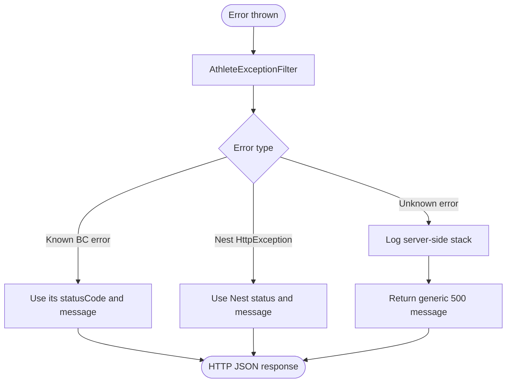

# Athletes error handling

The `athletes` bounded context does not throw NestJS HTTP exceptions from the domain/application core.

Instead:

1. Domain objects throw domain errors.
2. Application use cases convert expected domain errors to application errors.
3. HTTP controllers let errors bubble up.
4. `AthleteExceptionFilter` converts errors to HTTP responses.

## Error flow

## Filter mapping

Known BC errors are:

| Error family | Source | Example HTTP result |
| --- | --- | --- |
| `AthleteApplicationError` | Athlete profile use cases and access policy | `403`, `404`, `400` |
| `PersonalRecordException` | Personal record use cases | `400`, `404` |
| `CompetitorStatusException` | Competition status use cases | `400`, `404` |

## Rules of thumb

- Domain objects throw domain errors only.
- Application use cases convert domain validation errors to application errors with HTTP-safe status codes.
- Controllers do not translate business errors manually.
- `AthleteExceptionFilter` is responsible for converting known errors to HTTP responses.
- Unknown technical errors are logged server-side and returned as a generic `500` message.
