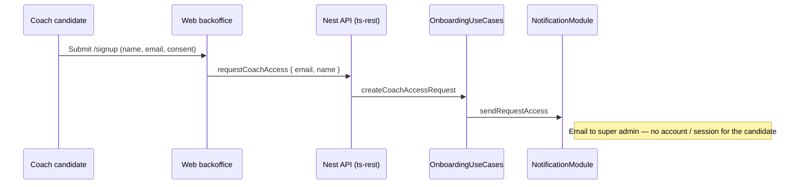
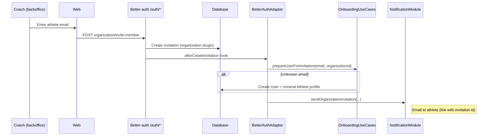
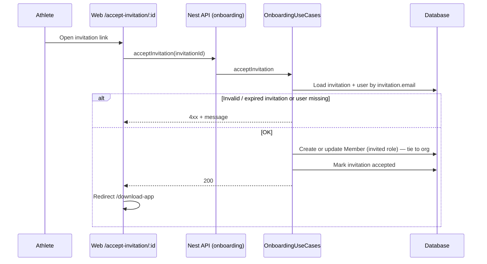

# Onboarding

How people enter the app: who creates what, how an athlete is tied to a club, and where the code lives.

## Business rules

| Actor | Role |
|--------|------|
| **Super admin** | Creates **clubs** (organizations) and **coach accounts**. On the API side, only a user with `user.role === 'admin'` (better-auth admin plugin) can create an organization: `allowUserToCreateOrganization` in `better-auth.config.ts`. |
| **Coach candidate** | Does not create a club on their own. They submit a **request** via the backoffice signup form (`/signup`) → email notification to the super admin (`requestCoachAccess` / `sendRequestAccess`). |
| **Coach** | Runs their club in the backoffice; **invites** athletes by email (organization plugin). |
| **Athlete** | **No** self-service signup: they are **always invited** by a coach. When they click the link, they are **attached to the organization** from the invitation (see acceptance flow). Session / mobile login (**email OTP**) is **outside** this acceptance step — see [Auth module README](./README.md#authentication-overview). |

---

## 1. Coach access request (public `/signup` form)

The form does **not** register a better-auth account: it sends a request handled on the super admin side (manual process or internal tooling).

**Code:** `apps/web/src/features/auth/signup-form.tsx` → `api.onboarding.requestCoachAccess` → `OnboardingController` → `OnboardingUseCases.createCoachAccessRequest` → `sendRequestAccess`.

---

## 2. Inviting an athlete (coach → email)

The coach uses the better-auth client from the logged-in backoffice.

`/auth/*` routes go through better-auth middleware (not the usual Nest guards on those paths).

Email details: [Notification module README](../notification/README.md).

---

## 3. Accepting the invitation (web link)

The web route loads and immediately calls the **onboarding API** (public) with the invitation id in the URL — no better-auth `acceptInvitation` on the client for this page.

**Code:** `apps/web/src/routes/_auth/accept-invitation.$invitationId.tsx`, `OnboardingUseCases.acceptInvitation`, `onboarding.controller.ts`.

---

## Useful files

| Topic | Files |
|--------|--------|
| Who can create an organization | `better-auth.config.ts` (`allowUserToCreateOrganization`) |
| Invitation hook + user pre-provisioning | `infrastructure/better-auth.adapter.ts`, `application/onboarding.use-cases.ts` |
| Coach request | `interface/controllers/onboarding.controller.ts`, onboarding contract in `packages/contract` |
| Invitation acceptance | same as above + web route listed above |

For technical auth (OTP, middleware, guards), see the [Auth module README](./README.md).
