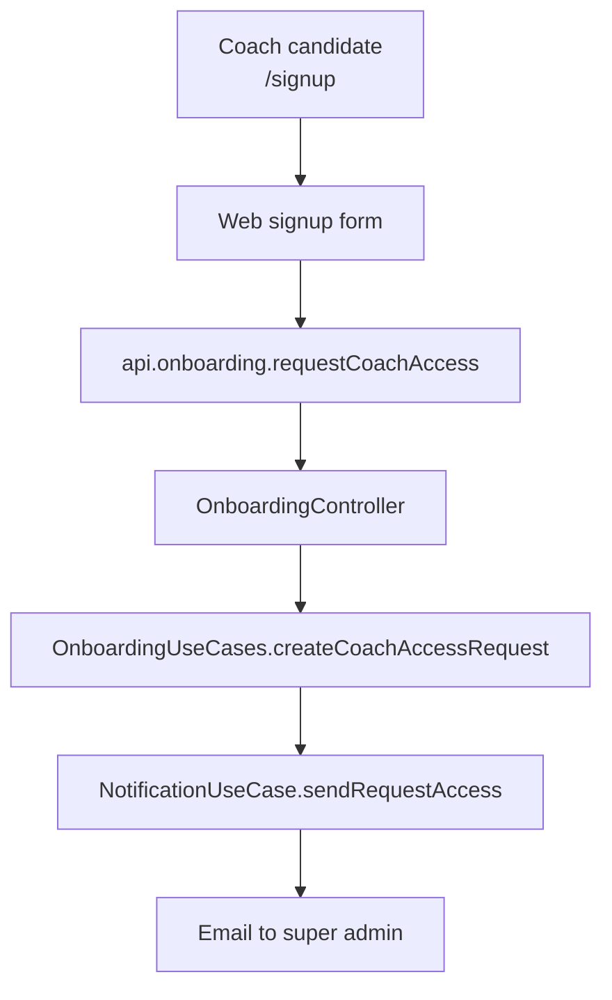
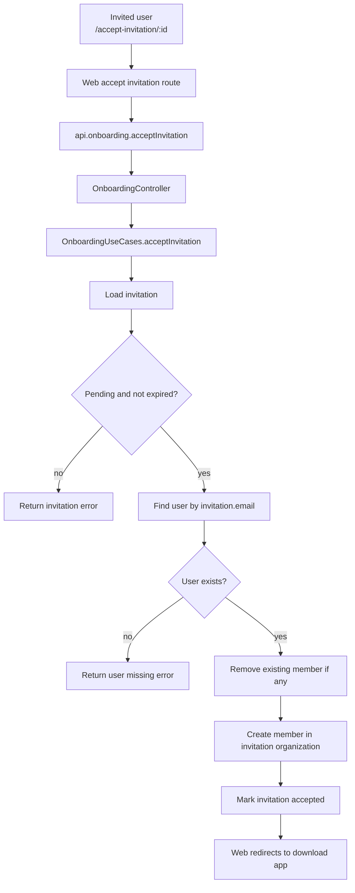

# Onboarding

Onboarding covers entry points that are not regular authenticated app actions.

## Scope

- Coach access request from the public `/signup` form.
- Invitation acceptance from the public accept-invitation link.
- Invitation creation is handled by [InvitationsModule](../invitations/README.md).

## Coach Access Request

No user account or better-auth session is created by this flow.

## Accept Invitation

## Related

- [Auth README](./README.md) — better-auth, guards, sessions.
- [Invitations README](../invitations/README.md) — coach/admin invitation creation.
- [Notification README](../notification/README.md) — email delivery.
