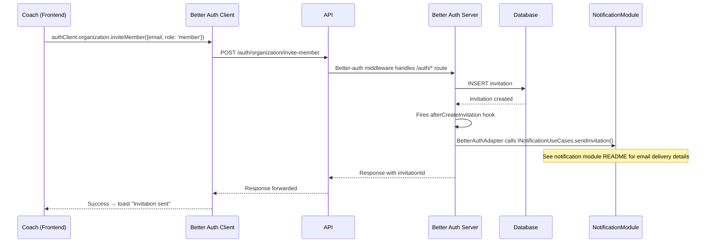
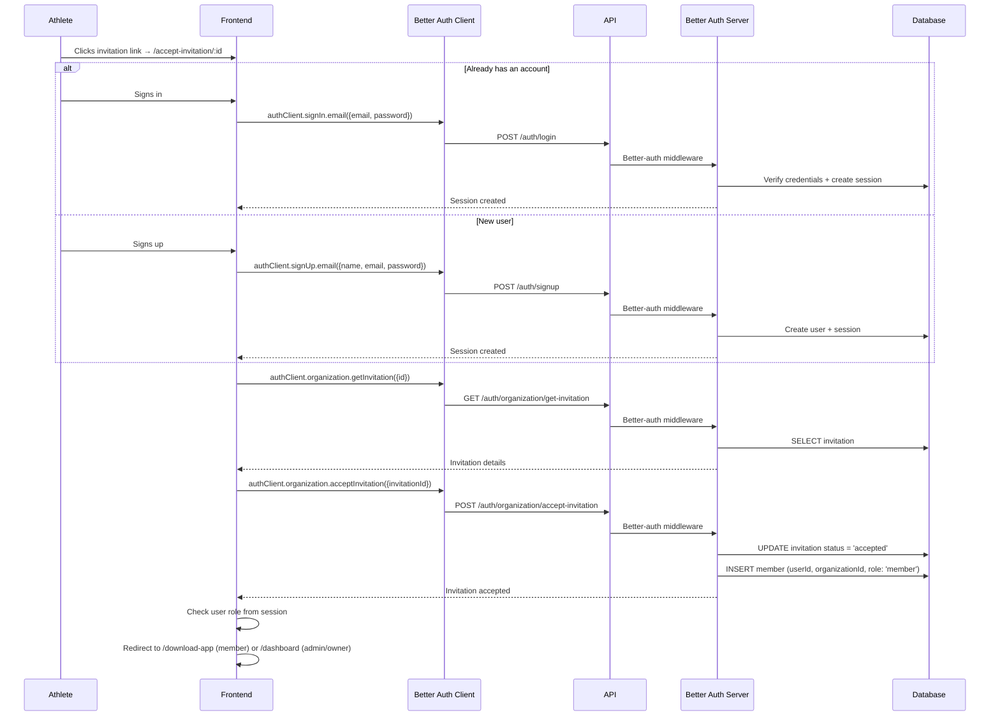

# Organization & Onboarding

How users create or join organizations, and how the invitation system works.

## User stories

### New user onboarding

A newly signed-up user with no organization chooses their path:

- **Create a club** — becomes a coach (owner), redirected to `/dashboard` (web backoffice)
- **Join a club** — becomes an athlete (member), redirected to `/download-app` (mobile app)

### Creating an organization

1. Coach navigates to `/create-organization`
2. Fills in club details
3. Better-auth creates the organization and assigns the `owner` role
4. Redirect to `/dashboard`

### Joining an organization

1. Athlete receives an invitation email from their coach
2. Clicks the link → `/accept-invitation/:id`
3. Signs in or signs up
4. Invitation is accepted, `member` record created
5. Redirect to `/download-app`

## Invitation flow

A coach invites an athlete from the backoffice. The entire flow is handled by better-auth's organization plugin.

Note: `/auth/*` routes are handled directly by better-auth middleware, not by NestJS controllers. AuthGuard and PermissionsGuard do not run for these routes.

For details on how the invitation email is rendered and sent, see the [Notification module README](../notification/README.md).

## Acceptance flow

The athlete receives the email and clicks the invitation link.

