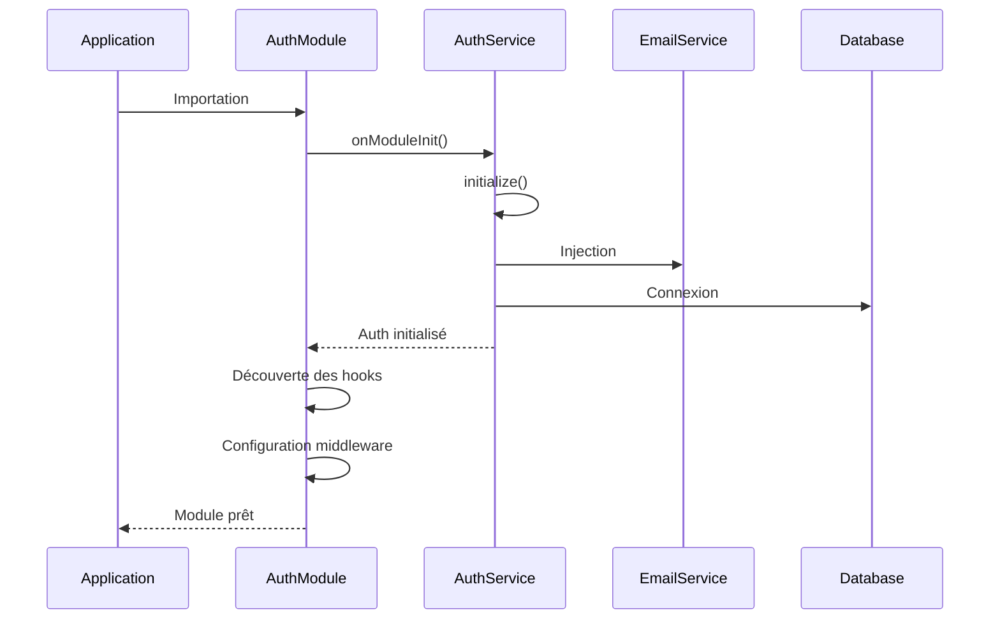
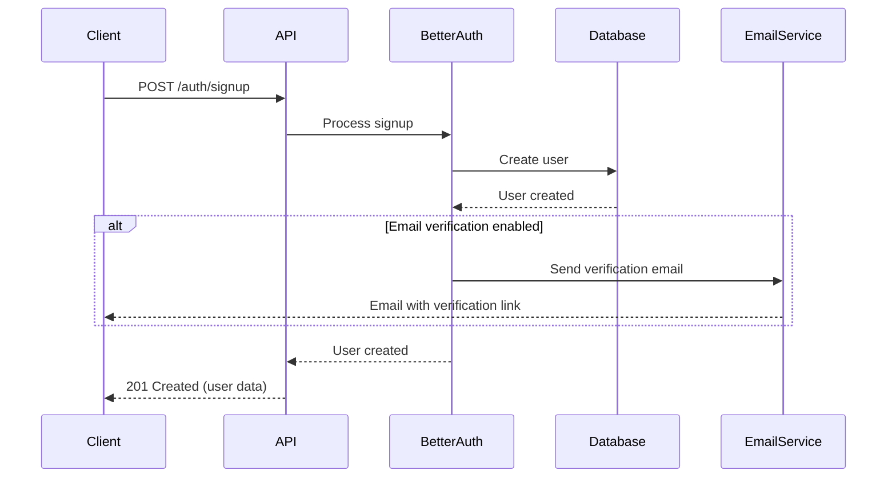
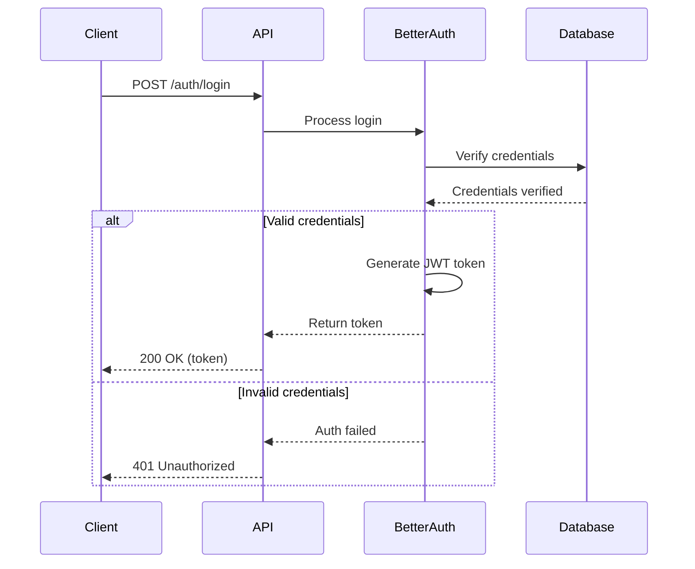
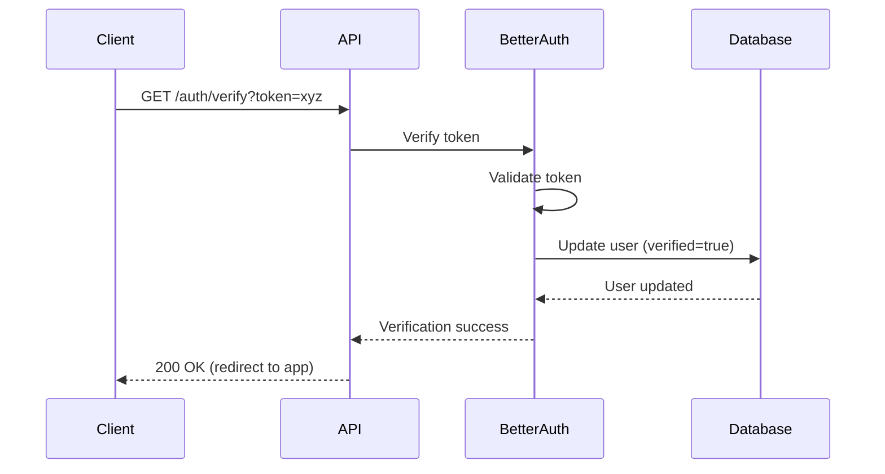
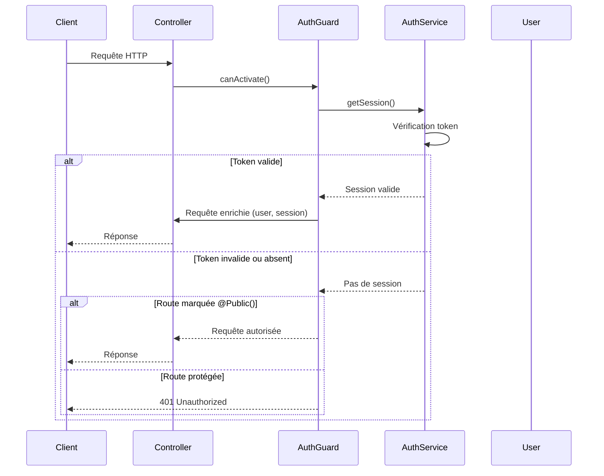
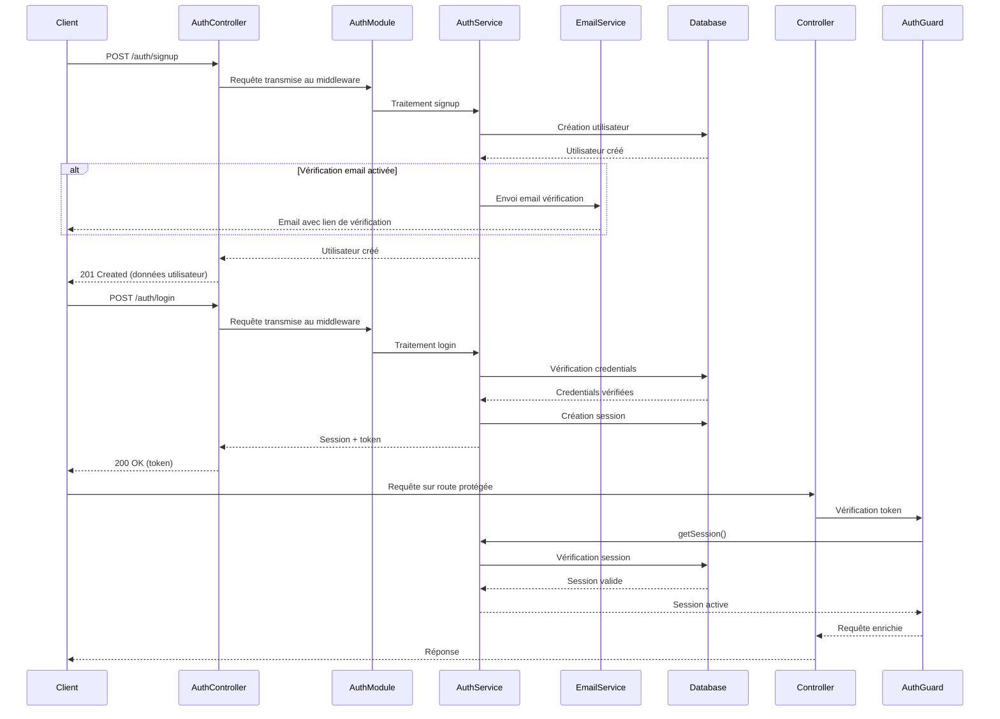
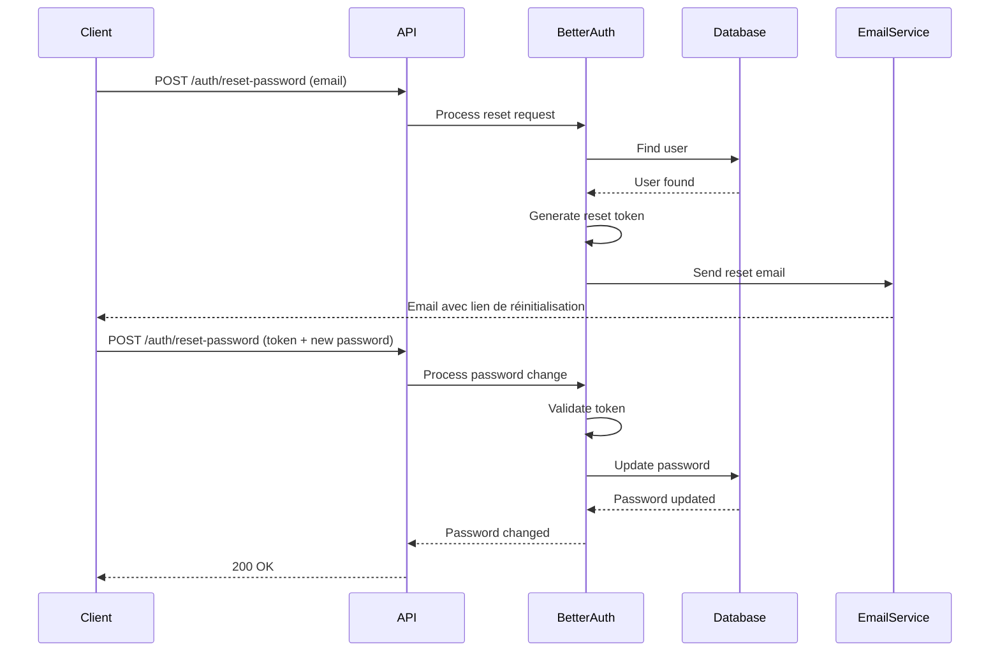

# Module Auth Core

Ce module configure et initialise better-auth pour l'application.

## Architecture

```
@/core/auth/
├── auth.module.ts    # Configuration better-auth (middleware, hooks, discovery)
├── auth.service.ts   # Service wrapper better-auth
└── README.md         # Documentation
```

## Processus d'initialisation

### 1. Démarrage de l'application

```typescript
// app.module.ts
@Module({
  imports: [
    IdentityModule, // Importe AuthModule via IdentityModule
    // ...
  ],
})
export class AppModule {}
```

### 2. Initialisation du module core/auth

```typescript
// @/core/auth/auth.module.ts
@Global()
@Module({
  imports: [DiscoveryModule, EmailModule],
  providers: [AuthService],
  exports: [AuthService],
})
export class AuthModule implements NestModule, OnModuleInit {
  // ...
}
```

**Ordre d'exécution :**

1. **`onModuleInit()`** : Initialise AuthService
2. **`configure()`** : Configure le middleware et les hooks

### 3. Initialisation d'AuthService

```typescript
// @/core/auth/auth.service.ts
@Injectable()
export class AuthService implements OnModuleInit {
  async onModuleInit() {
    // Singleton pattern pour éviter les initialisations multiples
    if (!AuthService.initPromise) {
      AuthService.initPromise = this.initialize();
    }
    await AuthService.initPromise;
  }

  private async initialize() {
    // Crée l'instance better-auth avec la configuration
    this._auth = createAuthConfig({
      sendResetPassword: async (data) => {
        return this.emailService.sendEmail({...});
      },
      sendVerificationEmail: async (data) => {
        return this.emailService.sendEmail({...});
      },
    }, this.em);
  }
}
```

**Configuration better-auth :**
- **Secret** : Clé de chiffrement des sessions
- **Cookies** : Configuration HttpOnly, secure, sameSite
- **Bearer token** : Support pour mobile
- **Email** : Hooks pour reset password et verification
- **Database** : Pool PostgreSQL
- **Rate limiting** : Protection contre les attaques
- **Organization plugin** : Support multi-organisations

### 4. Configuration du middleware

```typescript
// @/core/auth/auth.module.ts
async configure(consumer: MiddlewareConsumer) {
  // 1. Attendre l'initialisation
  await this.onModuleInit();

  // 2. Discovery des hooks d'authentification
  const providers = this.discoveryService
    .getProviders()
    .filter(({ metatype }) => metatype && Reflect.getMetadata(HOOK_KEY, metatype));

  // 3. Configuration des hooks before/after
  for (const provider of providers) {
    // Configure les hooks @BeforeHook et @AfterHook
    this.setupHook(BEFORE_HOOK_KEY, 'before', providerMethod);
    this.setupHook(AFTER_HOOK_KEY, 'after', providerMethod);
  }

  // 4. Configuration du middleware NestJS
  const handler = toNodeHandler(auth);
  consumer.apply(handler).forRoutes({
    path: '/auth/*',
    method: RequestMethod.ALL,
  });
}
```

## Routes better-auth configurées

Le middleware s'applique sur toutes les routes `/auth/*` :

| Route | Méthode | Description |
|-------|---------|-------------|
| `/auth/signup` | POST | Inscription utilisateur |
| `/auth/login` | POST | Connexion utilisateur |
| `/auth/logout` | POST | Déconnexion utilisateur |
| `/auth/me` | GET | Informations utilisateur connecté |
| `/auth/refresh` | POST | Rafraîchissement token |
| `/auth/verify` | GET | Vérification email |
| `/auth/reset-password` | POST | Demande reset password |

## Hooks d'authentification

### Décorateurs disponibles

```typescript
// @/identity/infrastructure/decorators/auth.decorator.ts
@BeforeHook('/auth/login')  // Exécuté avant login
@AfterHook('/auth/signup')  // Exécuté après signup
@Hook()                     // Marque une classe comme hook
```

### Exemple d'utilisation

```typescript
@Hook()
export class AuthHooks {
  @BeforeHook('/auth/login')
  async beforeLogin(ctx: MiddlewareContext) {
    console.log('Before login:', ctx.path);
  }

  @AfterHook('/auth/signup')
  async afterSignup(ctx: MiddlewareContext) {
    console.log('After signup:', ctx.path);
  }
}
```

## Utilisation dans les autres modules

### Import du module

```typescript
// @/identity/identity.module.ts
@Module({
  imports: [AuthModule], // Importe la configuration better-auth
  // ...
})
export class IdentityModule {}
```

### Utilisation du service

```typescript
// Dans un guard ou service
@Injectable()
export class AuthGuard {
  constructor(private authService: AuthService) {}

  async canActivate() {
    const session = await this.authService.api.getSession({...});
    // ...
  }
}
```

## Tables d'identité

Les tables d'identité restent dans `@/identity` car elles correspondent à l'implémentation better-auth :

- **User** : Utilisateurs better-auth
- **Session** : Sessions better-auth  
- **Organization** : Organisations métier
- **Member** : Membres d'organisation
- **Invitation** : Invitations d'organisation

## Dépendances

- **EmailModule** : Envoi des emails de reset/verification
- **EntityManager** : Accès aux entités MikroORM
- **DiscoveryModule** : Discovery des hooks d'authentification
- **MetadataScanner** : Analyse des métadonnées des hooks 


# Authentication Module

Ce module gère l'authentification et l'autorisation des utilisateurs dans l'application.

⚠️ **Avertissement**: Le middleware est configuré pour les routes commençant par `/auth/*`

## Technologies utilisées

- [better-auth](https://www.better-auth.com/docs) - Bibliothèque d'authentification

## Fonctionnalités

- Gestion des sessions utilisateur
- Gestion des comptes utilisateur
- Système de vérification d'email
- Middleware d'authentification
- Guards de protection des routes
- Hooks d'événements d'authentification

## Structure du module

```
modules/auth/
├── auth.decorator.ts  # Décorateurs pour l'authentification
├── auth.entity.ts     # Entités complémentaires pour l'authentification
├── auth.guard.ts      # Guard pour la protection des routes
├── auth.module.ts     # Configuration du module
├── auth.service.ts    # Service d'authentification
└── README.md          # Documentation
```

## Configuration

La configuration de better-auth est définie dans `better-auth.config.ts` et comprend:

- **secret**: Clé secrète pour signer les JWT
- **trustedOrigins**: Domaines autorisés pour les requêtes cross-origin
- **emailAndPassword**: Configuration pour l'authentification par email/mot de passe
- **emailVerification**: Paramètres pour la vérification des emails
- **database**: Connexion à la base de données PostgreSQL
- **rateLimit**: Paramètres de limitation des requêtes
- **hooks**: Points d'extension pour logiques personnalisées
- **plugins**: Modules additionnels (openAPI, organisation)
- **databaseHooks**: Hooks de session pour gérer l'organisation active

Exemple de configuration:

```typescript
this._auth = betterAuth({
  secret: config.betterAuth.secret,
  trustedOrigins: config.betterAuth.trustedOrigins,
  emailAndPassword: {
    enabled: true,
    sendResetPassword: async (data) => {
      // Logique d'envoi d'email de réinitialisation
    },
  },
  emailVerification: {
    sendOnSignUp: true,
    expiresIn: 60 * 60 * 24 * 10, // 10 jours
    sendVerificationEmail: async (data) => {
      // Logique d'envoi d'email de vérification
    },
  },
  database: new Pool({
    connectionString: config.database.connectionString,
  }),
  advanced: {
    generateId: false,
  },
  rateLimit: {
    window: 50,
    max: 100,
  },
  hooks: {
    before: createAuthMiddleware(async (ctx) => {
      // Hook avant authentification
    }),
  },
  plugins: [openAPI()],
});
```

## Composants nécessaires et leurs rôles

### 1. auth.service.ts

Service principal qui initialise better-auth et fournit les méthodes d'authentification.

**Pourquoi ?** C'est le cœur du système qui:
- Configure et initialise better-auth
- Expose l'API d'authentification
- Gère la connexion avec votre service d'emails

### 2. auth.guard.ts

Guard NestJS qui vérifie si l'utilisateur est authentifié pour accéder aux routes protégées.

**Pourquoi ?** Il permet de:
- Vérifier automatiquement les tokens d'authentification
- Protéger les routes sensibles
- Injecter l'utilisateur dans la requête

### 3. auth.decorator.ts

Décorateurs qui simplifient la protection des routes et l'accès aux données d'authentification.

**Pourquoi ?** Ils offrent:
- `@Public()` - Marquer une route comme publique
- `@Optional()` - Autoriser l'accès authentifié ou non
- `@Session()` - Accéder à la session dans un contrôleur
- `@BeforeHook()` / `@AfterHook()` - Ajouter des hooks d'authentification

### 4. auth.module.ts

Module NestJS qui configure le système d'authentification et découvre les hooks.

**Pourquoi ?** Il:
- Configure le middleware better-auth
- Enregistre les guards et services
- Détecte et configure les hooks d'authentification
- Applique le middleware sur les routes `/auth/*`

### 5. auth.entity.ts

Définit les entités nécessaires pour le stockage des données d'authentification.

## Rôle de chaque entité d'authentification

### User (Entité existante)

Cette entité est déjà définie dans `src/entities/user.entity.ts`.

**Rôle**: Stocke les informations de base des utilisateurs:
- Identifiants (email, mot de passe)
- Rôles et permissions
- État du compte (actif, vérifié)

### AuthSession

**Rôle**: Gère les sessions actives des utilisateurs:
- Stocke les tokens JWT actifs
- Permet l'invalidation des sessions (déconnexion)
- Garde une trace des appareils connectés (IP, User-Agent)
- Lie les sessions aux utilisateurs

### AuthAccount

**Rôle**: Gère les identités externes (OAuth, réseaux sociaux):
- Stocke les informations de connexion aux services tiers
- Permet la connexion via Google, Facebook, etc.
- Stocke les tokens d'accès et de rafraîchissement
- Lie les comptes externes aux utilisateurs internes

### AuthVerification

**Rôle**: Gère les tokens de vérification temporaires:
- Tokens de vérification d'email
- Tokens de réinitialisation de mot de passe
- Tokens à usage unique 
- Stocke l'expiration des tokens

## Sessions et Tokens

better-auth utilise les JSON Web Tokens (JWT) pour l'authentification:

1. Lors de la connexion, un JWT est généré et signé avec la clé secrète
2. Le client stocke ce token (dans localStorage, cookies, etc.)
3. Pour les requêtes authentifiées, le client envoie le token via l'en-tête HTTP Authorization
4. L'API vérifie la validité du token pour chaque requête protégée

## Routes d'authentification

Better-auth expose automatiquement plusieurs endpoints sur le préfixe `/auth`:

| Route | Méthode | Description |
|-------|---------|-------------|
| `/auth/signup` | POST | Inscription d'un nouvel utilisateur |
| `/auth/login` | POST | Connexion d'un utilisateur |
| `/auth/logout` | POST | Déconnexion de l'utilisateur |
| `/auth/me` | GET | Informations sur l'utilisateur connecté |
| `/auth/refresh` | POST | Rafraîchissement du token |
| `/auth/verify` | GET | Vérification de l'email avec token |
| `/auth/reset-password` | POST | Demande de réinitialisation de mot de passe |

## Guide d'utilisation des Guards et Décorateurs

### Protection des routes avec AuthGuard

Pour protéger une API entière:

```typescript
// athlete.controller.ts
import { Controller, UseGuards } from '@nestjs/common';
import { AuthGuard } from '../auth/auth.guard';

@Controller('athlete')
@UseGuards(AuthGuard)  // ⚠️ Protège toutes les routes du contrôleur
export class AthleteController {
  // Toutes les routes nécessitent une authentification
}
```

Pour protéger une route spécifique:

```typescript
// athlete.controller.ts
import { Controller, Get, UseGuards } from '@nestjs/common';
import { AuthGuard } from '../auth/auth.guard';

@Controller('athlete')
export class AthleteController {
  @Get('protected')
  @UseGuards(AuthGuard)  // ⚠️ Protège uniquement cette route
  getProtectedData() {
    // Cette route nécessite une authentification
  }
  
  @Get('public')
  getPublicData() {
    // Cette route est accessible sans authentification
  }
}
```

### Utilisation du décorateur @Public()

Pour rendre une route publique dans un contrôleur protégé:

```typescript
// athlete.controller.ts
import { Controller, Get, UseGuards } from '@nestjs/common';
import { AuthGuard } from '../auth/auth.guard';
import { Public } from '../auth/auth.decorator';

@Controller('athlete')
@UseGuards(AuthGuard)  // Protège toutes les routes par défaut
export class AthleteController {
  @Get('private')
  getPrivateData() {
    // Cette route nécessite une authentification
  }
  
  @Get('public')
  @Public()  // ⚠️ Marque cette route comme publique
  getPublicData() {
    // Cette route est accessible sans authentification
  }
}
```

### Utilisation du décorateur @Session()

Pour accéder aux données de session dans un contrôleur:

```typescript
// profile.controller.ts
import { Controller, Get, UseGuards } from '@nestjs/common';
import { AuthGuard } from '../auth/auth.guard';
import { Session } from '../auth/auth.decorator';

@Controller('profile')
@UseGuards(AuthGuard)
export class ProfileController {
  @Get()
  getProfile(@Session() session) {  // ⚠️ Injection de la session
    // session contient les données de l'utilisateur connecté
    return {
      user: session.user,
      // Autres données du profil
    };
  }
}
```

### Utilisation du décorateur @Optional()

Pour rendre l'authentification optionnelle sur une route:

```typescript
// content.controller.ts
import { Controller, Get, UseGuards } from '@nestjs/common';
import { AuthGuard } from '../auth/auth.guard';
import { Optional, Session } from '../auth/auth.decorator';

@Controller('content')
@UseGuards(AuthGuard)
export class ContentController {
  @Get('articles')
  @Optional()  // ⚠️ Authentification optionnelle
  getArticles(@Session() session) {
    if (session) {
      // Utilisateur authentifié : contenu personnalisé
      return this.getPersonalizedContent(session.user);
    } else {
      // Utilisateur non authentifié : contenu public
      return this.getPublicContent();
    }
  }
}
```

### Middleware d'authentification

En plus du Guard NestJS, better-auth fournit un middleware traditionnel:

```typescript
import { auth } from './auth.service';

// Protéger une route avec le middleware (pour les apps Express)
app.get('/protected-route', auth.middleware(), (req, res) => {
  // Accès aux infos utilisateur via req.user
  res.json({ message: 'Route protégée', user: req.user });
});
```

## Personnalisation

Les hooks before/after permettent d'exécuter du code personnalisé pendant le processus d'authentification:

```typescript
hooks: {
  before: createAuthMiddleware(async (ctx) => {
    // Code exécuté avant l'authentification
  }),
  after: createAuthMiddleware(async (ctx) => {
    // Code exécuté après l'authentification réussie
  }),
}
```

## Envoi d'emails

Better-auth n'inclut pas de fonctionnalité d'envoi d'emails, mais expose des hooks pour l'intégrer avec une bibliothèque d'envoi d'emails.

Pour l'implémentation détaillée de l'envoi d'emails, référez-vous au README du module Email dans `apps/api/src/modules/email/README.md`.

## Diagrammes de séquence

### Initialisation du module Auth



### Inscription (Sign Up)



### Connexion (Login)



### Vérification d'email



### Protection d'une route avec AuthGuard



### Flux d'authentification complet



### Réinitialisation de mot de passe



## Implémentation recommandée

1. **Importez le module Auth** dans votre AppModule
2. **Protégez vos routes** avec le AuthGuard
3. **Utilisez les décorateurs** pour gérer les exceptions et accéder aux données de session
4. **Vérifiez que votre entité User** contient tous les champs requis

---

# 🎯 **Système de Permissions et Rôles**

Pour garantir la cohérence et une source unique de vérité, la gestion des permissions a été centralisée dans un paquet partagé `@dropit/permissions`. Ce paquet est consommé à la fois par le backend (API) et le frontend (web), assurant que les deux environnements opèrent avec les mêmes règles d'autorisation.

## **Concepts Clés**

### **Policies et Roles**
- **Policies** : Définissent les permissions sur les ressources (ex: `workout: ["read", "create", "update", "delete"]`)
- **Roles** : Groupent les policies pour différents types d'utilisateurs (ex: `owner`, `admin`, `member`)

## **Architecture des Permissions**

Le système fonctionne en **deux étapes** :

1. **Authentification** : Vérification de l'identité de l'utilisateur (AuthGuard global)
2. **Autorisation** : Gérée automatiquement par Better Auth côté client

### **Conception Métier**

- **AuthGuard** : Vérifie uniquement que l'utilisateur existe et est authentifié
- **Better Auth Middleware** : Gère automatiquement les permissions côté client
- **Pas de PermissionGuard** : Les permissions sont vérifiées côté client !

## **Configuration des Permissions**

La configuration est définie dans le paquet `@dropit/permissions`.

### 1. Définition des Resources et Actions
```typescript
// packages/permissions/src/index.ts
const statement = {
  // Ressources par défaut de Better Auth
  ...defaultStatements,
  
  // Nos ressources métier
  workout: ["read", "create", "update", "delete"],
  exercise: ["read", "create", "update", "delete"],
  complex: ["read", "create", "update", "delete"],
  athlete: ["read", "create", "update", "delete"],
  session: ["read", "create", "update", "delete"],
  personalRecord: ["read", "create", "update", "delete"],
} as const;
```

### 2. Création de l'Access Control
```typescript
export const ac = createAccessControl(statement);
```

### 3. Définition des Roles avec leurs Policies
```typescript
// Rôle Member (lecture seule + création de ses propres records)
export const member = ac.newRole({
  ...memberAc.statements,
  workout: ["read"],
  exercise: ["read"],
  complex: ["read"],
  athlete: ["read"],
  session: ["read"],
  personalRecord: ["read", "create"],
});

// Rôle Admin (gestion complète sauf suppression d'organisation)
export const admin = ac.newRole({
  ...adminAc.statements,
  workout: ["read", "create", "update", "delete"],
  exercise: ["read", "create", "update", "delete"],
  complex: ["read", "create", "update", "delete"],
  athlete: ["read", "create", "update", "delete"],
  session: ["read", "create", "update", "delete"],
  personalRecord: ["read", "create", "update", "delete"],
});

// Rôle Owner (toutes les permissions)
export const owner = ac.newRole({
  ...ownerAc.statements,
  workout: ["read", "create", "update", "delete"],
  exercise: ["read", "create", "update", "delete"],
  complex: ["read", "create", "update", "delete"],
  athlete: ["read", "create", "update", "delete"],
  session: ["read", "create", "update", "delete"],
  personalRecord: ["read", "create", "update", "delete"],
});
```

## **Configuration Backend**

### 1. Configuration Better Auth
```typescript
// better-auth.config.ts
import { organization } from 'better-auth/plugins/organization';
import { ac, owner, admin, member } from '@dropit/permissions';

export function createAuthConfig() {
  return betterAuth({
    // ... autres configurations
    plugins: [
      openAPI(), 
      organization({
        ac, // ✅ AccessControl avec vos permissions
        roles: {
          owner,
          admin, 
          member,
        }
      })
    ],
  });
}
```

### 2. Configuration Client
```typescript
// auth-client.ts
import { createAuthClient } from 'better-auth/react';
import { organizationClient } from 'better-auth/client/plugins';
import { ac, owner, admin, member } from '@dropit/permissions';

const authClient = createAuthClient({
  baseURL: 'http://localhost:3000',
  plugins: [organizationClient({
    ac, // ✅ Même AccessControl
    roles: {
      owner,
      admin,
      member,
    }
  })],
});
```

## **Flux Complet des Permissions**

### **Étape 1 : Connexion**
1. Utilisateur se connecte
2. Better Auth récupère son rôle depuis la DB
3. Session créée avec le rôle

### **Étape 2 : Navigation**
1. Utilisateur navigue dans l'app
2. Better Auth vérifie automatiquement les permissions
3. Si autorisé → affiche le contenu
4. Si non autorisé → redirige ou cache

### **Étape 3 : Appels API**
1. Frontend fait un appel API (avec session)
2. Backend vérifie juste l'authentification (AuthGuard)
3. Retourne les données
4. Frontend affiche selon les permissions

## **Utilisation Côté Frontend**

### **Protection de Routes**
```typescript
// Route protégée automatiquement
function ProtectedPage() {
  const { data: session } = authClient.useSession();
  
  if (!session) {
    return <Navigate to="/login" />;
  }
  
  return <ProtectedContent />;
}
```

### **Affichage Conditionnel basé sur les Roles**
```typescript
function WorkoutActions() {
  const { data: session } = authClient.useSession();
  
  return (
    <div>
      <button>Voir les workouts</button>
      {session?.user?.role === 'owner' && (
        <button>Créer un workout</button>
      )}
      {session?.user?.role === 'admin' && (
        <button>Modifier les workouts</button>
      )}
    </div>
  );
}
```

### **Vérification de Permissions Spécifiques**
```typescript
function WorkoutManagement() {
  const { data: session } = authClient.useSession();
  const { data: activeOrganization } = authClient.useActiveOrganization();

  // Vérifier si l'utilisateur peut créer des workouts
  const canCreateWorkout = activeOrganization?.can('workout', 'create');

  return (
    <div>
      {canCreateWorkout && (
        <button>Créer un nouveau workout</button>
      )}
    </div>
  );
}
```

## **Tableau des Rôles et Permissions**

| Rôle | Workout | Exercise | Athlete | Session | Personal Record |
|------|---------|----------|---------|---------|-----------------|
| **owner** | read, create, update, delete | read, create, update, delete | read, create, update, delete | read, create, update, delete | read, create, update, delete |
| **admin** | read, create, update, delete | read, create, update, delete | read, create, update, delete | read, create, update, delete | read, create, update, delete |
| **member** | read | read | read | read | read, create |

## **Sécurité des Permissions**

### **Côté Client**
- Better Auth gère les permissions automatiquement
- Interface adaptée selon les rôles
- Protection des routes et composants

### **Côté Serveur**
- Juste vérification de l'authentification
- Pas de logique de permissions complexe
- Performance optimisée

### **Base de Données**
- Rôles stockés et vérifiés
- Sessions sécurisées
- Tokens JWT signés

## **Avantages de Cette Approche**

- ✅ **Simple** : Pas de guards complexes côté serveur
- ✅ **Automatique** : Better Auth gère tout
- ✅ **Sécurisé** : Permissions vérifiées côté client
- ✅ **Performance** : Moins de requêtes côté serveur
- ✅ **UX** : Interface adaptée aux permissions
- ✅ **Maintenable** : Une seule source de vérité pour les permissions

---

## 🔧 **Gestion de l'Organisation Active**

### **Problème : activeOrganizationId null par défaut**

Par défaut, better-auth définit `activeOrganizationId` à `null` lors de la création d'une session, même si l'utilisateur appartient à une organisation. Cela provoque des redirections incorrectes vers `/onboarding` au lieu des routes appropriées (`/dashboard` pour owner/admin, `/download-app` pour member).

### **Solution : Hook databaseHooks.session.create.before**

Pour résoudre ce problème, nous utilisons un hook de session qui définit automatiquement l'organisation active lors de la connexion :

```typescript
// better-auth.config.ts
databaseHooks: {
  session: {
    create: {
      before: async (session) => {
        if (!em) return { data: session };
        
        try {
          const emFork = em.fork();
          const memberRecord = await emFork.findOne(Member, { user: { id: session.userId } });
          
          console.log('🔧 [BetterAuth Hook] Setting activeOrganizationId:', {
            userId: session.userId,
            organizationId: memberRecord?.organization.id || null
          });
          
          return {
            data: {
              ...session,
              activeOrganizationId: memberRecord?.organization.id ?? null,
            },
          };
        } catch (error) {
          console.error('❌ [BetterAuth Hook] Error setting activeOrganizationId:', error);
          return { data: session };
        }
      },
    },
  },
},
```

### **Pourquoi ce hook est nécessaire ?**

D'après la [documentation officielle better-auth](https://www.better-auth.com/docs/plugins/organization), **l'activeOrganizationId est null par défaut** lors de la création de session. La documentation recommande explicitement d'utiliser les `databaseHooks` pour définir l'organisation active :

> "By default, when a user signs in, the active organization is set to `null`. You can set the active organization using database hooks during session creation."

### **Flux d'exécution**

1. **Utilisateur se connecte** → Better-auth déclenche `session.create.before`
2. **Le hook recherche** l'appartenance de l'utilisateur à une organisation via MikroORM
3. **L'organisation trouvée** est injectée dans `activeOrganizationId`
4. **La session est créée** avec l'organisation active correctement définie
5. **Le frontend peut maintenant** rediriger correctement selon le rôle

### **Impact sur les redirections**

Sans ce hook :
```javascript
// activeOrganizationId = null → redirection vers /onboarding
const activeMember = await authClient.organization.getActiveMember();
// activeMember?.data sera null même si l'utilisateur a une organisation
```

Avec ce hook :
```javascript
// activeOrganizationId = "org-uuid" → redirection correcte
const activeMember = await authClient.organization.getActiveMember();
// activeMember?.data contient le rôle (owner/admin/member)
```

### **Gestion d'erreurs**

Le hook inclut une gestion d'erreurs robuste :
- **Try-catch** pour éviter les plantages de session
- **Logs détaillés** pour le debugging
- **Fallback** vers session normale en cas d'erreur
- **Vérification EntityManager** pour éviter les erreurs d'injection

Cette implémentation garantit que les utilisateurs sont toujours redirigés vers la bonne interface selon leur rôle organisationnel.

