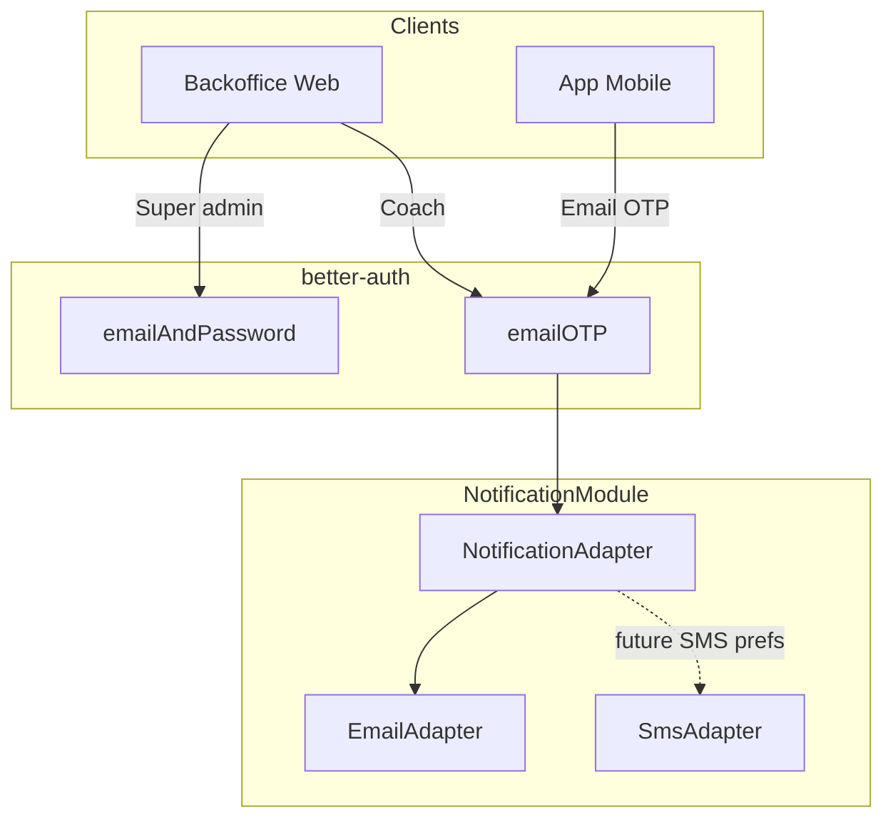

# Auth Module

Handles authentication, identity management, and organization-based permissions using [better-auth](https://www.better-auth.com/docs/introduction).

## Structure

```
auth/
├── application/
│   ├── ports/
│   │   ├── inbound/                       # What other modules call
│   │   │   ├── user-use-cases.port.ts
│   │   │   ├── organization-use-cases.port.ts
│   │   │   ├── member-use-cases.port.ts
│   │   │   └── onboarding-use-cases.port.ts
│   │   └── outbound/                      # What use cases depend on
│   │       ├── user.repository.port.ts
│   │       ├── organization.repository.port.ts
│   │       ├── member.repository.port.ts
│   │       └── invitation.repository.port.ts
│   ├── use-cases/
│   │   ├── user.use-cases.ts
│   │   ├── organization.use-cases.ts
│   │   ├── member.use-cases.ts
│   │   └── onboarding.use-cases.ts
│   └── exceptions/
│       └── user.exceptions.ts
├── domain/
│   ├── auth/
│   │   ├── user.entity.ts                 # Better-auth user (+ admin plugin: role, banned, etc.)
│   │   ├── session.entity.ts              # Better-auth session (+ impersonatedBy, admin plugin)
│   │   ├── account.entity.ts              # OAuth accounts
│   │   └── verification.entity.ts         # Email verification tokens
│   └── organization/
│       ├── organization.entity.ts
│       ├── member.entity.ts               # User <-> Organization link (with role)
│       └── invitation.entity.ts
├── infrastructure/
│   ├── better-auth.adapter.ts             # Initializes better-auth, exposes auth & api
│   ├── decorators/
│   │   ├── auth.decorator.ts              # @Public, @Optional, @Session, @CurrentUser
│   │   ├── organization.decorator.ts      # @CurrentOrganization
│   │   └── permissions.decorator.ts       # @RequirePermissions, @NoOrganization
│   ├── guards/
│   │   ├── auth.guard.ts                  # Global guard: validates session
│   │   └── permissions.guard.ts           # Route guard: checks organization role
│   └── orm/
│       ├── mikro-user.repository.ts
│       ├── mikro-organization.repository.ts
│       ├── mikro-member.repository.ts
│       └── mikro-invitation.repository.ts
├── interface/
│   ├── controllers/
│   │   ├── user.controller.ts
│   │   └── onboarding.controller.ts
│   ├── mappers/
│   │   └── user.mapper.ts
│   └── presenters/
│       ├── user.presenter.ts
│       └── onboarding.presenter.ts
├── auth.module.ts                         # NestJS module wiring + middleware
├── better-auth.config.ts                  # Static better-auth configuration
└── permissions.config.ts                  # Org role permissions (used by PermissionsGuard)
```

## Authentication overview

Clients, plugins better-auth, and OTP delivery through **NotificationModule**. **Email OTP** (coach + mobile) and **email + password** (super admin only; server restricts `/sign-in/email` to admin accounts) are wired. **SMS** is not used for sign-in; a future **phone number for notification preferences** (alerts by SMS) is tracked in [`docs/task-management/mobile-notification-preferences-phonenumber.md`](../../../../../docs/task-management/mobile-notification-preferences-phonenumber.md).



## How it works

### Better-auth integration

Better-auth handles authentication (sessions, organization plugin, admin plugin, **email OTP** for coach-style login, **email + password** where still used). The module integrates it in two parts:

- **`better-auth.config.ts`** contains the static configuration (secret, cookies, database, rate limiting, plugins: `openAPI`, `admin`, `emailOTP`, `organization`, `customSession`). It is a pure function that receives callbacks as parameters.

- **`BetterAuthAdapter`** initializes better-auth at startup and wires callbacks: invitation emails via `INotificationUseCases.sendOrganizationInvitation`, **OTP emails** via `INotificationUseCases.sendOtp` (from the `emailOTP` plugin’s `sendVerificationOTP`), session enrichment, and database hooks.

For roadmap tasks (deep links, SMS preferences, admin 2FA / password reset), see [`docs/task-management/deep-links-mobile-download-app.md`](../../../../../docs/task-management/deep-links-mobile-download-app.md), [`mobile-notification-preferences-phonenumber.md`](../../../../../docs/task-management/mobile-notification-preferences-phonenumber.md), [`super-admin-2fa-password-reset.md`](../../../../../docs/task-management/super-admin-2fa-password-reset.md). For how notifications are wired (ports, invitation pipeline), see the [Notification module README](../notification/README.md).

### Middleware

`AuthModule.configure()` registers better-auth as HTTP middleware on all `/auth/*` routes. Better-auth handles its own request parsing and response for these routes (signup, login, session, organization invites, etc.).

Note: the body parser is skipped for `/auth/*` routes in `main.ts` because better-auth needs to parse the raw body itself.

### Guards

**AuthGuard** (global, registered as `APP_GUARD`):
- Runs on every request
- Calls `betterAuthAdapter.api.getSession()` to validate the session
- Injects `session` and `user` into the request object
- Routes marked `@Public()` skip authentication
- Routes marked `@Optional()` allow unauthenticated access

**PermissionsGuard** (per-route, used with `@UseGuards`):
- Checks the user's organization role against `@RequirePermissions()`
- Uses `permissions.config.ts` for role definitions (2 org roles: member/admin)
- Super admin (`user.role === 'admin'`) bypasses all permission checks
- Derives the resource name from the controller name

### Decorators

| Decorator | Type | Description |
|-----------|------|-------------|
| `@Public()` | Method | Skip authentication entirely |
| `@Optional()` | Method | Allow authenticated or unauthenticated access |
| `@Session()` | Param | Inject the better-auth session |
| `@CurrentUser()` | Param | Inject the authenticated user |
| `@CurrentOrganization()` | Param | Inject the active organization ID |
| `@RequirePermissions('read', 'create')` | Method | Require at least one of the listed permissions |
| `@NoOrganization()` | Method | Skip organization check in PermissionsGuard |

### Database hooks

`BetterAuthAdapter` registers a **`session.create.before`** hook via `createAuthConfig()`: it sets **`activeOrganizationId`** on the new session from the user’s membership so the client can redirect after login.


Note: `athleteId` is enriched at read-time via the `customSession` plugin, not stored in the session table.

## Dependencies

Nest `imports` and cross-module wiring (see `auth.module.ts`):

- **[NotificationModule](../notification/notification.module.ts)** (`forwardRef`): `BetterAuthAdapter` and **`OnboardingUseCases`** use **`INotificationUseCases`** for invitation emails, OTP email (`sendOtp`), and coach access requests (`sendRequestAccess`).
- **[AthletesModule](../athletes/)** (`forwardRef`): **`IAthleteUseCases`** for `OnboardingUseCases` (athlete stub when inviting by email) and for **`BetterAuthAdapter.enrichSession`** (`athleteId` on the session).
- **MikroORM** (`MikroOrmModule.forFeature`): entities **User**, **Organization**, **Member**, **Invitation** and their repositories.

## Related docs

- **[Hexagonal architecture](../../../../../docs/architecture-hexagonale.md)** (French) — ports & adapters, token-based injection, `useFactory`, channel vs transport composition
- **[Task management (auth & mobile)](../../../../../docs/task-management/)** — [`deep-links-mobile-download-app.md`](../../../../../docs/task-management/deep-links-mobile-download-app.md), [`mobile-notification-preferences-phonenumber.md`](../../../../../docs/task-management/mobile-notification-preferences-phonenumber.md), [`super-admin-2fa-password-reset.md`](../../../../../docs/task-management/super-admin-2fa-password-reset.md)
- **[Onboarding](./README-onboarding.md)** — clubs, coaches, invitations, acceptance flow
- **[Permissions](./README-permissions.md)** — `PermissionsGuard`, `@RequirePermissions`, role matrix
- **[Notification module](../notification/README.md)** — `NotificationRequest` / `KIND`, email channel, Maildev/Brevo; generic DI patterns in the hexagonal doc above
