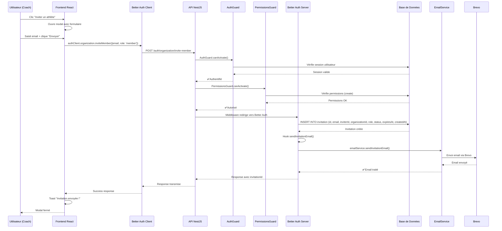

# Flux d'Invitation d'Athlète

Ce document décrit le flux complet d'invitation d'un athlète, depuis le clic utilisateur jusqu'à l'envoi de l'email.

## Diagramme de Séquence

## Composants Impliqués

### Frontend
- **Formulaire** : `AthleteInvitationForm` (React + react-hook-form)
- **Client** : `authClient.organization.inviteMember()`
- **UI** : Modal, toast, validation

### Backend
- **Route** : `POST /auth/organization/invite-member` (Better Auth)
- **Guards** : `AuthGuard` + `PermissionsGuard`
- **Service** : `EmailService` avec Brevo
- **Base** : Table `invitation` (Better Auth)

### Configuration
- **Better Auth** : Plugin `organization` avec hook `sendInvitationEmail`
- **Email** : Template HTML + configuration Brevo
- **Permissions** : `create` sur ressource `invitation`

## Points Clés

1. **Sécurité** : Double vérification (auth + permissions)
2. **Automatisation** : Better Auth gère tout le processus
3. **Email** : Template HTML professionnel via Brevo
4. **Lien** : `http://localhost:5173/accept-invitation/{id}`
5. **Expiration** : 7 jours par défaut

## Prochaines Étapes

1. ✅ **Invitation créée** - Fonctionne
2. 🔄 **Configuration Brevo** - En cours
3. ⏳ **Route d'acceptation** - À faire
4. ⏳ **Flux complet** - À tester 