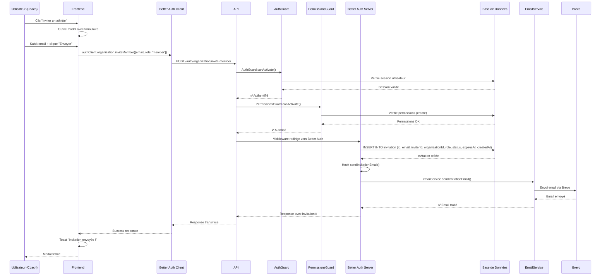
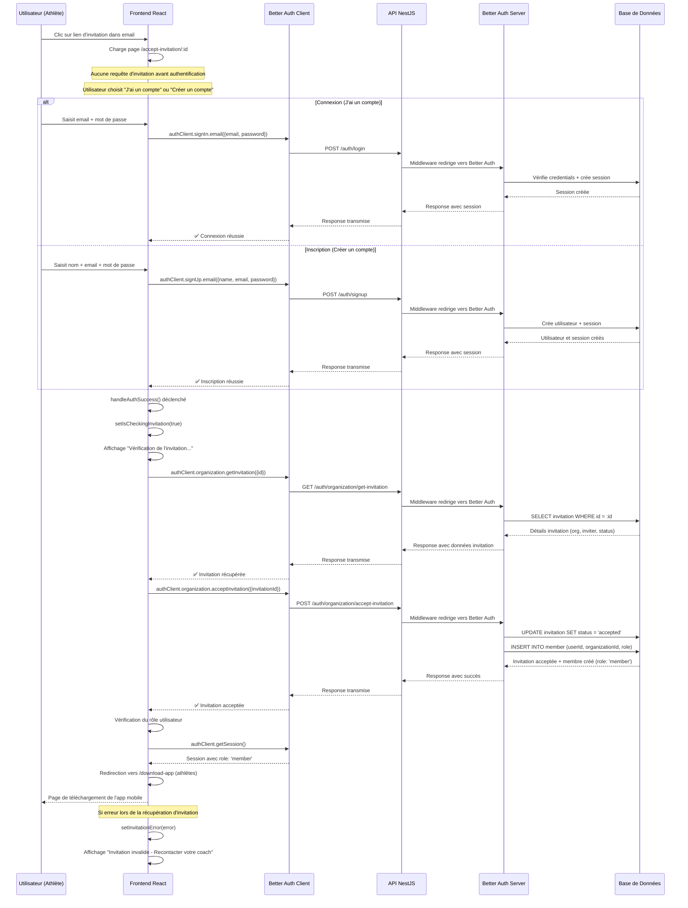

# Rejoindre une organisation ou ajouter des membres

Ce document regroupe toute la documentation technique relative à l'ajout d'un athlète dans son club et au fonctionnement du système d'invitations.

## User Stories

### Onboarding utilisateur

**En tant qu'utilisateur nouvellement connecté sans organisation**, je veux choisir mon rôle dans l'écosystème afin de rejoindre ou créer un club.

**Scénarios :**
- **Créer un club** : L'utilisateur devient coach et accède au dashboard web (backoffice d'administration)
- **Rejoindre un club** : L'utilisateur devient athlète et est redirigé vers l'application mobile

### Création d'organisation

**En tant que coach**, je veux créer mon club afin d'administrer mes athlètes.

**Flux :**
1. Route : `/create-organization`
2. Formulaire de création avec informations du club
3. Attribution automatique du rôle `coach`
4. Redirection vers `/dashboard` (dashboard web - backoffice d'administration du club)

### Adhésion à une organisation

**En tant qu'athlète**, je veux rejoindre un club existant afin de bénéficier du coaching.

**Flux :**
1. Route : `/join-organization`
2. Choix : sélection du club + message OU code d'invitation
3. **Desktop** : redirection vers `/download-app` (téléchargement de l'app mobile)
4. **Mobile** : notification d'attente + accès limité au dashboard mobile (visualisation des entraînements)

### Téléchargement de l'application mobile

**En tant qu'athlète**, je veux télécharger l'application mobile afin d'accéder à mon dashboard mobile et visualiser mes entraînements.

**Page :** `/download-app` avec liens vers App Store et Google Play

---

## Flux techniques

### Flux d'Invitation d'Athlète

Le flux complet d'invitation d'un athlète, depuis le clic utilisateur jusqu'à l'envoi de l'email.

### Diagramme de Séquence

### Composants Impliqués

#### Frontend
- **Formulaire** : `AthleteInvitationForm` (React + react-hook-form)
- **Client** : `authClient.organization.inviteMember()`
- **UI** : Modal, toast, validation

#### Backend
- **Route** : `POST /auth/organization/invite-member` (Better Auth)
- **Guards** : `AuthGuard` + `PermissionsGuard`
- **Service** : `EmailService` avec Brevo
- **Base** : Table `invitation` (Better Auth)

#### Configuration
- **Better Auth** : Plugin `organization` avec hook `sendInvitationEmail`
- **Email** : Template HTML + configuration Brevo
- **Permissions** : `create` sur ressource `invitation`

### Points Clés

1. **Sécurité** : Double vérification (auth + permissions)
2. **Automatisation** : Better Auth gère tout le processus
3. **Email** : Template HTML professionnel via Brevo
4. **Lien** : `http://localhost:5173/accept-invitation/{id}`
5. **Expiration** : 7 jours par défaut

---

## Flux d'Acceptation d'Invitation

Ce diagramme décrit le flux complet d'acceptation d'une invitation, depuis la réception de l'email jusqu'à l'intégration dans l'organisation.

### Composants Impliqués

#### Frontend
- **Page** : `AcceptInvitationPage` avec tabs login/signup
- **Composants** : `LoginForm` et `SignupForm` réutilisables
- **État local** : `isCheckingInvitation` et `invitationError` pour gérer les états
- **Client** : `authClient.organization.getInvitation()` et `acceptInvitation()`
- **Navigation** : Redirection intelligente selon le rôle :
  - Athlètes (`member`) → `/download-app`
  - Coaches (`admin`/`owner`) → `/dashboard`

#### Backend
- **Routes** : 
  - `GET /auth/organization/get-invitation` (Better Auth)
  - `POST /auth/organization/accept-invitation` (Better Auth)
  - `POST /auth/login` et `POST /auth/signup` (Better Auth)
- **Base** : Tables `invitation` et `member` (Better Auth)

#### Configuration
- **Better Auth** : Plugin `organization` avec gestion automatique
- **Permissions** : Vérification automatique des rôles
- **Session** : Gestion automatique après authentification

