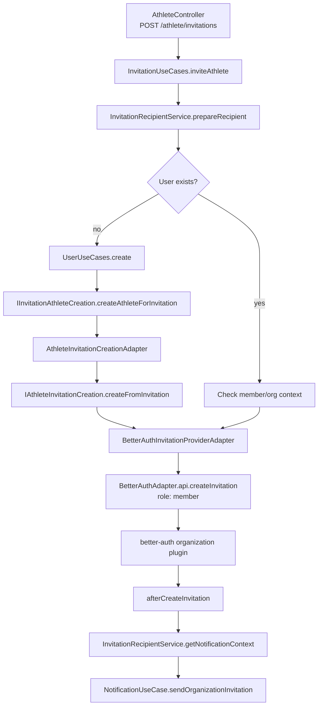
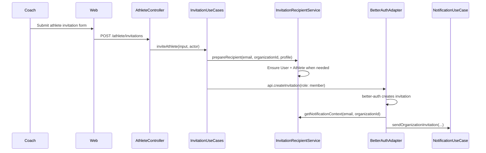
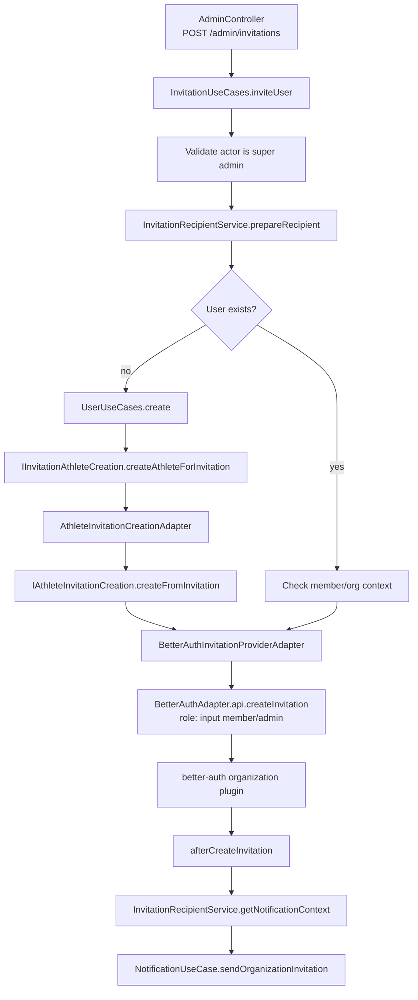
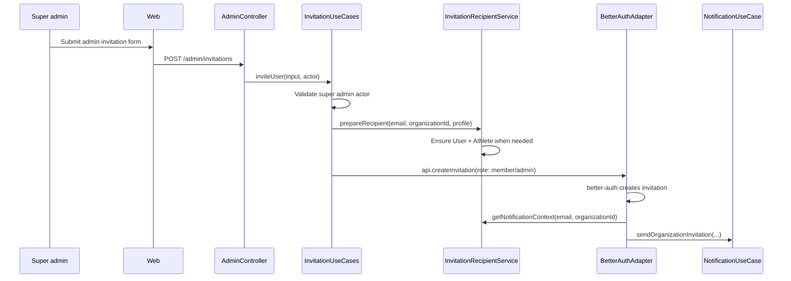
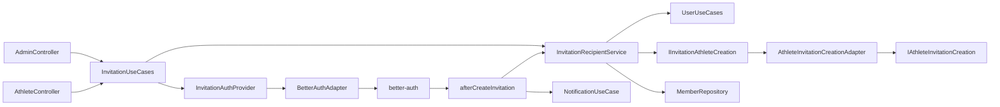
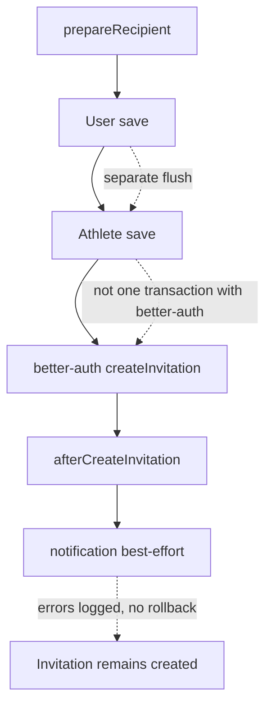

# Invitations Module

Owns invitation orchestration. Existing HTTP routes stay in their current controllers for now.

## Responsibilities

- Prepare invited recipients (`User` + `Athlete` profile when needed).
- Delegate invitation creation to better-auth through `InvitationAuthProvider`.
- Provide recipient context to the better-auth notification hook.
- Keep route-specific authorization inputs explicit via `InvitationActor`.

## Coach Invites Athlete

## Super Admin Invites User

## Module Relations

## Current Boundaries

## Notes

- No `InvitationController` yet.
- Route paths and frontend calls are unchanged.
- `acceptInvitation` still lives in onboarding for now.
- Notification still starts from better-auth `afterCreateInvitation`.
