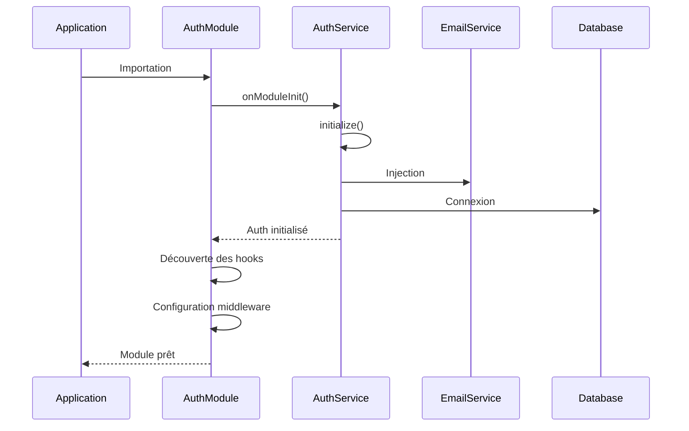
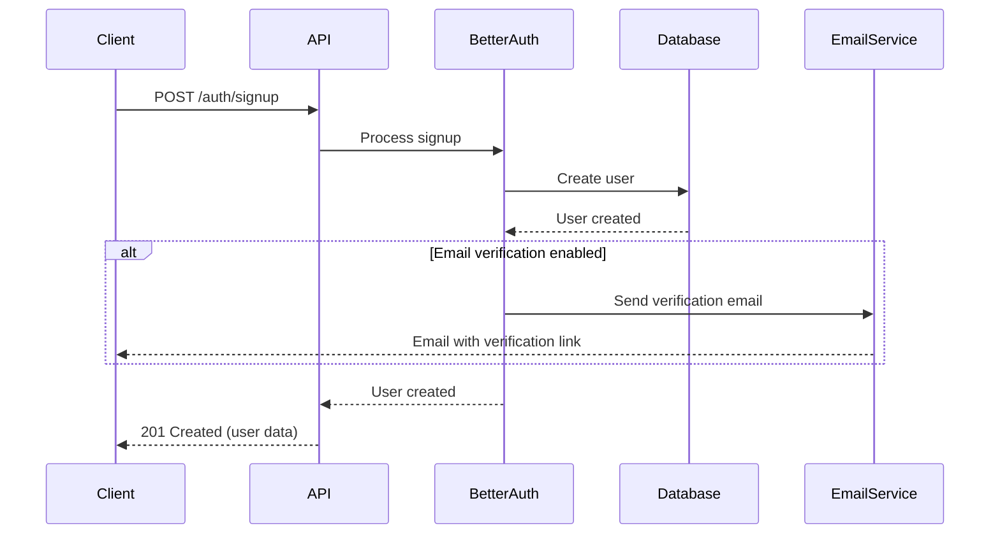
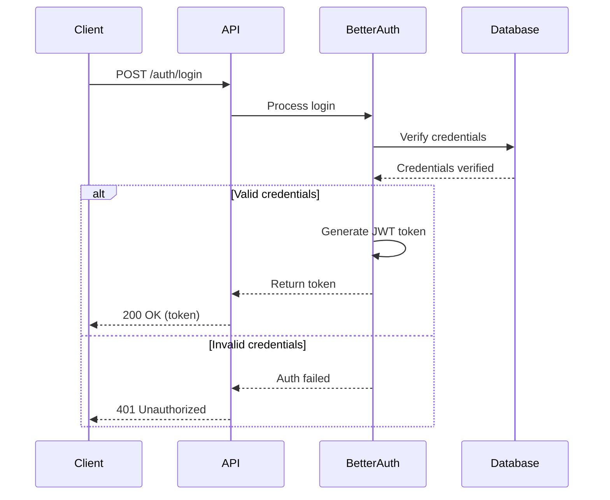
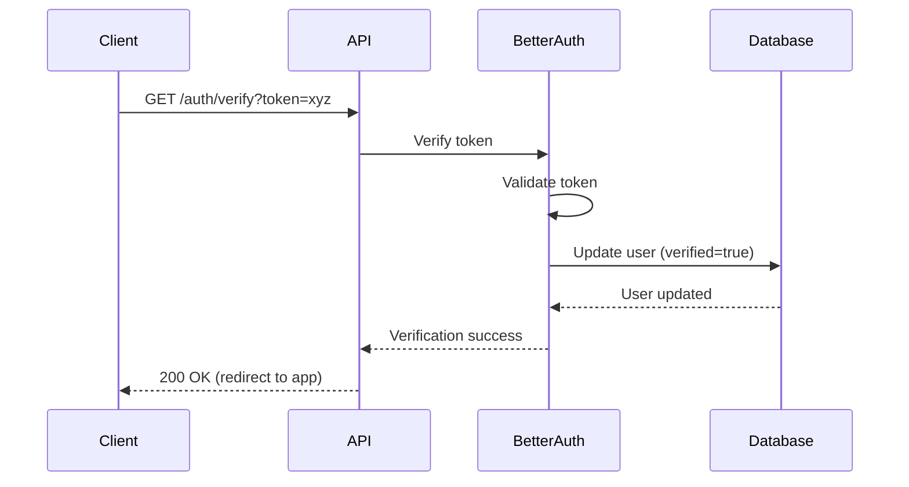
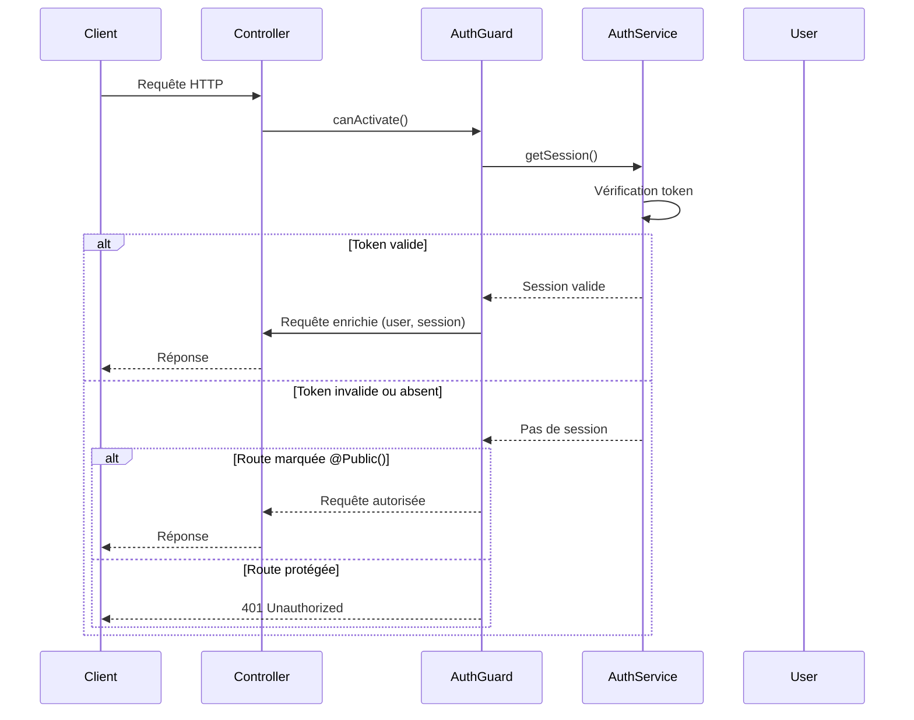
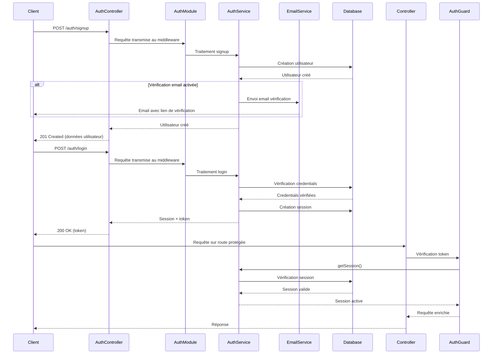

# Authentication Module

Ce module gère l'authentification et l'autorisation des utilisateurs dans l'application.

⚠️ **Avertissement**: Le middleware est configuré pour les routes commençant par `/auth/*`

## Technologies utilisées

- [better-auth](https://www.better-auth.com/docs) - Bibliothèque d'authentification

## Fonctionnalités

- Gestion des sessions utilisateur
- Gestion des comptes utilisateur
- Système de vérification d'email
- Middleware d'authentification
- Guards de protection des routes
- Hooks d'événements d'authentification

## Structure du module

```
modules/auth/
├── auth.decorator.ts  # Décorateurs pour l'authentification
├── auth.entity.ts     # Entités complémentaires pour l'authentification
├── auth.guard.ts      # Guard pour la protection des routes
├── auth.module.ts     # Configuration du module
├── auth.service.ts    # Service d'authentification
└── README.md          # Documentation
```

## Configuration

La configuration de better-auth est définie dans `auth.service.ts` et comprend:

- **secret**: Clé secrète pour signer les JWT
- **trustedOrigins**: Domaines autorisés pour les requêtes cross-origin
- **emailAndPassword**: Configuration pour l'authentification par email/mot de passe
- **emailVerification**: Paramètres pour la vérification des emails
- **database**: Connexion à la base de données PostgreSQL
- **rateLimit**: Paramètres de limitation des requêtes
- **hooks**: Points d'extension pour logiques personnalisées
- **plugins**: Modules additionnels (openAPI)

Exemple de configuration:

```typescript
this._auth = betterAuth({
  secret: config.betterAuth.secret,
  trustedOrigins: config.betterAuth.trustedOrigins,
  emailAndPassword: {
    enabled: true,
    sendResetPassword: async (data) => {
      // Logique d'envoi d'email de réinitialisation
    },
  },
  emailVerification: {
    sendOnSignUp: true,
    expiresIn: 60 * 60 * 24 * 10, // 10 jours
    sendVerificationEmail: async (data) => {
      // Logique d'envoi d'email de vérification
    },
  },
  database: new Pool({
    connectionString: config.database.connectionString,
  }),
  advanced: {
    generateId: false,
  },
  rateLimit: {
    window: 50,
    max: 100,
  },
  hooks: {
    before: createAuthMiddleware(async (ctx) => {
      // Hook avant authentification
    }),
  },
  plugins: [openAPI()],
});
```

## Composants nécessaires et leurs rôles

### 1. auth.service.ts

Service principal qui initialise better-auth et fournit les méthodes d'authentification.

**Pourquoi ?** C'est le cœur du système qui:
- Configure et initialise better-auth
- Expose l'API d'authentification
- Gère la connexion avec votre service d'emails

### 2. auth.guard.ts

Guard NestJS qui vérifie si l'utilisateur est authentifié pour accéder aux routes protégées.

**Pourquoi ?** Il permet de:
- Vérifier automatiquement les tokens d'authentification
- Protéger les routes sensibles
- Injecter l'utilisateur dans la requête

### 3. auth.decorator.ts

Décorateurs qui simplifient la protection des routes et l'accès aux données d'authentification.

**Pourquoi ?** Ils offrent:
- `@Public()` - Marquer une route comme publique
- `@Optional()` - Autoriser l'accès authentifié ou non
- `@Session()` - Accéder à la session dans un contrôleur
- `@BeforeHook()` / `@AfterHook()` - Ajouter des hooks d'authentification

### 4. auth.module.ts

Module NestJS qui configure le système d'authentification et découvre les hooks.

**Pourquoi ?** Il:
- Configure le middleware better-auth
- Enregistre les guards et services
- Détecte et configure les hooks d'authentification
- Applique le middleware sur les routes `/auth/*`

### 5. auth.entity.ts

Définit les entités nécessaires pour le stockage des données d'authentification.

## Rôle de chaque entité d'authentification

### User (Entité existante)

Cette entité est déjà définie dans `src/entities/user.entity.ts`.

**Rôle**: Stocke les informations de base des utilisateurs:
- Identifiants (email, mot de passe)
- Rôles et permissions
- État du compte (actif, vérifié)

### AuthSession

**Rôle**: Gère les sessions actives des utilisateurs:
- Stocke les tokens JWT actifs
- Permet l'invalidation des sessions (déconnexion)
- Garde une trace des appareils connectés (IP, User-Agent)
- Lie les sessions aux utilisateurs

### AuthAccount

**Rôle**: Gère les identités externes (OAuth, réseaux sociaux):
- Stocke les informations de connexion aux services tiers
- Permet la connexion via Google, Facebook, etc.
- Stocke les tokens d'accès et de rafraîchissement
- Lie les comptes externes aux utilisateurs internes

### AuthVerification

**Rôle**: Gère les tokens de vérification temporaires:
- Tokens de vérification d'email
- Tokens de réinitialisation de mot de passe
- Tokens à usage unique 
- Stocke l'expiration des tokens

## Sessions et Tokens

better-auth utilise les JSON Web Tokens (JWT) pour l'authentification:

1. Lors de la connexion, un JWT est généré et signé avec la clé secrète
2. Le client stocke ce token (dans localStorage, cookies, etc.)
3. Pour les requêtes authentifiées, le client envoie le token via l'en-tête HTTP Authorization
4. L'API vérifie la validité du token pour chaque requête protégée

## Routes d'authentification

Better-auth expose automatiquement plusieurs endpoints sur le préfixe `/auth`:

| Route | Méthode | Description |
|-------|---------|-------------|
| `/auth/signup` | POST | Inscription d'un nouvel utilisateur |
| `/auth/login` | POST | Connexion d'un utilisateur |
| `/auth/logout` | POST | Déconnexion de l'utilisateur |
| `/auth/me` | GET | Informations sur l'utilisateur connecté |
| `/auth/refresh` | POST | Rafraîchissement du token |
| `/auth/verify` | GET | Vérification de l'email avec token |
| `/auth/reset-password` | POST | Demande de réinitialisation de mot de passe |

## Guide d'utilisation des Guards et Décorateurs

### Protection des routes avec AuthGuard

Pour protéger une API entière:

```typescript
// athlete.controller.ts
import { Controller, UseGuards } from '@nestjs/common';
import { AuthGuard } from '../auth/auth.guard';

@Controller('athlete')
@UseGuards(AuthGuard)  // ⚠️ Protège toutes les routes du contrôleur
export class AthleteController {
  // Toutes les routes nécessitent une authentification
}
```

Pour protéger une route spécifique:

```typescript
// athlete.controller.ts
import { Controller, Get, UseGuards } from '@nestjs/common';
import { AuthGuard } from '../auth/auth.guard';

@Controller('athlete')
export class AthleteController {
  @Get('protected')
  @UseGuards(AuthGuard)  // ⚠️ Protège uniquement cette route
  getProtectedData() {
    // Cette route nécessite une authentification
  }
  
  @Get('public')
  getPublicData() {
    // Cette route est accessible sans authentification
  }
}
```

### Utilisation du décorateur @Public()

Pour rendre une route publique dans un contrôleur protégé:

```typescript
// athlete.controller.ts
import { Controller, Get, UseGuards } from '@nestjs/common';
import { AuthGuard } from '../auth/auth.guard';
import { Public } from '../auth/auth.decorator';

@Controller('athlete')
@UseGuards(AuthGuard)  // Protège toutes les routes par défaut
export class AthleteController {
  @Get('private')
  getPrivateData() {
    // Cette route nécessite une authentification
  }
  
  @Get('public')
  @Public()  // ⚠️ Marque cette route comme publique
  getPublicData() {
    // Cette route est accessible sans authentification
  }
}
```

### Utilisation du décorateur @Session()

Pour accéder aux données de session dans un contrôleur:

```typescript
// profile.controller.ts
import { Controller, Get, UseGuards } from '@nestjs/common';
import { AuthGuard } from '../auth/auth.guard';
import { Session } from '../auth/auth.decorator';

@Controller('profile')
@UseGuards(AuthGuard)
export class ProfileController {
  @Get()
  getProfile(@Session() session) {  // ⚠️ Injection de la session
    // session contient les données de l'utilisateur connecté
    return {
      user: session.user,
      // Autres données du profil
    };
  }
}
```

### Utilisation du décorateur @Optional()

Pour rendre l'authentification optionnelle sur une route:

```typescript
// content.controller.ts
import { Controller, Get, UseGuards } from '@nestjs/common';
import { AuthGuard } from '../auth/auth.guard';
import { Optional, Session } from '../auth/auth.decorator';

@Controller('content')
@UseGuards(AuthGuard)
export class ContentController {
  @Get('articles')
  @Optional()  // ⚠️ Authentification optionnelle
  getArticles(@Session() session) {
    if (session) {
      // Utilisateur authentifié : contenu personnalisé
      return this.getPersonalizedContent(session.user);
    } else {
      // Utilisateur non authentifié : contenu public
      return this.getPublicContent();
    }
  }
}
```

### Middleware d'authentification

En plus du Guard NestJS, better-auth fournit un middleware traditionnel:

```typescript
import { auth } from './auth.service';

// Protéger une route avec le middleware (pour les apps Express)
app.get('/protected-route', auth.middleware(), (req, res) => {
  // Accès aux infos utilisateur via req.user
  res.json({ message: 'Route protégée', user: req.user });
});
```

## Personnalisation

Les hooks before/after permettent d'exécuter du code personnalisé pendant le processus d'authentification:

```typescript
hooks: {
  before: createAuthMiddleware(async (ctx) => {
    // Code exécuté avant l'authentification
  }),
  after: createAuthMiddleware(async (ctx) => {
    // Code exécuté après l'authentification réussie
  }),
}
```

## Envoi d'emails

Better-auth n'inclut pas de fonctionnalité d'envoi d'emails, mais expose des hooks pour l'intégrer avec une bibliothèque d'envoi d'emails.

Pour l'implémentation détaillée de l'envoi d'emails, référez-vous au README du module Email dans `apps/api/src/modules/email/README.md`.

## Diagrammes de séquence

### Initialisation du module Auth



### Inscription (Sign Up)



### Connexion (Login)



### Vérification d'email



### Protection d'une route avec AuthGuard



### Flux d'authentification complet



### Réinitialisation de mot de passe


## Implémentation recommandée

1. **Importez le module Auth** dans votre AppModule
2. **Protégez vos routes** avec le AuthGuard
3. **Utilisez les décorateurs** pour gérer les exceptions et accéder aux données de session
4. **Vérifiez que votre entité User** contient tous les champs requis
