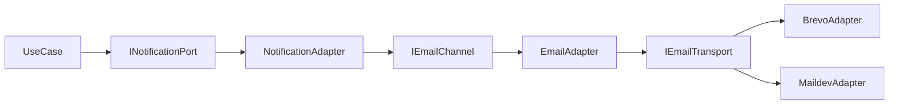

# Architecture Hexagonale dans DropIt

Ce document est la **référence française** pour les patterns transverses de l’API (ports, adapters, injection Nest avec tokens, `useFactory`, découpage canal/transport). Les README des modules (ex. notification, auth) renvoient ici pour la théorie et gardent les détails propres au module.

## Vue d'ensemble

DropIt utilise une approche inspirée de l'architecture hexagonale (aussi appelée "Ports & Adapters") pour isoler la **logique métier** des **frameworks et infrastructures**.

### ⚠️ Implémentation Partielle

Cette architecture est une **implémentation pragmatique** de l'hexagonale, avec un compromis assumé :
- ✅ **Use-cases framework-agnostic** : Logique métier pure TypeScript
- ✅ **Ports & Adapters** : Injection via interfaces
- 🟡 **Entités avec MikroORM** : Les entités domaine utilisent les décorateurs ORM pour éviter un double mapping

Ce compromis permet de bénéficier des avantages de l'architecture hexagonale (testabilité, indépendance des use-cases) sans la complexité d'un mapping complet.

### Objectifs
- ✅ **Indépendance du framework** : La logique métier ne dépend pas de NestJS
- ✅ **Testabilité** : Les use-cases sont testables sans mock du framework
- ✅ **Flexibilité** : Possibilité de changer de framework (NestJS → Express, etc.) sans toucher au métier
- ✅ **Clarté** : Séparation nette des responsabilités

### Pourquoi cette architecture ?

L'API a progressivement évolué d'une architecture n-tiers classique vers cette approche hexagonale partielle. Cette évolution répond à une double motivation : approfondir ma compréhension de patterns architecturaux rencontrés en contexte professionnel, et anticiper des évolutions futures nécessitant l'isolation de la logique métier (intégration matériel externe, sources de données tierces).

Cette implémentation reste partielle : mes entités domaine conservent les décorateurs MikroORM plutôt que d'être des objets métier purs. Ce compromis pragmatique m'a permis de livrer un MVP fonctionnel tout en explorant concrètement les bénéfices et contraintes de l'architecture hexagonale, au-delà de la théorie.

---

## Structure des Couches

```
modules/
└── athletes/
    ├── domain/              # 🔵 Couche Domain (Entités métier)
    │   └── athlete.entity.ts
    │
    ├── application/         # 🟢 Couche Application (Logique métier)
    │   ├── ports/          # Interfaces (contrats)
    │   │   ├── athlete.repository.ts        # IAthleteRepository (Output Port)
    │   │   └── athlete-use-cases.port.ts    # IAthleteUseCases (Input Port)
    │   └── use-cases/
    │       └── athlete-use-cases.ts         # Implémentation (framework-agnostic)
    │
    ├── infrastructure/      # 🟡 Couche Infrastructure (Adaptateurs sortants)
    │   └── mikro-athlete.repository.ts      # Implémentation MikroORM
    │
    └── interface/          # 🔴 Couche Interface (Adaptateurs entrants)
        ├── controllers/
        │   └── athlete.controller.ts        # Controller NestJS
        ├── mappers/
        │   └── athlete.mapper.ts            # Entité → DTO
        └── presenters/
            └── athlete.presenter.ts         # DTO → Réponse HTTP
```

### Règle de placement (application / infrastructure / interface)

- **`application/`** : ports (contrats), use-cases sans décorateurs Nest, types et exceptions métier. Aucune dépendance à NestJS, à l’ORM ni aux SDK externes.
- **`infrastructure/`** : implémentations des ports sortants (`@Injectable()`, `@Inject()`, accès base de données, APIs tierces, email, etc.).
- **`interface/`** : adaptateurs entrants (controllers, mappers, presenters).
- **`*Module` Nest** : composition uniquement — enregistre les `providers`, `useFactory` / `useClass`, et relie chaque **token** (`Symbol`) à son implémentation.

---

## Flux de Données

### Requête HTTP → Réponse

```
1. HTTP Request
   ↓
2. 🔴 Controller (NestJS)
   - Valide les permissions
   - Extrait les paramètres
   ↓
3. 🟢 Use-Case (Pure TypeScript)
   - Logique métier
   - Règles de validation
   - Orchestration
   ↓
4. 🟡 Repository (MikroORM)
   - Accès base de données
   ↓
5. 🔵 Entity (Domain)
   - Retourne l'entité métier
   ↓
6. 🔴 Mapper (Interface)
   - Entité → DTO
   ↓
7. 🔴 Presenter (Interface)
   - DTO → Réponse HTTP (status code, format)
   ↓
8. HTTP Response
```

---

## Ports & Adapters

### 🔌 Qu'est-ce qu'un Port ?

Un **port** est une **interface** qui définit un contrat. C'est un point d'entrée ou de sortie de l'application.

#### Input Port (Port d'entrée)
Interface exposée par l'application (ce que l'extérieur peut appeler).

**Exemple** : `IAthleteUseCases`

```typescript
// application/ports/athlete-use-cases.port.ts
export interface IAthleteUseCases {
  findOne(id: string, userId: string, orgId: string): Promise<Athlete>;
  create(data: CreateAthlete, userId: string): Promise<Athlete>;
  // ...
}

export const ATHLETE_USE_CASES = Symbol('ATHLETE_USE_CASES'); // Token d'injection
```

#### Output Port (Port de sortie)
Interface que l'application utilise pour communiquer avec l'extérieur (DB, API, etc.).

**Exemple** : `IAthleteRepository`

```typescript
// application/ports/athlete.repository.ts
export interface IAthleteRepository {
  getOne(id: string): Promise<Athlete | null>;
  save(athlete: Athlete): Promise<void>;
  // ...
}

export const ATHLETE_REPO = Symbol('ATHLETE_REPO'); // Token d'injection
```

### 🔌 Qu'est-ce qu'un Adapter ?

Un **adapter** est une **implémentation** d'un port. Il adapte une technologie spécifique au contrat défini.

#### Driving Adapter (Adaptateur entrant)
Appelle l'application depuis l'extérieur.

**Exemple** : `AthleteController` (adapter NestJS)

```typescript
// interface/controllers/athlete.controller.ts
@Controller()
export class AthleteController {
  constructor(
    @Inject(ATHLETE_USE_CASES) // ✅ Dépend de l'interface, pas de l'implémentation
    private readonly athleteUseCases: IAthleteUseCases
  ) {}
}
```

#### Driven Adapter (Adaptateur sortant)
Implémente les ports de sortie avec une technologie spécifique.

**Exemple** : `MikroAthleteRepository` (adapter MikroORM)

```typescript
// infrastructure/mikro-athlete.repository.ts
@Injectable()
export class MikroAthleteRepository implements IAthleteRepository {
  // Utilise MikroORM pour accéder à la DB
}
```

---

## Injection de Dépendances

### Qu'est-ce qu'un Token d'Injection ?

Un **token** est un **identifiant unique** utilisé par NestJS pour savoir **quelle implémentation injecter** quand on demande une interface.

#### Pourquoi des Symbols ?

En TypeScript, les interfaces n'existent pas au runtime. On ne peut pas faire :
```typescript
@Inject(IAthleteUseCases) // ❌ IAthleteUseCases n'existe pas au runtime
```

On utilise donc un **Symbol** comme token :
```typescript
export const ATHLETE_USE_CASES = Symbol('ATHLETE_USE_CASES'); // ✅ Existe au runtime

@Inject(ATHLETE_USE_CASES) // ✅ Fonctionne !
```

### Configuration dans le Module NestJS

Le module NestJS fait le lien entre les **ports** (interfaces) et les **adapters** (implémentations).

```typescript
// athletes.module.ts
@Module({
  providers: [
    // 1️⃣ Repositories : Port → Adapter
    MikroAthleteRepository, // Implémentation concrète
    {
      provide: ATHLETE_REPO, // Token (identifiant)
      useClass: MikroAthleteRepository, // Quelle classe injecter
    },

    // 2️⃣ Use-Cases : Port → Adapter
    AthleteUseCases, // Implémentation concrète
    {
      provide: ATHLETE_USE_CASES, // Token
      useFactory: (
        athleteRepo: IAthleteRepository,
        userUseCases: UserUseCases,
        memberUseCases: MemberUseCases
      ) => {
        // Factory : on construit l'instance manuellement
        return new AthleteUseCases(athleteRepo, userUseCases, memberUseCases);
      },
      inject: [ATHLETE_REPO, UserUseCases, MemberUseCases], // Dépendances à injecter
    },
  ],
})
export class AthletesModule {}
```

### Pourquoi pas de `@Injectable()` dans les Use Cases ?

Les use cases sont dans la couche **application** et doivent rester **framework-agnostic**.

```typescript
// ❌ MAUVAIS - Couplage à NestJS
@Injectable() // <- Dépendance à NestJS !
export class AthleteUseCases {
  constructor(
    @Inject(ATHLETE_REPO) // <- Dépendance à NestJS !
    private readonly athleteRepository: IAthleteRepository
  ) {}
}

// ✅ BON - Framework-agnostic
export class AthleteUseCases { // <- Pur TypeScript !
  constructor(
    private readonly athleteRepository: IAthleteRepository // <- Pas de décorateur !
  ) {}
}
```

**Résultat** : Le même use-case peut être utilisé dans NestJS, Express, CLI, Lambda, etc.

### Pourquoi utiliser `useFactory` ?

#### Option 1 : `useClass` (simple)
```typescript
{
  provide: ATHLETE_USE_CASES,
  useClass: AthleteUseCases, // ❌ NestJS ne peut pas résoudre les dépendances
}
```
**Problème** : NestJS ne peut pas injecter automatiquement car `AthleteUseCases` n'a plus `@Injectable()`.

#### Option 2 : `useFactory` (flexible) ✅
```typescript
{
  provide: ATHLETE_USE_CASES,
  useFactory: (repo, user, member) => new AthleteUseCases(repo, user, member),
  inject: [ATHLETE_REPO, UserUseCases, MemberUseCases],
}
```
**Avantage** : On contrôle la création de l'instance et on injecte les dépendances manuellement.

### Composition d’adaptateurs sortants : port → canal → transport

Parfois un seul adapter ne suffit pas : on découpe en **plusieurs responsabilités**, chacune derrière un petit contrat.

- **Port sortant large** : ce que le use-case voit (ex. « envoyer une notification »).
- **Canal** : traduit une demande métier en message adapté au médium (ex. construire un email HTML à partir d’un `NotificationRequest`).
- **Transport** : envoie réellement le message avec une technologie précise (ex. SMTP local en dev, API HTTP en prod).

Le use-case et les ports **application** ne choisissent pas Maildev vs Brevo : ce choix vit dans une **factory** enregistrée dans le module (voir ci-dessous). Exemple concret dans le dépôt : module **notification** — `INotificationPort` / `NotificationAdapter`, canaux email/SMS/push, et `EMAIL_TRANSPORT` pour Brevo ou Maildev.



### Factory pilotée par l’environnement

Quand l’implémentation dépend du **contexte d’exécution** (dev, test, prod), un `useFactory` sans dépendances injectées, ou avec la config, permet de retourner la bonne classe **sans** que les adapters métier contiennent de `if (env === 'production')`.

Pattern typique dans un `@Module` :

```typescript
{
  provide: EMAIL_TRANSPORT,
  useFactory: (): IEmailTransport => {
    if (config.env !== 'production') {
      return new MaildevAdapter(/* … */);
    }
    if (!config.email.brevo.apiKey) {
      throw new Error('BREVO_API_KEY is required in production');
    }
    return new BrevoAdapter(/* … */);
  },
}
```

Les adapters (canal) reçoivent uniquement `IEmailTransport` via `@Inject(EMAIL_TRANSPORT)` : ils restent testables et découplés du fournisseur concret.

### Fail-fast au démarrage

Pour l’infra **indispensable** (clés API, URLs, secrets), il est préférable de **faire échouer le bootstrap** de l’application si la configuration est invalide, plutôt que de découvrir l’erreur au premier envoi en production. Les `useFactory` du module sont un endroit naturel pour ces validations.

---

## Flux de Démarrage

### 1. NestJS démarre et scanne les modules

```typescript
@Module({
  imports: [AthletesModule],
})
export class AppModule {}
```

### 2. NestJS enregistre les providers

Pour chaque provider dans `AthletesModule` :
- `ATHLETE_REPO` → `MikroAthleteRepository`
- `ATHLETE_USE_CASES` → Factory qui crée `AthleteUseCases`

### 3. Injection dans le Controller

```typescript
@Controller()
export class AthleteController {
  constructor(
    @Inject(ATHLETE_USE_CASES) // NestJS cherche le provider avec ce token
    private readonly athleteUseCases: IAthleteUseCases
  ) {}
}
```

**Ce qui se passe** :
1. NestJS voit `@Inject(ATHLETE_USE_CASES)`
2. Il cherche le provider avec `provide: ATHLETE_USE_CASES`
3. Il exécute la factory : `(repo, user, member) => new AthleteUseCases(...)`
4. Pour exécuter la factory, il injecte les dépendances listées dans `inject: [...]`
5. Il retourne l'instance créée au controller

---

## Gestion des Erreurs

### Dans le Use-Case (Application Layer)

On utilise des **erreurs JavaScript standard** pour rester framework-agnostic :

```typescript
// application/use-cases/athlete-use-cases.ts
async findOne(id: string): Promise<Athlete> {
  const athlete = await this.athleteRepository.getOne(id);

  if (!athlete) {
    throw new Error(`Athlete with ID ${id} not found`); // ✅ Standard JS
  }

  return athlete;
}
```

### Dans le Controller (Interface Layer)

Le **Presenter** convertit les erreurs en réponses HTTP appropriées :

```typescript
// interface/controllers/athlete.controller.ts
@TsRestHandler(c.getAthlete)
getAthlete() {
  return tsRestHandler(c.getAthlete, async ({ params }) => {
    try {
      const athlete = await this.athleteUseCases.findOne(params.id);
      const dto = AthleteMapper.toDto(athlete);
      return AthletePresenter.presentOne(dto); // 200 OK
    } catch (error) {
      return AthletePresenter.presentError(error as Error); // 404, 500, etc.
    }
  });
}
```

Le **Presenter** analyse l'erreur et retourne le bon code HTTP :
- `"not found"` → `404 Not Found`
- `"already exists"` → `400 Bad Request`
- Autre → `500 Internal Server Error`

---

## Avantages de cette Architecture

### ✅ Indépendance du Framework

**Sans architecture hexagonale :**
```typescript
import { Injectable, NotFoundException } from '@nestjs/common'; // ❌ Couplage NestJS

@Injectable()
export class AthleteUseCases {
  async findOne(id: string) {
    if (!athlete) {
      throw new NotFoundException(); // ❌ Exception NestJS
    }
  }
}
```

**Avec architecture hexagonale :**
```typescript
// ✅ Zéro import NestJS, pure TypeScript
export class AthleteUseCases implements IAthleteUseCases {
  async findOne(id: string): Promise<Athlete> {
    if (!athlete) {
      throw new Error('Athlete not found'); // ✅ Standard JS
    }
  }
}
```

→ Ce code peut tourner dans **n'importe quel environnement** (Express, CLI, Lambda, etc.)

### ✅ Testabilité

**Tests unitaires simples** sans mock NestJS :

```typescript
describe('AthleteUseCases', () => {
  it('should find athlete', async () => {
    // Arrange : Mock simple de l'interface
    const mockRepo: IAthleteRepository = {
      getOne: jest.fn().mockResolvedValue(athlete),
    };
    const useCase = new AthleteUseCases(mockRepo, mockUser, mockMember);

    // Act
    const result = await useCase.findOne('123', 'user-id', 'org-id');

    // Assert
    expect(result).toBe(athlete);
  });
});
```

→ Pas besoin de `TestingModule`, `@nestjs/testing`, etc.

### ✅ Réutilisabilité

Le même use-case peut être utilisé dans :
- API REST (NestJS)
- GraphQL (Apollo)
- CLI
- Message Queue (Bull, RabbitMQ)
- Serverless (Lambda)

→ Seuls les **adapters** changent, la **logique métier** reste identique.

---

## Checklist : Comment implémenter un nouveau Use-Case

### 1. Définir le Port (Interface)

```typescript
// application/ports/my-feature-use-cases.port.ts
export interface IMyFeatureUseCases {
  doSomething(data: CreateData): Promise<Entity>;
}

export const MY_FEATURE_USE_CASES = Symbol('MY_FEATURE_USE_CASES');
```

### 2. Implémenter le Use-Case

```typescript
// application/use-cases/my-feature-use-cases.ts
export class MyFeatureUseCases implements IMyFeatureUseCases {
  constructor(
    private readonly repository: IMyRepository, // Interface !
    private readonly otherService: IOtherService, // Interface !
  ) {}

  async doSomething(data: CreateData): Promise<Entity> {
    // Logique métier pure
    // Pas d'import NestJS, juste TypeScript
    const entity = await this.repository.save(data);
    return entity;
  }
}
```

### 3. Créer le Controller

```typescript
// interface/controllers/my-feature.controller.ts
@Controller()
export class MyFeatureController {
  constructor(
    @Inject(MY_FEATURE_USE_CASES)
    private readonly useCases: IMyFeatureUseCases
  ) {}

  @TsRestHandler(contract.doSomething)
  doSomething() {
    return tsRestHandler(contract.doSomething, async ({ body }) => {
      try {
        const entity = await this.useCases.doSomething(body);
        const dto = MyMapper.toDto(entity);
        return MyPresenter.presentOne(dto);
      } catch (error) {
        return MyPresenter.presentError(error as Error);
      }
    });
  }
}
```

### 4. Configurer le Module

```typescript
// my-feature.module.ts
@Module({
  providers: [
    MyFeatureUseCases,
    {
      provide: MY_FEATURE_USE_CASES,
      useFactory: (repo: IMyRepository, other: IOtherService) => {
        return new MyFeatureUseCases(repo, other);
      },
      inject: [MY_REPOSITORY, OTHER_SERVICE],
    },
  ],
})
export class MyFeatureModule {}
```

---

## Ressources

- [Hexagonal Architecture (Alistair Cockburn)](https://alistair.cockburn.us/hexagonal-architecture/)
- [NestJS Dependency Injection](https://docs.nestjs.com/fundamentals/custom-providers)
- [Clean Architecture (Robert C. Martin)](https://blog.cleancoder.com/uncle-bob/2012/08/13/the-clean-architecture.html)
- Exemple appliqué dans le dépôt : [module notification](../apps/api/src/modules/notification/README.md) (flux métier, canaux, wiring Nest)

---

## État Actuel du Projet

### ✅ Modules refactorisés en architecture hexagonale

**Athletes Module :**
- `athlete-use-cases` ✅
- `personal-record-use-cases` (à refactoriser)
- `competitor-status-use-cases` (à refactoriser)

**Training Module :**
- `exercise-use-cases` (à refactoriser)
- `complex-use-cases` (à refactoriser)
- `workout-use-cases` (à refactoriser)
- `training-session-use-cases` (à refactoriser)

**Notification Module :**
- Ports IN/OUT, use-case pur, adapters canaux + factory transport (Maildev / Brevo) ✅ — voir [apps/api/src/modules/notification/README.md](../apps/api/src/modules/notification/README.md)

**Auth Module :**
- Structure hexagonale en place (ports, use-cases, adapters better-auth, repositories MikroORM) ; affinages et alignement avec le reste du monorepo en cours selon les besoins produit (OTP, organisations, etc.)
