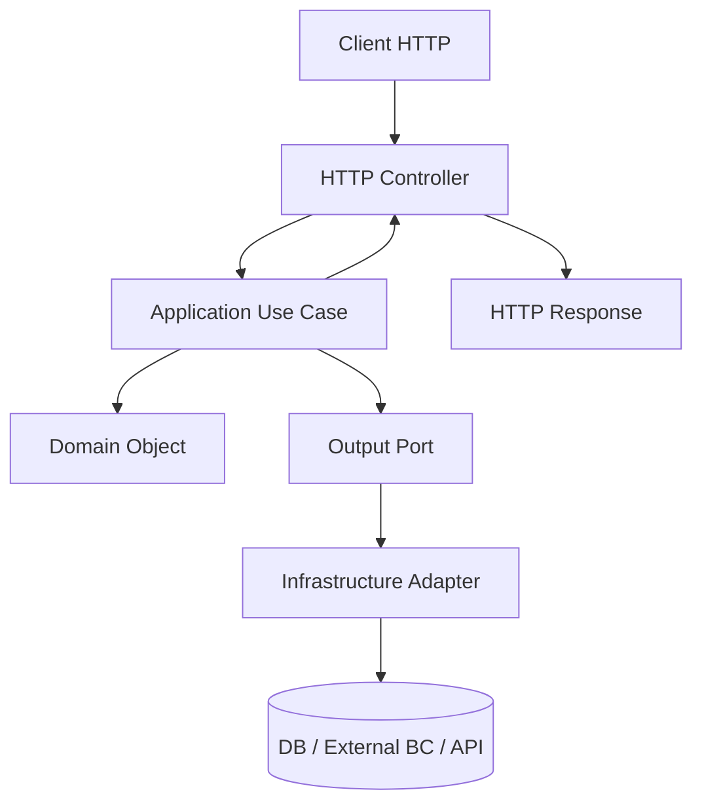
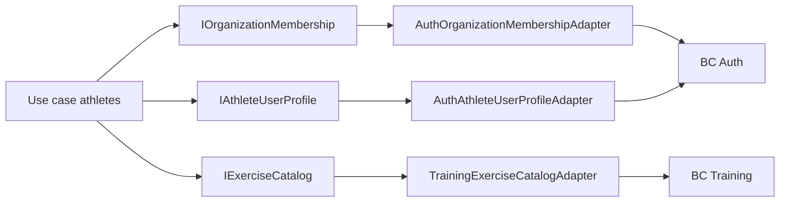
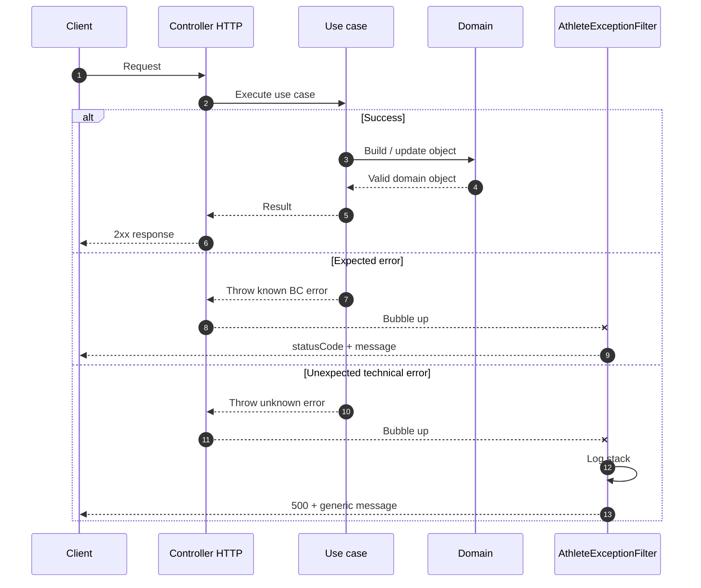
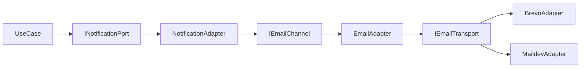

# Architecture Hexagonale dans DropIt

Ce document est la **référence** pour les patterns transverses de l’API DropIt : ports, adapters, injection Nest avec tokens, `useFactory`, découpage canal/transport, séparation HTTP / application / infrastructure, et compromis pragmatiques du projet.

Il garde aussi une dimension de **journal d’évolution** : l’API a commencé avec une architecture n-tiers plus classique, puis certains bounded contexts ont été migrés progressivement vers une architecture hexagonale. Aujourd’hui, le bounded context **`athletes`** est le cas de référence le plus abouti.

---

## Vue d’ensemble

DropIt utilise une approche inspirée de l’architecture hexagonale, aussi appelée **Ports & Adapters**, pour isoler la logique métier des frameworks et des détails d’infrastructure.

L’objectif n’est pas d’appliquer une Clean Architecture académique partout et dogmatique. L’objectif est plutôt de faire évoluer le monorepo vers une architecture plus testable, plus lisible et moins couplée, en priorisant les bounded contexts qui portent le plus de logique métier.

### Objectifs

- **Indépendance du framework** : la logique métier ne dépend pas de NestJS.
- **Testabilité** : les use cases sont testables sans `TestingModule` Nest.
- **Découplage infrastructure** : l’application dépend de ports, pas de MikroORM, Auth, Training, Brevo, etc.
- **Clarté des responsabilités** : HTTP, application, domaine et infrastructure ne jouent pas le même rôle.
- **Migration progressive** : un module peut être amélioré sans réécrire toute l’API.

### Pourquoi cette architecture ?

L’API a progressivement évolué d’une architecture **n-tiers classique** vers cette approche hexagonale. Cette évolution répond à une double motivation : approfondir des patterns architecturaux rencontrés en contexte professionnel, et anticiper des évolutions futures nécessitant l’isolation de la logique métier, par exemple l’intégration de matériel externe, de sources de données tierces ou de nouveaux canaux d’entrée.

Cette migration reste pragmatique : tous les modules ne sont pas au même niveau de maturité. Certains modules historiques conservent encore des entités ou services plus couplés à l’ORM ou à NestJS. En revanche, le bounded context **`athletes`** illustre désormais la cible actuelle : domaine TypeScript pur, ports entrants/sortants explicites, adapters isolés, composition Nest dans le module.

---

## Implémentation pragmatique

### Ce qui est visé

- Les classes `application/` et `domain/` ne doivent pas dépendre de NestJS.
- Les use cases reçoivent leurs dépendances via des interfaces.
- Les dépendances techniques vivent dans `infrastructure/` ou `http/`.
- Le `*Module` Nest est la couche de composition : il branche les tokens vers les implémentations concrètes.

### Ce qui varie encore selon les modules

- Certains bounded contexts historiques ont encore des entités domaine couplées à MikroORM.
- Certains services applicatifs sont encore plus proches du modèle n-tiers.
- Certains contrats d’erreur ou DTOs sont encore à affiner.

### Cas de référence actuel : `athletes`

Le bounded context `athletes` est aujourd’hui globalement aligné avec l’architecture cible :

- ✅ Domaine pur TypeScript : `Athlete`, `PersonalRecord`, `PhysicalMetric`, `CompetitorStatus`, `PersonalRecordExercise`.
- ✅ Entités MikroORM sorties du domaine et placées dans `modules/database/entities`.
- ✅ Ports entrants découpés par capacité métier.
- ✅ Ports sortants pour persistence et dépendances inter-BC.
- ✅ Génération de strong IDs (`AthleteId`, `PersonalRecordId`, etc.) côté application/domaine et passés obligatoirement aux factories du domaine.
- ✅ Repositories MikroORM isolés en infrastructure.
- ✅ Adapters vers Auth et Training derrière des ports.
- ✅ Mappers séparés entre persistence/domain et HTTP/DTO.
- ✅ Policies d’accès dans la couche application.
- ✅ Exception filter HTTP dédié.
- ✅ Read-models applicatifs pour les vues optimisées.

Restes, compromis ou chantiers connus :
- Certains inputs applicatifs utilisent encore des types issus de `@dropit/schemas`.
- Les tests doivent être renforcés pour profiter réellement de cette architecture : tests unitaires des objets domaine et use cases avec ports mockés, sans `TestingModule` Nest ni base de données.- Les autres bounded contexts ne sont pas tous au même niveau de séparation.

---

## Structure des couches

Structure cible illustrée par `apps/api/src/modules/athletes` :

```txt
modules/
└── athletes/
    ├── domain/
    │   ├── athlete.ts
    │   ├── personal-record.ts
    │   ├── personal-record-exercise.ts
    │   ├── physical-metric.ts
    │   ├── competitor-status.ts
    │   └── *-id.ts
    │
    ├── application/
    │   ├── athlete-profiles.ts
    │   ├── athlete-invitation-creation.ts
    │   ├── athlete-personal-records.ts
    │   ├── athlete-physical-metrics.ts
    │   ├── athlete-competition-status.ts
    │   ├── ports/
    │   │   ├── in/
    │   │   └── out/
    │   ├── policies/
    │   ├── errors/
    │   └── models/
    │
    ├── infrastructure/
    │   ├── mikro-athlete.repository.ts
    │   ├── mikro-personal-record.repository.ts
    │   ├── mikro-physical-metric.repository.ts
    │   ├── mikro-competitor-status.repository.ts
    │   ├── auth-organization-membership.adapter.ts
    │   ├── auth-athlete-user-profile.adapter.ts
    │   ├── training-exercise-catalog.adapter.ts
    │   └── mappers/
    │
    ├── http/
    │   ├── athlete.controller.ts
    │   ├── personal-record.controller.ts
    │   ├── physical-metric.controller.ts
    │   ├── competitor-status.controller.ts
    │   ├── athlete-exception.filter.ts
    │   └── mappers/
    │
    └── athletes.module.ts
```

### Règle de placement

- **`domain/`** : objets métier, invariants, value objects, IDs, erreurs domaine. Pas de NestJS, pas de MikroORM, pas d’API externe.
- **`application/`** : use cases, ports, policies, erreurs applicatives, models. Pas de décorateurs Nest, pas d’accès direct à l’ORM.
- **`application/ports/in/`** : contrats appelés par les adapters entrants, par exemple HTTP.
- **`application/ports/out/`** : contrats utilisés par les use cases pour sortir du cœur applicatif : repositories, autres BC, APIs externes.
- **`infrastructure/`** : adapters sortants : repositories MikroORM, adapters vers Auth/Training, SDKs externes, mappers persistence.
- **`http/`** : adapters entrants HTTP : controllers, mappers DTO, filters, parsing des paramètres externes.
- **`*Module` Nest** : composition uniquement — enregistre les providers, `useFactory` / `useClass`, et relie chaque token `Symbol` à son implémentation.

---

## Flux de données

### Requête HTTP → réponse HTTP

```txt
1. HTTP Request
   ↓
2. 🔴 Controller HTTP NestJS
   - Applique guards / permissions
   - Parse les IDs externes
   - Mappe body/params vers inputs applicatifs
   ↓
3. 🟢 Use case application
   - Orchestre le cas d’usage
   - Applique les règles applicatives
   - Appelle les policies et ports sortants
   ↓
4. 🔵 Domaine
   - Porte les invariants métier
   - Construit / modifie des objets valides
   ↓
5. 🟡 Adapter infrastructure
   - Repository MikroORM, adapter Auth, adapter Training, API externe...
   ↓
6. 🟢 Use case application
   - Retourne domaine ou read-model
   ↓
7. 🔴 Mapper HTTP / Exception filter
   - Transforme le résultat ou l’erreur en réponse HTTP
   ↓
8. HTTP Response
```



---

## Ports & Adapters

### Qu’est-ce qu’un port ?

Un **port** est une interface qui définit un contrat. Il représente ce que le cœur applicatif expose ou ce dont il a besoin.

#### Input port

Un input port décrit ce qu’un adapter entrant peut appeler.

Exemple dans `athletes` :

```typescript
// application/ports/in/athlete-profiles.port.ts

export interface IAthleteProfiles {
  findById(athleteId: AthleteId, currentUserId: UserId, organizationId: OrganizationId): Promise<Athlete>;
  findDetailsById(athleteId: AthleteId, currentUserId: UserId, organizationId: OrganizationId): Promise<AthleteDetailsReadModel>;
  listAccessible(currentUserId: UserId, organizationId: OrganizationId): Promise<Athlete[]>;
  listAccessibleDetails(currentUserId: UserId, organizationId: OrganizationId, query: SearchablePaginationQuery): Promise<PaginatedAthleteDetailsReadModel>;
  listDetailsByOrganization(organizationId: OrganizationId, query: SearchablePaginationQuery): Promise<PaginatedAthleteDetailsReadModel>;
  create(data: AthleteCreation): Promise<Athlete>;
  updateOwn(athleteId: AthleteId, data: AthleteUpdate, userId: UserId): Promise<Athlete>;
  deleteOwn(athleteId: AthleteId, userId: UserId): Promise<void>;
  findIdByUserId(userId: UserId): Promise<string | null>;
}
```

Le BC `athletes` expose plusieurs ports entrants au lieu d’un seul gros service :

- `ATHLETE_PROFILES`
- `ATHLETE_INVITATION_CREATION`
- `ATHLETE_PERSONAL_RECORDS`
- `ATHLETE_PHYSICAL_METRICS`
- `ATHLETE_COMPETITION_STATUS`

Ce découpage rend les responsabilités plus lisibles qu’un unique `AthleteUseCases` monolithique.

#### Output port

Un output port décrit une dépendance dont l’application a besoin.

Exemple repository :

```typescript
// application/ports/out/athlete.repository.port.ts

export interface IAthleteRepository {
  findById(athleteId: AthleteId): Promise<Athlete | null>;
  findByUserId(userId: UserId): Promise<Athlete | null>;
  listByIds(athleteIds: string[]): Promise<Athlete[]>;
  listByUserIds(athleteUserIds: UserId[]): Promise<Athlete[]>;
  add(athlete: Athlete): Promise<Athlete>;
  save(athlete: Athlete): Promise<Athlete>;
  remove(athlete: Athlete): Promise<void>;
}

export interface IAthleteReadRepository {
  findDetailsByUserId(athleteUserId: UserId): Promise<AthleteDetailsReadModel | null>;
  listDetailsByUserIds(athleteUserIds: UserId[], query: SearchablePaginationQuery): Promise<PaginatedAthleteDetailsReadModel>;
}
```

Exemples de ports inter-BC dans `athletes` :

- `IOrganizationMembership` : masque le BC Auth / membership.
- `IAthleteUserProfile` : masque le profil utilisateur Auth.
- `IExerciseCatalog` : masque le catalogue d’exercices du BC Training.
- `IAthleteAccessPolicy` : port de la policy d’accès, injectable comme les autres dépendances.

Ainsi, les use cases `athletes` ne dépendent pas directement des implémentations Auth ou Training.

### Qu’est-ce qu’un adapter ?

Un **adapter** est une implémentation concrète d’un port.

#### Driving adapter / adapter entrant

Il appelle l’application depuis l’extérieur.

Exemple : un controller HTTP NestJS.

```typescript
@Controller()
export class AthleteController {
  constructor(
    @Inject(ATHLETE_PROFILES)
    private readonly athleteProfiles: IAthleteProfiles
  ) {}
}
```

Le controller dépend du port `IAthleteProfiles`, pas d’une classe concrète de use case.

> Dans le BC `athletes`, les controllers HTTP utilisent **ts-rest** (`@ts-rest/nest`) pour lier le contrat partagé (`@dropit/contract`) aux handlers. Cela renforce la frontière HTTP/DTO sans que le contrat ne dépende de NestJS.

#### Driven adapter / adapter sortant

Il implémente un port sortant avec une technologie précise.

Exemples dans `athletes` :

- `MikroAthleteRepository` implémente `IAthleteRepository` et `IAthleteReadRepository` avec MikroORM.
- `AuthOrganizationMembershipAdapter` implémente `IOrganizationMembership` en s’appuyant sur Auth.
- `AuthAthleteUserProfileAdapter` implémente `IAthleteUserProfile` en s’appuyant sur Auth/User.
- `TrainingExerciseCatalogAdapter` implémente `IExerciseCatalog` en s’appuyant sur Training.

---

## Domaine pur et persistence séparée

Le BC `athletes` ne met plus les décorateurs MikroORM dans ses objets domaine.

### Domaine

Les objets du BC `athletes` sont **immutables** et exposent des factories explicites (`create`, `reconstitute`) plutôt qu’un constructeur public.

```typescript
export class Athlete {
  private constructor(
    public readonly id: AthleteId,
    public readonly userId: UserId,
    public readonly firstName: string,
    public readonly lastName: string,
    public readonly birthday: Date | null,
    public readonly country: string | null
  ) {}

  static create(creation: AthleteCreation): Athlete {
    return Athlete.build({ ...creation, birthday: creation.birthday ?? null, country: creation.country ?? null });
  }

  static reconstitute(snapshot: AthleteSnapshot): Athlete {
    return Athlete.build(snapshot);
  }

  update(changes: AthleteUpdate): Athlete {
    return Athlete.build({
      id: this.id,
      userId: this.userId,
      firstName: changes.firstName ?? this.firstName,
      lastName: changes.lastName ?? this.lastName,
      birthday: changes.birthday !== undefined ? changes.birthday : this.birthday,
      country: changes.country !== undefined ? changes.country : this.country,
    });
  }

  private static build(snapshot: AthleteSnapshot): Athlete {
    const firstName = snapshot.firstName.trim();
    const lastName = snapshot.lastName.trim();

    if (!firstName) {
      throw new FirstNameIsRequiredError('First name is required');
    }

    if (!lastName) {
      throw new LastNameIsRequiredError('Last name is required');
    }

    if (snapshot.birthday !== null && snapshot.birthday.getTime() > Date.now()) {
      throw new BirthDateCannotBeInFutureError('Birth date cannot be in the future');
    }

    return new Athlete(snapshot.id, snapshot.userId, firstName, lastName, snapshot.birthday, snapshot.country);
  }
}
```

> L’identité est créée **avant** l’appel à `create` (par exemple `generateAthleteId()` côté application/mapper HTTP), puis passée explicitement au domaine. MikroORM n’est plus la source implicite de l’ID.

### Persistence

Les entités MikroORM vivent dans `apps/api/src/modules/database/entities` et sont converties via des mappers dans `infrastructure/mappers`.

Ce choix évite que le domaine dépende de MikroORM et permet de faire évoluer la persistence sans faire fuiter ses détails dans les use cases.

---

## Injection de dépendances NestJS

### Pourquoi des tokens `Symbol` ?

En TypeScript, les interfaces n’existent pas au runtime. On ne peut pas injecter une interface directement :

```typescript
@Inject(IAthleteProfiles) // ❌ IAthleteProfiles n'existe pas au runtime
```

On utilise donc un token :

```typescript
export const ATHLETE_PROFILES = Symbol('ATHLETE_PROFILES');

@Inject(ATHLETE_PROFILES) // ✅ Existe au runtime
```

### Pourquoi pas de `@Injectable()` dans les use cases ?

Les use cases sont dans la couche application et doivent rester framework-agnostic.

```typescript
// ❌ Mauvais : couplage NestJS
@Injectable()
export class AthleteProfiles {
  constructor(@Inject(ATHLETE_REPO) private readonly repo: IAthleteRepository) {}
}

// ✅ Bon : TypeScript pur
export class AthleteProfiles {
  constructor(private readonly repo: IAthleteRepository) {}
}
```

Le même use case peut alors être utilisé depuis NestJS, une CLI, un worker, une Lambda, etc.

### Pourquoi utiliser `useFactory` ?

Comme les use cases n’ont pas de décorateurs Nest, le module Nest est responsable de leur construction.

```typescript
{
  provide: ATHLETE_PROFILES,
  useFactory: (
    athleteRepo: IAthleteRepository,
    athleteReadRepo: IAthleteReadRepository,
    athleteUserProfile: IAthleteUserProfile,
    organizationMembership: IOrganizationMembership,
    athleteAccessPolicy: IAthleteAccessPolicy
  ) => {
    return new AthleteProfiles(
      athleteRepo,
      athleteReadRepo,
      athleteUserProfile,
      organizationMembership,
      athleteAccessPolicy
    );
  },
  inject: [
    ATHLETE_REPO,
    ATHLETE_READ_REPO,
    ATHLETE_USER_PROFILE,
    ORGANIZATION_MEMBERSHIP,
    ATHLETE_ACCESS_POLICY,
  ],
}
```

Le `*Module` Nest devient la racine de composition : il sait quelles implémentations concrètes brancher, mais cette connaissance ne remonte pas dans l’application.

---

## Ports inter-BC

Un point important de la refactorisation `athletes` est l’isolation des dépendances vers les autres bounded contexts.



Les use cases `athletes` parlent uniquement à des contrats métier locaux. Les adapters traduisent ensuite ces contrats vers Auth ou Training.

Cette règle limite les dépendances directes entre bounded contexts et évite que des choix internes à Auth ou Training contaminent le cœur applicatif `athletes`.

---

## Policies applicatives

Les règles d’accès qui relèvent du métier applicatif vivent dans `application/policies`.

Exemple : `AthleteAccessPolicy` centralise les règles du type :

- un coach peut voir les athlètes de son organisation ;
- un athlète peut voir ses propres données ;
- seul un coach peut gérer certaines données d’athlète ;
- un athlète doit appartenir à l’organisation courante.

Cela évite de disperser ces règles dans les controllers HTTP ou dans les repositories.

---

## Read-models

Le BC `athletes` distingue les objets domaine et certains read-models applicatifs.

Exemple : `AthleteDetailsReadModel` sert à retourner une vue enrichie d’un athlète avec des informations agrégées ou optimisées pour l’affichage.

La logique de requête optimisée vit dans l’infrastructure, mais le type retourné au use case est un read-model applicatif. Cela permet d’éviter de forcer le domaine à représenter toutes les projections nécessaires à l’UI.

Règle pratique :

- **Domaine** : objets qui portent des invariants et comportements métier.
- **Read-model** : projection utile à une lecture, sans prétendre être une entité métier complète.

---

## Gestion des erreurs

Le BC `athletes` ne traduit pas les erreurs business manuellement dans chaque controller.

Flux actuel :

```txt
Domain object
  → throw DomainError
Use case application
  → convertit en erreur applicative connue si nécessaire
Controller HTTP
  → laisse remonter
AthleteExceptionFilter
  → convertit en réponse HTTP
```



Règles :

- Le domaine throw des erreurs domaine.
- Les IDs externes sont parsés à la frontière HTTP avec des parseurs domaine (`parseAthleteId`, `parsePersonalRecordId`, etc.).
- Les use cases convertissent les erreurs de validation domaine attendues en erreurs applicatives.
- Les controllers ne font pas de mapping d’erreur business à la main.
- `AthleteExceptionFilter` convertit les erreurs connues en réponses HTTP.
- Les erreurs techniques inconnues sont loggées côté serveur et retournées comme `500` générique.

Le filter ne se contente pas des erreurs "athletes" : il catche aussi des erreurs transversales du shared kernel (`InvalidUuidError`, `NotFoundError`, `ConflictError`, `AccessDeniedError`) avant de tomber sur une réponse `500` générique.

Les erreurs applicatives du BC `athletes` héritent d’erreurs métier neutres du shared kernel (`NotFoundError`, `ConflictError`, `AccessDeniedError`). Le mapping vers le status HTTP est entièrement concentré dans `AthleteExceptionFilter`, ce qui évite que les erreurs applicatives portent elles-mêmes un `statusCode`.

---

## Composition d’adaptateurs sortants : port → canal → transport

Parfois un seul adapter ne suffit pas. Certains modules découpent l’infrastructure en plusieurs responsabilités, chacune derrière un petit contrat.

- **Port sortant large** : ce que le use case voit, par exemple « envoyer une notification ».
- **Canal** : traduit une demande métier en message adapté au médium, par exemple construire un email HTML.
- **Transport** : envoie réellement le message avec une technologie précise, par exemple SMTP local en dev ou API HTTP en prod.

Le use case et les ports application ne choisissent pas Maildev ou Brevo. Ce choix vit dans une factory enregistrée dans le module.

Exemple concret dans le dépôt : module **notification** — `INotificationPort` / `NotificationAdapter`, canaux email/SMS/push, et `EMAIL_TRANSPORT` pour Brevo ou Maildev.



### Factory pilotée par l’environnement

Quand l’implémentation dépend du contexte d’exécution, un `useFactory` permet de retourner la bonne classe sans mettre de `if (env === 'production')` dans les use cases ou adapters métier.

```typescript
{
  provide: EMAIL_TRANSPORT,
  useFactory: (): IEmailTransport => {
    if (config.env !== 'production') {
      return new MaildevAdapter(/* … */);
    }

    if (!config.email.brevo.apiKey) {
      throw new Error('BREVO_API_KEY is required in production');
    }

    return new BrevoAdapter(/* … */);
  },
}
```

Pour l’infrastructure indispensable, les factories sont aussi un bon endroit pour faire du **fail-fast** au démarrage : mieux vaut échouer au bootstrap si une clé API ou une URL critique manque, plutôt que découvrir l’erreur au premier appel en production.

---

## Chantiers de consolidation

### Tests métier

La refactorisation hexagonale n’a de valeur que si elle est exploitée dans les tests.

Pour les bounded contexts alignés avec cette architecture, les tests à privilégier sont :

- tests unitaires du domaine : invariants, méthodes métier, erreurs domaine ;
- tests unitaires des use cases : ports sortants remplacés par des doubles simples, sans NestJS ;
- tests des policies applicatives : règles d’accès et cas limites ;
- tests d’adapters séparés : repositories MikroORM, mappers persistence, mappers HTTP ;
- quelques tests d’intégration HTTP pour vérifier le wiring Nest, les guards et les filters.

L’objectif est d’éviter que chaque test métier démarre Nest ou touche la base de données. Les tests lourds doivent vérifier l’intégration, pas remplacer les tests du cœur métier.

### Génération des IDs

Dans le BC `athletes`, la responsabilité de génération des IDs a été déplacée hors de la persistence. Les objets domaine reçoivent leur identité **avant** d’être construits, via les fonctions de génération d’ID brandé :

```typescript
export type AthleteId = Uuid & { readonly __brand: 'AthleteId' };

export function generateAthleteId(): AthleteId {
  return generateUuid() as AthleteId;
}
```

Exemples concrets :

- Le mapper HTTP crée l’ID à la frontière :
  ```typescript
  export const toAthleteCreation = (input: CreateAthleteInput, userId: UserId): AthleteCreation => ({
    id: generateAthleteId(),
    userId,
    firstName: input.firstName,
    lastName: input.lastName,
    birthday: input.birthday !== undefined ? toBirthdayDate(input.birthday) : null,
    country: input.country ?? null,
  });
  ```

- Le use case `AthleteInvitationCreation` génère explicitement l’ID :
  ```typescript
  const athlete = Athlete.create({
    id: generateAthleteId(),
    userId: input.userId,
    firstName: input.firstName,
    lastName: input.lastName,
    birthday: null,
    country: null,
  });
  ```

Les repositories déclarent une méthode `add(...)` pour les créations (où l’ID est déjà connu) et `save(...)` pour les mises à jour. Ce pattern limite le risque de double génération ou d’identité implicite.

---

## Ressources

- [Hexagonal Architecture — Alistair Cockburn](https://alistair.cockburn.us/hexagonal-architecture/)
- [NestJS Dependency Injection](https://docs.nestjs.com/fundamentals/custom-providers)
- [Clean Architecture — Robert C. Martin](https://blog.cleancoder.com/uncle-bob/2012/08/13/the-clean-architecture.html)
