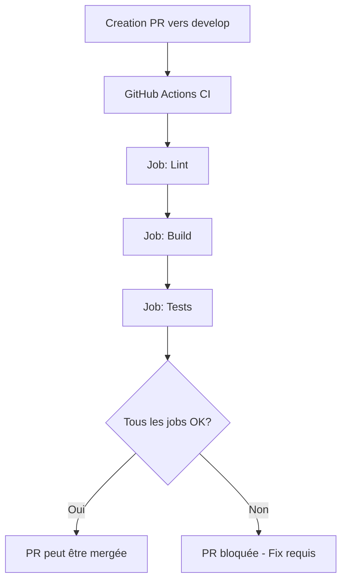
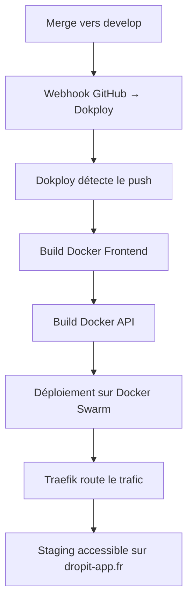
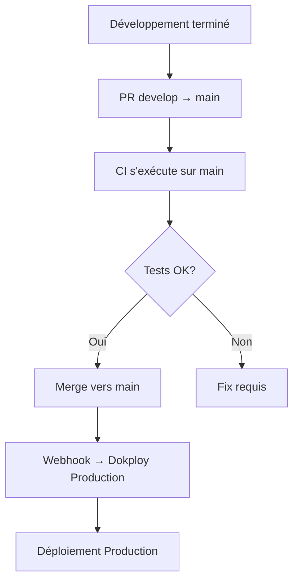

# Flow CI/CD - DropIt

## Vue d'ensemble du Flow

Ce document décrit le flow CI/CD complet de l'application DropIt, de la branche de développement jusqu'au déploiement en production via Dokploy.

## Architecture des Branches

```
main (staging) ←─── develop (dev)
    ↑                    ↑
  PROTÉGÉE           PROTÉGÉE
(commits directs interdits)
```

- **`develop`** : Branche de développement principal
- **`main`** : Branche de staging/production
- **Protection** : Les deux branches sont protégées contre les commits directs
- **Workflow** : Une PR = une feature

## Flow de Développement d'une Feature

### 1. Développement Local
```bash
# Créer une branche feature depuis develop
git checkout develop
git pull origin develop
git checkout -b feature/nouvelle-fonctionnalite

# Développement local... puis
git push origin feature/nouvelle-fonctionnalite 
```

### 2. Ouverture d'une Pull Request vers `develop` sur GitHub

**Déclenchement automatique de la CI :**



**Jobs CI exécutés :**
- **Lint** : Vérification du code avec Biome
- **Build** : Compilation TypeScript + build des packages
- **Tests** : Tests unitaires + intégration avec PostgreSQL de test

### 3. Merge vers `develop`
- ✅ CI passe avec succès
- ✅ Review code (optionnel)
- ✅ Merge de la PR

## Déploiement Staging (Dokploy)

### Configuration Dokploy
```
Provider: GitHub
Repository: dropit
Branch: develop
Build Path: apps/web (pour le frontend)
Trigger Type: On Push
Build Type: Dockerfile
```

### Processus de Build Automatique



**Services déployés automatiquement :**
- **Frontend** : `dropit-app.fr` (Nginx + React build)
- **API** : `api.dropit-app.fr` (NestJS + PostgreSQL)
- **Database** : PostgreSQL 16 (persistance locale)

## Déploiement Production

### Déclenchement
**Production = Merge `develop` → `main`**



### Processus de Déploiement Production

1. **Merge `develop` → `main`**
2. **Webhook GitHub → Dokploy** (configuration production)
3. **Build des images Docker** (API + Frontend)
4. **Déploiement sur Docker Swarm**
5. **Health checks** automatiques
6. **Routage Traefik** vers la nouvelle version

## Routes Traefik

- **`dropit-app.fr`** → Frontend (Nginx + React)
- **`api.dropit-app.fr`** → API NestJS
- **`traefik.dropit-app.fr`** → Dashboard Traefik (avec auth)
- **`[IP]:3000`** → Dashboard Dokploy

## Sécurité et Monitoring

### Protection des Branches
- **Commits directs interdits** sur `main` et `develop`
- **CI obligatoire** avant merge
- **Review code** recommandée

### Backups Automatiques
- **Backups quotidiens** PostgreSQL
- **Backup pré-déploiement** automatique
- **Rollback** possible via Dokploy UI

### SSL Automatique
- **Let's Encrypt** via Traefik
- **Renouvellement automatique**
- **HTTPS** forcé sur tous les domaines

## Points Critiques

1. **Docker Context Path = `.`** : Essentiel pour accéder aux fichiers du monorepo
2. **Build Path = `apps/web`** : Limite les triggers aux modifications frontend
3. **Variables d'environnement** : Configuration via Dokploy UI
4. **Migrations DB** : Exécution automatique au démarrage API
5. **Health Checks** : Vérification automatique avant routage du trafic

