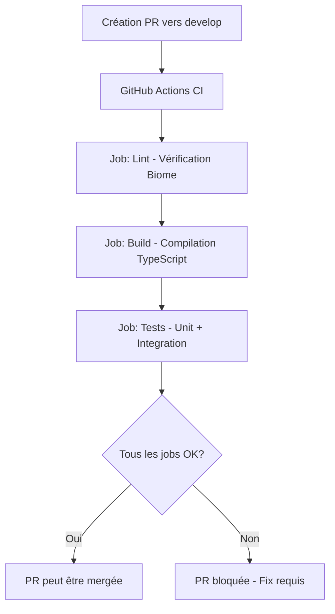
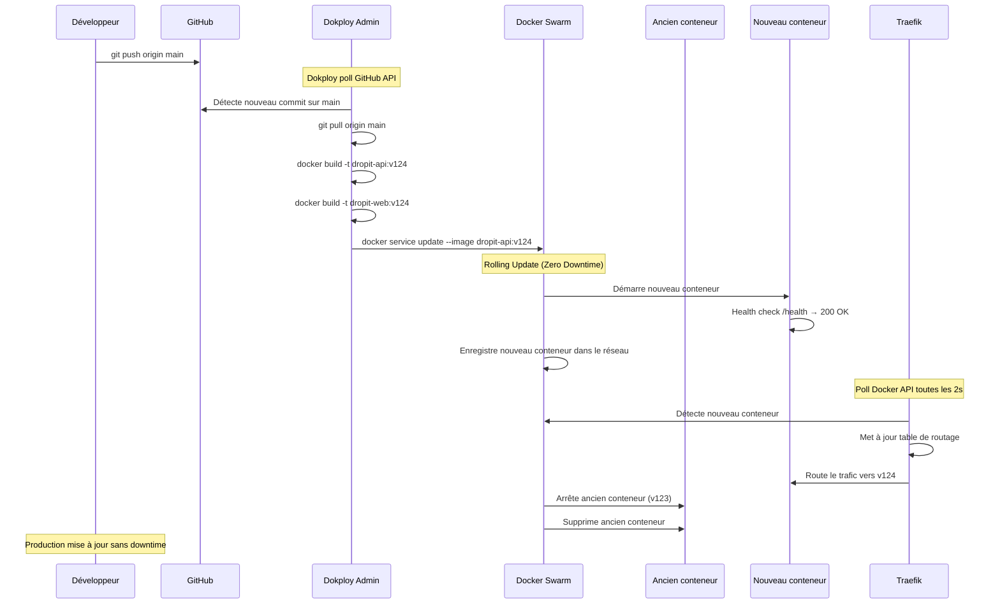

# Flow CI/CD - DropIt

## Vue d'ensemble du Flow

Ce document décrit le flow CI/CD complet de l'application DropIt, de la branche de développement jusqu'au déploiement en production.

## Architecture des Branches

```
main (production) ←─── develop (dev)
    ↑                    ↑
  PROTÉGÉE           PROTÉGÉE
(commits directs interdits)
```

- **`develop`** : Branche de développement principal
- **`main`** : Branche de production
- **Protection** : Les deux branches sont protégées contre les commits directs
- **Workflow** : Une PR = une feature

## Flow de Développement d'une Feature

### 1. Développement Local

```bash
# Créer une branche feature depuis develop
git checkout develop
git pull origin develop
git checkout -b feature/nouvelle-fonctionnalite

# Développement local... puis
git push origin feature/nouvelle-fonctionnalite
```

### 2. Ouverture d'une Pull Request vers `develop`

**Déclenchement automatique de la CI GitHub Actions :**



**Jobs CI exécutés :**
- **Lint** : Vérification du code avec Biome
- **Build** : Compilation TypeScript + build des packages
- **Tests** : Tests unitaires + intégration avec PostgreSQL de test

### 3. Merge vers `develop`

- ✅ CI passe avec succès
- ✅ Review code (optionnel)
- ✅ Merge de la PR

## Déploiement Production

### Configuration Dokploy

```yaml
Provider: GitHub (OAuth)
Repository: dropit
Branch: main
Build Path: /
Trigger Type: On Push
Build Type: Dockerfile
```

### Processus de Déploiement Complet



### Détail du Rolling Update (Zero Downtime)

Quand Dokploy exécute `docker service update`, Docker Swarm fait un **rolling update** :

1. **Démarre un nouveau conteneur** avec la nouvelle image (ex: v124)
2. **Vérifie le health check** : `GET /health` doit retourner `200 OK`
3. **Enregistre le nouveau conteneur** dans le réseau overlay Swarm
4. **Traefik détecte le changement** via polling de l'API Docker (toutes les 2s)
5. **Bascule le trafic** du vieux conteneur vers le nouveau
6. **Supprime l'ancien conteneur** une fois le trafic basculé

**Résultat** : Aucune interruption de service pour l'utilisateur.

### Services Déployés

- **Frontend** : `dropit-app.fr` (Nginx + React build)
- **API** : `api.dropit-app.fr` (NestJS)
- **Database** : PostgreSQL 16 (persistance locale)

### Déploiement Sélectif

Dokploy est intelligent : **il ne rebuild QUE les services dont le code a changé**.

**Exemple** : Si tu modifies uniquement `apps/api/src/...`
- ✅ Rebuild `dropit-api` → Rolling update du conteneur API
- ❌ Ne rebuild PAS `dropit-web` → Frontend inchangé
- ❌ Ne rebuild PAS la Database → Inchangée

## Architecture Serveur

### Rôles des Composants

#### Dokploy Admin
- **Rôle** : Détecte les changements sur GitHub et orchestre les déploiements
- **Actions** :
  - Poll l'API GitHub pour détecter les nouveaux commits sur `main`
  - Exécute `git pull origin main`
  - Build les images Docker (`docker build`)
  - Commande à Docker Swarm de mettre à jour les services

#### Docker Swarm
- **Rôle** : Orchestrateur de conteneurs (pas un conteneur lui-même)
- **Actions** :
  - Démarre/arrête les conteneurs
  - Surveille leur état (auto-restart si crash)
  - Gère le networking overlay entre conteneurs
  - Exécute les rolling updates (zero downtime)
  - Expose les métadonnées (labels) aux services

#### Traefik
- **Rôle** : Reverse proxy et load balancer
- **Actions** :
  - Reçoit le trafic HTTP/HTTPS entrant
  - Poll l'API Docker Swarm pour détecter les services
  - Lit les labels Docker pour configurer les routes automatiquement
  - Route le trafic vers les bons conteneurs

### Communication entre Composants

```
Dokploy → Docker Swarm : Commandes docker service update
Traefik → Docker Swarm : Polling API Docker (lecture des services)
```

**Important** :
- Dokploy **commande** Swarm (docker service update)
- Traefik **interroge** Swarm (lecture de l'état des services)
- Swarm **orchestre** les conteneurs (cycle de vie, networking)

## Routes Traefik

- **`dropit-app.fr`** → Frontend (Nginx + React)
- **`api.dropit-app.fr`** → API NestJS
- **`traefik.dropit-app.fr`** → Dashboard Traefik (avec auth)
