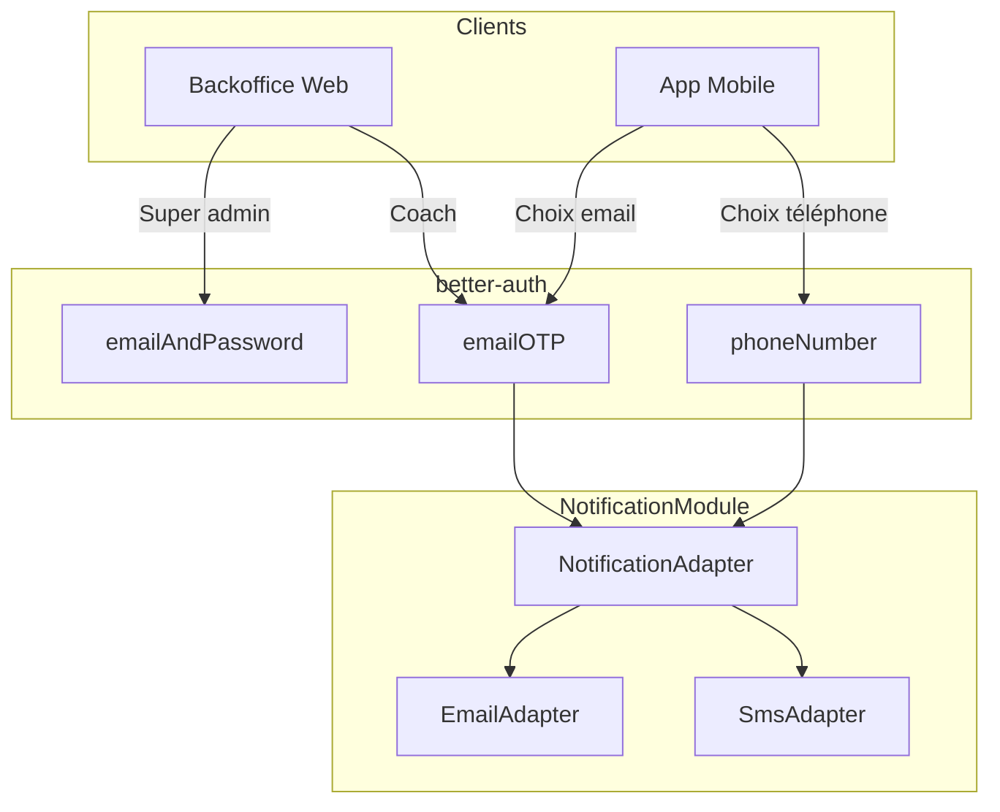

# Plan Migration Auth OTP (emailOTP + phoneNumber)

## Contexte

Actuellement : authentification **email + password** pour tous, avec **emailVerification** par lien.

Cible :

- **Super admin** : garder email + password (plus sécurisé)
- **Coachs (backoffice)** : email OTP
- **Athlètes (app mobile)** : au choix, email OTP **ou** phone OTP (SMS)

## Architecture cible



## Fichiers clés

| Fichier | Rôle |
|---------|------|
| `apps/api/src/modules/auth/better-auth.config.ts` | Config better-auth (ajouter plugins) |
| `apps/api/src/modules/auth/infrastructure/better-auth.adapter.ts` | Injection des callbacks OTP |
| `apps/api/src/modules/auth/domain/auth/user.entity.ts` | Entity User (ajouter `phoneNumber`, `phoneNumberVerified`) |
| `apps/api/src/modules/notification/application/use-cases/notification.use-cases.ts` | sendOtp déjà prêt (WEB/MOBILE) |
| `apps/api/src/modules/notification/infrastructure/channels/sms/sms.adapter.ts` | À implémenter (Twilio) |
| `apps/web/src/lib/auth-client.ts` | Client auth web (ajouter emailOTPClient) |
| `apps/web/src/shared/components/auth/login-form.tsx` | Remplacer par flow OTP pour coachs |
| `apps/mobile/src/lib/auth-client.ts` | Client auth mobile (ajouter emailOTPClient + phoneNumberClient) |

---

## Phase 1 : Base de données

- [ ] Ajouter à `User` entity :
  - `phoneNumber?: string` (nullable, unique, format E.164)
  - `phoneNumberVerified?: boolean`
- [ ] Le plugin `phoneNumber` de better-auth requiert ces champs. Créer une migration MikroORM.
- [ ] Exécuter les migrations better-auth pour les tables OTP (`npx @better-auth/cli migrate` ou `generate`).

---

## Phase 2 : Backend - better-auth

### 2.1 Config better-auth

Dans `better-auth.config.ts` :

- [ ] **Garder** `emailAndPassword: { enabled: true }` (super admin)
- [ ] **Garder** `emailVerification` (ou optionnellement `overrideDefaultEmailVerification: true` dans emailOTP pour tout passer en OTP)
- [ ] **Ajouter** plugin `emailOTP` avec :
  - `sendVerificationOTP` → délègue à `BetterAuthDeps.sendVerificationOTP`
  - `otpLength: 6`, `expiresIn: 300`, `allowedAttempts: 3`
- [ ] **Ajouter** plugin `phoneNumber` avec :
  - `sendOTP` → délègue à `BetterAuthDeps.sendPhoneOTP`
  - `signUpOnVerification: { getTempEmail: (phone) => \`${phone}@dropit.temp\` }` pour inscription par téléphone
  - `otpLength: 6`, `expiresIn: 300`

### 2.2 Interface BetterAuthDeps

- [ ] Étendre l'interface dans `better-auth.config.ts` :

```typescript
sendVerificationOTP?: (data: {
  email: string;
  otp: string;
  type: 'sign-in' | 'email-verification' | 'forget-password';
}) => Promise<void>;

sendPhoneOTP?: (data: {
  phoneNumber: string;
  code: string;
}) => Promise<void>;
```

### 2.3 BetterAuthAdapter

Dans `better-auth.adapter.ts` :

- [ ] Passer `sendVerificationOTP` qui appelle `notificationUseCase.sendOtp({ origin: PLATFORM.WEB, email, otp, type })`
- [ ] Passer `sendPhoneOTP` qui appelle `notificationUseCase.sendOtp({ origin: PLATFORM.MOBILE, otp, phoneNumber })`

### 2.4 NotificationUseCase

Dans `notification.use-cases.ts` :

- [ ] L'appel web existe déjà : `sendOtp({ origin: PLATFORM.WEB, ... })` → email via `KIND.OTP`
- [ ] L'appel mobile actuellement throw car SMS non implémenté. Une fois SmsAdapter implémenté, il enverra le SMS.
- [ ] Adapter `notification.port.ts` si nécessaire : le type `NotificationRequest` pour OTP doit supporter `phoneNumber` en plus de `email` (pour le variant MOBILE).

---

## Phase 3 : Implémenter SmsAdapter (optionnel ou minimal)

- [ ] Créer un adaptateur Twilio (ou mock pour dev) dans `sms.adapter.ts`
- [ ] Format SMS recommandé pour auto-fill Android/iOS : `Votre code DropIt : 123456` (conventions OTP)
- [ ] Ajouter variables d'environnement : `TWILIO_ACCOUNT_SID`, `TWILIO_AUTH_TOKEN`, `TWILIO_PHONE_NUMBER`
- [ ] En dev, possibilité de logger le code en console si Twilio non configuré

---

## Phase 4 : Frontend Web (backoffice)

### 4.1 auth-client

- [ ] Dans `auth-client.ts` : ajouter `emailOTPClient()` au tableau des plugins.

### 4.2 Login form

- [ ] Créer un composant `LoginFormOTP` (ou adapter `login-form.tsx`) : étape 1 (email) → étape 2 (saisie OTP)
- [ ] Utiliser `authClient.emailOtp.sendVerificationOtp({ email, type: 'sign-in' })` puis `authClient.signIn.emailOtp({ email, otp })`
- [ ] **Lien super admin** : garder une option "Connexion admin" (email + password) sur la page login, ou une route `/admin/login` séparée. Sinon, afficher les deux options (OTP par défaut, "Mode admin" en petit lien).

### 4.3 Signup

- [ ] Adapter le flow signup pour utiliser email OTP si on remplace la vérification par lien par OTP (`overrideDefaultEmailVerification`).

---

## Phase 5 : App mobile

### 5.1 auth-client

- [ ] Dans `auth-client.ts` mobile : ajouter `emailOTPClient()` et `phoneNumberClient()`.

### 5.2 Écrans de connexion

- [ ] Écran login : deux onglets/boutons "Continuer avec email" et "Continuer avec téléphone"
- [ ] **Email** : `sendVerificationOtp` → `signIn.emailOtp` (même flow que web)
- [ ] **Téléphone** : `phoneNumber.sendOtp` → `phoneNumber.verify` (création de session)
- [ ] Composant OTP réutilisable (6 chiffres, auto-focus, paste)

---

## Phase 6 : Restriction email+password au super admin (optionnel)

- Better-auth ne propose pas de hook "autoriser signIn.email seulement si user.role === 'admin'" natif.
- Approches possibles :
  1. **Frontend** : masquer le formulaire email+password pour les non-admins (mais un coach pourrait deviner l'URL)
  2. **Backend** : hook/custom route qui vérifie `user.role === 'admin'` après `signIn.email` et invalide la session sinon (plus complexe)
  3. **Pragmatique** : garder email+password disponible côté API, mais ne l'exposer que sur une route `/admin/login` non indexée. Les coachs n'utilisent que l'OTP.

---

## Ordre d'exécution recommandé

1. Phase 1 (BDD) + migrations better-auth
2. Phase 2 (backend better-auth)
3. Phase 4 (frontend web) pour valider le flow email OTP
4. Phase 3 (SMS) quand Twilio prêt
5. Phase 5 (mobile)
6. Phase 6 (restriction admin) si souhaité

---

## Points d'attention

- **emailVerification** : garder le lien ou passer en OTP via `overrideDefaultEmailVerification` selon préférence.
- **Téléphone optionnel** : les athlètes peuvent rester en email OTP uniquement.
- **Rate limiting** : better-auth a déjà du rate limit global ; éventuellement ajouter une limite plus stricte sur les endpoints OTP.
- **Coût SMS** : surveiller l'usage Twilio et limiter les envois (ex. max 5 OTP/heure par numéro).

---

## Ressources

- [Better-auth Email OTP](https://www.better-auth.com/docs/plugins/email-otp)
- [Better-auth Phone Number](https://www.better-auth.com/docs/plugins/phone-number)
- [Better-auth Magic Link](https://www.better-auth.com/docs/plugins/magic-link)
- [Twilio Node SDK](https://www.twilio.com/docs/libraries/node)
