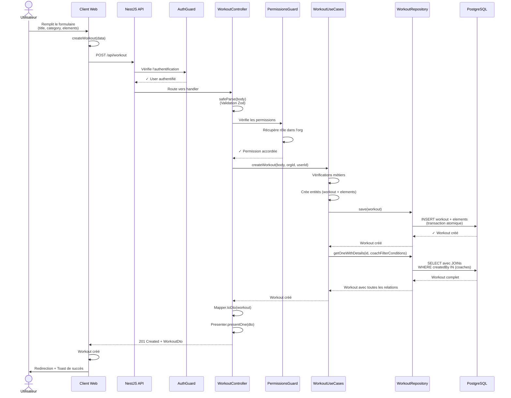

# Flow de Création d'un Workout

Ce document illustre le parcours complet d'une requête de création de workout, depuis le formulaire frontend jusqu'à la base de données, en passant par toutes les couches de l'architecture Clean Architecture.

## Diagramme de Séquence



## Snippets de Code Simplifiés

### 1. Frontend - Formulaire de Création

```typescript
// apps/web/src/routes/__home.workouts.create.tsx
import { api } from '@/lib/api';  // Client ts-rest généré depuis le contract
import type { CreateWorkout } from '@dropit/schemas';  // Type Zod partagé

function CreateWorkoutPage() {
  const { mutate: createWorkoutMutation } = useMutation({
    mutationFn: async (data: CreateWorkout) => {
      // 🛡️ PROTECTION XSS:
      // - React échappe automatiquement les données dans le JSX
      // - Pas de dangerouslySetInnerHTML utilisé

      // 🛡️ PROTECTION CSRF:
      // - better-auth envoie automatiquement les cookies httpOnly
      // - Cookies avec attribut SameSite=Lax

      // 🛡️ TYPE-SAFETY:
      // - CreateWorkout vient du package @dropit/schemas (voir snippet 3)
      // - api.workout vient du package @dropit/contract (voir snippet 2)
      // - ts-rest garantit le typage end-to-end

      const response = await api.workout.createWorkout({ body: data });
      if (response.status !== 201) {
        throw new Error('Erreur lors de la création');
      }
      return response.body;
    },
    onSuccess: (workout) => {
      toast({ title: 'Succès', description: 'Entraînement créé' });
      navigate({ to: `/workouts/${workout.id}` });
    }
  });

  return <WorkoutCreationStepper onSuccess={createWorkoutMutation} />;
}
```

**Failles de sécurité contrées** :
- ✅ **XSS (Cross-Site Scripting)** : React échappe automatiquement le contenu
- ✅ **CSRF (Cross-Site Request Forgery)** : Cookies httpOnly + SameSite
- ✅ **Man-in-the-Middle** : Communication HTTPS uniquement en production

### 2. Contract - Définition API avec ts-rest

```typescript
// packages/contract/src/workout.contract.ts
export const workoutContract = {
  createWorkout: {
    method: 'POST',
    path: '/workout',
    summary: 'Create a workout',
    body: createWorkoutSchema,  // 🛡️ Validation Zod obligatoire
    responses: {
      201: workoutSchema,       // 🛡️ Type de retour garanti
      400: z.object({ message: z.string() }),
      401: z.object({ message: z.string() }),  // Unauthorized
      403: z.object({ message: z.string() }),  // Forbidden
    },
  },
} as const;
```

**Failles de sécurité contrées** :
- ✅ **Type Safety** : Contrat partagé entre frontend et backend
- ✅ **API Contract Validation** : Impossible d'envoyer des données non conformes
- ✅ **Documentation automatique** : Le contrat documente les erreurs possibles

### 3. Validation Zod - Schéma de Données

```typescript
// packages/schemas/src/workout.schema.ts
export const createWorkoutSchema = z.object({
  // 🛡️ PROTECTION MASS ASSIGNMENT:
  // Seuls les champs définis sont acceptés, impossible d'injecter
  // des champs comme "isAdmin: true" ou "organizationId: 'autre-org'"

  title: z.string().min(1).max(200),  // 🛡️ Limite la taille
  workoutCategory: z.string().uuid(), // 🛡️ Validation format UUID
  description: z.string().max(1000).optional(),  // 🛡️ Limite DoS
  elements: z.array(createWorkoutElementSchema).min(1).max(50), // 🛡️ Limite
  trainingSession: z.object({
    athleteIds: z.array(z.string().uuid()).max(100),  // 🛡️ Limite
    scheduledDate: z.string().datetime(),  // 🛡️ Validation format
  }).optional(),
});

const createWorkoutElementSchema = z.discriminatedUnion('type', [
  z.object({
    type: z.literal('exercise'),
    id: z.string().uuid(),  // 🛡️ Format UUID
    sets: z.number().int().min(1).max(100),  // 🛡️ Limites
    reps: z.number().int().min(1).max(1000),
    rest: z.number().int().min(0).max(600).optional(),  // Max 10min
    // ...
  }),
  z.object({
    type: z.literal('complex'),
    // ... mêmes validations
  }),
]);
```

**Failles de sécurité contrées** :
- ✅ **Mass Assignment** : Whitelist stricte des champs acceptés
- ✅ **NoSQL/SQL Injection** : Validation de format (UUID, datetime)
- ✅ **DoS (Denial of Service)** : Limites de taille sur arrays et strings
- ✅ **Buffer Overflow** : Contraintes min/max sur les nombres
- ✅ **Input Validation** : Types stricts et formats validés

### 4. Controller - Point d'Entrée Backend

```typescript
// apps/api/src/modules/training/interface/controllers/workout.controller.ts

// 🛡️ PROTECTION BROKEN ACCESS CONTROL:
// PermissionsGuard vérifie que l'utilisateur a les permissions requises
@UseGuards(PermissionsGuard)
@Controller()
export class WorkoutController {
  constructor(private readonly workoutUseCases: IWorkoutUseCases) {}

  // 🛡️ RBAC (Role-Based Access Control):
  // Seuls les roles admin/owner ont la permission "create" sur "workout"
  @TsRestHandler(workoutContract.createWorkout)
  @RequirePermissions('create')
  createWorkout(
    @CurrentOrganization() organizationId: string,  // 🛡️ Injecté par AuthGuard
    @CurrentUser() user: AuthenticatedUser          // 🛡️ User vérifié
  ) {
    // 🛡️ VALIDATION ZOD RUNTIME:
    // tsRestHandler() intercepte la requête et exécute:
    //   const result = createWorkoutSchema.safeParse(req.body);
    //   if (!result.success) return { status: 400, body: result.error };
    //
    // Ici, dans le handler, body est DÉJÀ validé et typé

    return tsRestHandler(workoutContract.createWorkout, async ({ body }) => {
      // 🛡️ LAYERS DE SÉCURITÉ DÉJÀ PASSÉES:
      // 1. AuthGuard (global) → User authentifié via session better-auth
      // 2. tsRestHandler → Body validé avec Zod (runtime)
      // 3. PermissionsGuard → Rôle vérifié (admin ou owner)

      // 🛡️ PROTECTION PRIVILEGE ESCALATION:
      // organizationId vient de la session, pas du client
      // Impossible de créer un workout pour une autre organisation

      const workout = await this.workoutUseCases.createWorkout(
        body,              // Type: CreateWorkout (validé par Zod)
        organizationId,    // 🛡️ Valeur trustée de la session
        user.id
      );

      // Mapping entité → DTO (évite d'exposer des données sensibles)
      const workoutDto = WorkoutMapper.toDto(workout);

      // Présentation (status code + body)
      return WorkoutPresenter.presentOne(workoutDto);
    });
  }
}
```

**Failles de sécurité contrées** :
- ✅ **Broken Authentication** : AuthGuard global vérifie la session better-auth
- ✅ **Input Validation** : tsRestHandler valide le body avec Zod au runtime (safeParse)
- ✅ **Broken Access Control** : PermissionsGuard vérifie les droits RBAC
- ✅ **Privilege Escalation** : organizationId extrait de la session, pas du client
- ✅ **Parameter Tampering** : Paramètres critiques injectés par les decorators
- ✅ **Session Fixation** : better-auth gère la rotation des sessions

### 5. Use Case - Logique Métier

```typescript
// apps/api/src/modules/training/application/use-cases/workout.use-cases.ts
export class WorkoutUseCases implements IWorkoutUseCases {
  constructor(
    private readonly em: EntityManager,  // Injecté pour Unit of Work
    // ... autres dépendances
  ) {}

  async createWorkout(
    workout: CreateWorkout,
    organizationId: string,
    userId: string
  ): Promise<Workout> {
    // 🛡️ PROTECTION IDOR (Insecure Direct Object Reference):
    // coachFilterConditions limite l'accès aux ressources de l'organisation
    const coachFilterConditions = await this.memberUseCases.getCoachFilterConditions(
      organizationId
    );

    // Validation métier (règles business)
    if (!workout.elements || workout.elements.length === 0) {
      throw new WorkoutValidationException('Au moins un élément requis');
    }

    // 🛡️ PROTECTION IDOR:
    // Vérifie que la catégorie appartient à l'organisation
    const category = await this.workoutCategoryRepository.getOne(
      workout.workoutCategory,
      coachFilterConditions
    );
    if (!category) {
      throw new WorkoutCategoryNotFoundException('Catégorie introuvable');
    }

    // 🛡️ PROTECTION DATA INTEGRITY - Unit of Work Pattern:
    // Toutes les opérations ci-dessous sont dans l'Unit of Work (mémoire)
    // Aucune requête SQL n'est exécutée tant qu'on ne fait pas flush()
    // Si UNE opération échoue → ROLLBACK AUTOMATIQUE de TOUTES les opérations

    // Création de l'entité Workout
    const workoutToCreate = new Workout();
    workoutToCreate.title = workout.title;
    workoutToCreate.description = workout.description || '';
    workoutToCreate.category = category;
    workoutToCreate.createdBy = await this.userUseCases.getOne(userId);

    // Enregistre dans l'Unit of Work (PAS encore en DB)
    this.em.persist(workoutToCreate);

    // 🛡️ PROTECTION IDOR SUR LES ÉLÉMENTS:
    // Vérifie que les exercises/complexes appartiennent à l'organisation
    for (const element of workout.elements) {
      const workoutElement = new WorkoutElement();
      workoutElement.type = element.type;
      workoutElement.sets = element.sets;
      workoutElement.reps = element.reps;

      if (element.type === 'exercise') {
        const exercise = await this.exerciseRepository.getOne(
          element.id,
          coachFilterConditions
        );
        if (!exercise) throw new ExerciseNotFoundException();
        workoutElement.exercise = exercise;
      } else {
        const complex = await this.complexRepository.getOne(
          element.id,
          coachFilterConditions
        );
        if (!complex) throw new ComplexNotFoundException();
        workoutElement.complex = complex;
      }

      workoutElement.workout = workoutToCreate;

      // Enregistre dans l'Unit of Work (PAS encore en DB)
      this.em.persist(workoutElement);
    }

    // Optionnel: Création d'une session d'entraînement
    if (workout.trainingSession) {
      const trainingSession = new TrainingSession();
      trainingSession.workout = workoutToCreate;
      trainingSession.scheduledDate = new Date(
        workout.trainingSession.scheduledDate
      );
      this.em.persist(trainingSession);

      for (const athleteId of workout.trainingSession.athleteIds) {
        const athlete = await this.athleteRepository.getOne(athleteId);
        if (!athlete) throw new AthleteNotFoundException();

        const athleteSession = new AthleteTrainingSession();
        athleteSession.athlete = athlete;
        athleteSession.trainingSession = trainingSession;
        this.em.persist(athleteSession);
      }
    }

    // 🛡️ TRANSACTION ATOMIQUE:
    // flush() exécute TOUTES les requêtes SQL en une seule transaction:
    // BEGIN;
    //   INSERT INTO workout VALUES (...);           -- Génère UUID
    //   INSERT INTO workout_element VALUES (...);   -- Utilise l'UUID
    //   INSERT INTO workout_element VALUES (...);   -- Utilise l'UUID
    //   INSERT INTO training_session VALUES (...);
    //   INSERT INTO athlete_training_session VALUES (...);
    // COMMIT;
    //
    // Si UNE SEULE requête échoue → ROLLBACK de TOUT
    // Garantit l'intégrité: soit tout est créé, soit rien
    await this.em.flush();

    // Récupération du workout avec toutes ses relations
    // (pour envoyer les données complètes au frontend)
    return await this.workoutRepository.getOneWithDetails(
      workoutToCreate.id,
      coachFilterConditions
    );
  }
}
```

**Failles de sécurité contrées** :
- ✅ **IDOR (Insecure Direct Object Reference)** : Filtrage systématique par organisation
- ✅ **Horizontal Privilege Escalation** : Impossible d'accéder aux ressources d'autres orgs
- ✅ **Business Logic Bypass** : Validations métier strictes
- ✅ **Data Integrity** : Transaction atomique via Unit of Work (rollback automatique si erreur)
- ✅ **Partial Updates** : Impossible d'avoir un workout avec seulement 3/10 éléments

### 6. Repository - Accès aux Données

```typescript
// apps/api/src/modules/training/infrastructure/mikro-workout.repository.ts
export class MikroWorkoutRepository implements IWorkoutRepository {
  constructor(private readonly em: EntityManager) {}

  async save(workout: Workout): Promise<Workout> {
    // 🛡️ PROTECTION SQL INJECTION:
    // MikroORM utilise des requêtes paramétrées automatiquement
    // Exemple généré: INSERT INTO workout (title, description, category_id)
    //                 VALUES ($1, $2, $3)
    // Les valeurs sont passées séparément, jamais concaténées dans la requête

    await this.em.persistAndFlush(workout);
    return workout;
  }

  async getOneWithDetails(
    id: string,
    coachFilterConditions: CoachFilterConditions
  ): Promise<Workout | null> {
    // 🛡️ PROTECTION SQL INJECTION:
    // Requête générée: SELECT * FROM workout
    //                  WHERE id = $1
    //                  AND (created_by_id IS NULL OR created_by_id IN ($2, $3, ...))

    // 🛡️ PROTECTION IDOR:
    // coachFilterConditions force le filtrage par organisation
    // Impossible de récupérer un workout d'une autre organisation

    return await this.em.findOne(
      Workout,
      {
        id,                           // 🛡️ Paramètre $1
        $or: coachFilterConditions.$or  // 🛡️ Paramètres $2, $3, ...
      },
      {
        // 🛡️ PROTECTION N+1 QUERIES:
        // Eager loading évite les requêtes multiples
        populate: [
          'category',
          'elements',
          'elements.exercise',
          'elements.exercise.exerciseCategory',
          'elements.complex',
          'elements.complex.complexCategory',
          'createdBy'
        ],
      }
    );
  }
}
```

**Failles de sécurité contrées** :
- ✅ **SQL Injection** : Requêtes paramétrées via MikroORM (prepared statements)
- ✅ **IDOR** : Filtrage systématique avec coachFilterConditions
- ✅ **Performance (DoS)** : Eager loading évite les N+1 queries
- ✅ **Data Exposure** : Seules les relations nécessaires sont chargées

### 7. Entity - Modèle de Domaine

```typescript
// apps/api/src/modules/training/domain/workout.entity.ts
@Entity()
export class Workout {
  // 🛡️ PROTECTION IDOR / ENUMERATION:
  // UUID au lieu d'auto-increment empêche la prédiction des IDs
  // Impossible de deviner: /api/workout/550e8400-e29b-41d4-a716-446655440000
  @PrimaryKey({ type: 'uuid', defaultRaw: 'gen_random_uuid()' })
  id!: string;

  @Property()
  title!: string;

  @Property()
  description!: string;

  @ManyToOne(() => WorkoutCategory)
  category!: WorkoutCategory;

  // 🛡️ AUDIT TRAIL:
  // Traçabilité de qui a créé la ressource
  @ManyToOne(() => User, { nullable: true, deleteRule: 'cascade' })
  createdBy!: User | null;

  @OneToMany(() => WorkoutElement, element => element.workout)
  elements = new Collection<WorkoutElement>(this);

  @OneToMany(() => TrainingSession, session => session.workout)
  trainingSessions = new Collection<TrainingSession>(this);

  // 🛡️ AUDIT TRAIL:
  // Timestamps automatiques pour la traçabilité
  @Property({ onCreate: () => new Date() })
  createdAt: Date = new Date();

  @Property({ onUpdate: () => new Date() })
  updatedAt: Date = new Date();
}
```

**Failles de sécurité contrées** :
- ✅ **Insecure Direct Object Reference** : UUID non-prédictible vs auto-increment
- ✅ **Enumeration Attack** : Impossible de scanner les IDs séquentiellement
- ✅ **Audit Trail** : createdBy + timestamps pour la traçabilité
- ✅ **Data Integrity** : Relations enforced au niveau DB (foreign keys)

## Récapitulatif des Protections de Sécurité

### OWASP Top 10 (2021) - Protections Implémentées

| Vulnérabilité | Protection Implémentée | Couche |
|---------------|------------------------|--------|
| **A01:2021 – Broken Access Control** | AuthGuard global + PermissionsGuard RBAC | Controller |
| **A02:2021 – Cryptographic Failures** | HTTPS + cookies httpOnly + SameSite | Infrastructure |
| **A03:2021 – Injection** | Validation Zod + MikroORM parameterized queries | Validation + Repository |
| **A04:2021 – Insecure Design** | Clean Architecture + Domain-Driven Design | Architecture |
| **A05:2021 – Security Misconfiguration** | CORS configuré + trusted origins + env vars | Configuration |
| **A06:2021 – Vulnerable Components** | Dependencies scannées + mises à jour régulières | DevOps |
| **A07:2021 – Authentication Failures** | better-auth + session management + rotation | AuthGuard |
| **A08:2021 – Data Integrity Failures** | Validation Zod + transactions MikroORM | Validation + Repository |
| **A09:2021 – Logging Failures** | Audit trail (createdBy, timestamps) | Entity |
| **A10:2021 – SSRF** | Pas de requêtes externes basées sur input user | N/A |

### Defense in Depth - Couches de Sécurité

```
┌─────────────────────────────────────────────────────────────┐
│ 1. Frontend (React)                                         │
│    🛡️ XSS Protection (auto-escaping)                        │
│    🛡️ Validation Zod côté client (UX)                       │
└─────────────────────────────────────────────────────────────┘
                            ↓
┌─────────────────────────────────────────────────────────────┐
│ 2. Transport (HTTPS)                                        │
│    🛡️ Encryption en transit                                 │
│    🛡️ CSRF Protection (cookies SameSite)                    │
└─────────────────────────────────────────────────────────────┘
                            ↓
┌─────────────────────────────────────────────────────────────┐
│ 3. API Gateway (NestJS)                                     │
│    🛡️ CORS Configuration                                    │
│    🛡️ Rate Limiting (TODO)                                  │
└─────────────────────────────────────────────────────────────┘
                            ↓
┌─────────────────────────────────────────────────────────────┐
│ 4. AuthGuard (Global)                                       │
│    🛡️ Session Validation (better-auth)                      │
│    🛡️ Cookie httpOnly verification                          │
└─────────────────────────────────────────────────────────────┘
                            ↓
┌─────────────────────────────────────────────────────────────┐
│ 5. PermissionsGuard (Controller)                            │
│    🛡️ RBAC (member/admin/owner)                             │
│    🛡️ Resource-based permissions                            │
└─────────────────────────────────────────────────────────────┘
                            ↓
┌─────────────────────────────────────────────────────────────┐
│ 6. Validation (Zod)                                         │
│    🛡️ Input Validation                                      │
│    🛡️ Mass Assignment Prevention                            │
│    🛡️ DoS Prevention (size limits)                          │
└─────────────────────────────────────────────────────────────┘
                            ↓
┌─────────────────────────────────────────────────────────────┐
│ 7. Use Case (Business Logic)                                │
│    🛡️ IDOR Prevention (coachFilterConditions)               │
│    🛡️ Business Rules Enforcement                            │
└─────────────────────────────────────────────────────────────┘
                            ↓
┌─────────────────────────────────────────────────────────────┐
│ 8. Repository (Data Access)                                 │
│    🛡️ SQL Injection Prevention (parameterized queries)      │
│    🛡️ N+1 Query Prevention (eager loading)                  │
└─────────────────────────────────────────────────────────────┘
                            ↓
┌─────────────────────────────────────────────────────────────┐
│ 9. Database (PostgreSQL)                                    │
│    🛡️ Foreign Keys Constraints                              │
│    🛡️ UUID vs Auto-increment                                │
└─────────────────────────────────────────────────────────────┘
```

### Failles Spécifiques Contrées

#### 1. Injection Attacks
- **SQL Injection** : MikroORM avec requêtes paramétrées
- **NoSQL Injection** : Validation Zod des formats (UUID, datetime)
- **Command Injection** : Pas d'exécution de commandes système
- **Template Injection** : React auto-escaping

#### 2. Broken Authentication & Session
- **Session Fixation** : better-auth avec rotation de session
- **Weak Password** : Gestion par better-auth (bcrypt)
- **No Session Timeout** : Gestion par better-auth
- **Insecure Cookie** : httpOnly + Secure + SameSite=Lax

#### 3. Access Control
- **Horizontal Privilege Escalation** : coachFilterConditions par organisation
- **Vertical Privilege Escalation** : RBAC strict (member/admin/owner)
- **IDOR** : Filtrage systématique + UUID non-prédictibles
- **Path Traversal** : Validation des IDs (UUID format)

#### 4. Data Validation
- **Mass Assignment** : Whitelist Zod (seuls les champs définis acceptés)
- **Type Confusion** : TypeScript strict + Zod runtime validation
- **Buffer Overflow** : Limites min/max sur tous les champs
- **XXE (XML)** : Pas d'XML parsing

#### 5. Business Logic
- **Race Condition** : Transactions MikroORM
- **Enumeration** : UUID vs auto-increment
- **Resource Exhaustion** : Limites sur arrays (.max(50))

#### 6. Cross-Site Attacks
- **XSS (Reflected/Stored)** : React auto-escaping
- **CSRF** : Cookies SameSite + httpOnly
- **Clickjacking** : X-Frame-Options (TODO)
- **CORS Misconfiguration** : Whitelist des origins

## Points Clés de l'Architecture

### Séparation des Responsabilités

1. **Frontend (React + TanStack)**
   - Gestion de l'UI et de l'état local
   - Appels API typés avec ts-rest
   - Pas de logique métier

2. **Contract (ts-rest)**
   - Définition du contrat API
   - Type-safety entre frontend et backend
   - Validation Zod partagée

3. **Controller (NestJS)**
   - Point d'entrée HTTP
   - Validation des permissions
   - Délégation au use case

4. **Use Case (Business Logic)**
   - Logique métier pure (framework-agnostic)
   - Orchestration des opérations
   - Règles de validation métier

5. **Repository (Infrastructure)**
   - Abstraction de la persistance
   - Requêtes SQL via MikroORM
   - Implémentation de l'interface du port

6. **Entity (Domain)**
   - Modèle de données
   - Relations ORM
   - Pas de logique

### Système d'Authentification et Autorisation (2 Guards)

#### 1. AuthGuard (Global - APP_GUARD)

Appliqué automatiquement sur **toutes les routes** :

```typescript
// apps/api/src/modules/identity/identity.module.ts
{
  provide: APP_GUARD,
  useClass: AuthGuard,
}
```

**Responsabilités** :
- ✅ Vérifie la session better-auth via les cookies httpOnly
- ✅ Extrait `user` et `organizationId` de la session
- ✅ Injecte ces données dans la requête (`@CurrentUser`, `@CurrentOrganization`)
- ✅ Rejette les requêtes non authentifiées (401 Unauthorized)
- ✅ Supporte `@Public()` pour les routes publiques (login, register)

#### 2. PermissionsGuard (Controller-level)

Appliqué sur les **controllers spécifiques** avec `@UseGuards(PermissionsGuard)` :

**Responsabilités** :
- ✅ Récupère le **rôle** de l'utilisateur dans l'organisation (member/admin/owner)
- ✅ Vérifie la **permission requise** sur la **ressource**
- ✅ Rejette si l'utilisateur n'a pas la permission (403 Forbidden)

**Définition des Permissions** (`@dropit/permissions`) :
```typescript
// Seuls admin et owner ont accès à "workout"
export const admin = ac.newRole({
  workout: ["read", "create", "update", "delete"],
  exercise: ["read", "create", "update", "delete"],
  // ...
});

export const owner = ac.newRole({
  workout: ["read", "create", "update", "delete"],
  // ... (toutes les permissions)
});

// member (athlète) n'a PAS accès à "workout"
export const member = ac.newRole({
  athlete: ["read", "create", "update", "delete"],
  session: ["read"],
  // PAS de permissions sur "workout"
});
```

**Exemple d'utilisation** :
```typescript
@UseGuards(PermissionsGuard)  // Active le guard
@Controller()
export class WorkoutController {
  @RequirePermissions('create')  // Vérifie la permission "create" sur "workout"
  createWorkout() { ... }
}
```

#### Pourquoi 2 Guards Séparés ?

**Séparation des préoccupations** :
1. **AuthGuard** : "Qui es-tu ?" → Authentification
2. **PermissionsGuard** : "Que peux-tu faire ?" → Autorisation

**Avantages** :
- ✅ Réutilisabilité : AuthGuard global, PermissionsGuard ciblé
- ✅ Flexibilité : Routes publiques possibles avec `@Public()`
- ✅ Performance : AuthGuard ne fait qu'une requête session, PermissionsGuard une requête Member
- ✅ Lisibilité : Intentions claires dans le code

#### Pourquoi Pas de Vérification dans le Use Case ?

Le PermissionsGuard **garantit déjà** que seuls les coaches (admin/owner) accèdent aux endpoints `workout`.

Vérifier à nouveau `isUserCoachInOrganization` dans le use case serait :
- ❌ **Redondant** : Requête DB supplémentaire inutile
- ❌ **Moins performant** : +50-100ms par requête
- ❌ **Violation SRP** : Le use case fait de l'autorisation au lieu de logique métier

✅ **Le use case se concentre sur la logique métier pure** : validation des règles business, orchestration, création d'entités.

### Flux de Validation à 3 Niveaux

1. **Client-side** : Validation Zod avant l'envoi (UX)
2. **API Contract** : Validation Zod à la réception (Sécurité)
3. **Business Logic** : Validation métier dans le use case (Règles métier)

### Inversion de Dépendance

- Use Cases dépendent des **interfaces** (ports), pas des implémentations
- Repository implémente l'interface définie dans la couche application
- Framework (NestJS) injecte les dépendances concrètes

## Technologies Utilisées

- **Frontend** : React, TanStack Router, TanStack Query
- **API Contract** : ts-rest, Zod
- **Backend** : NestJS, TypeScript
- **ORM** : MikroORM
- **Database** : PostgreSQL
- **Architecture** : Clean Architecture + DDD
