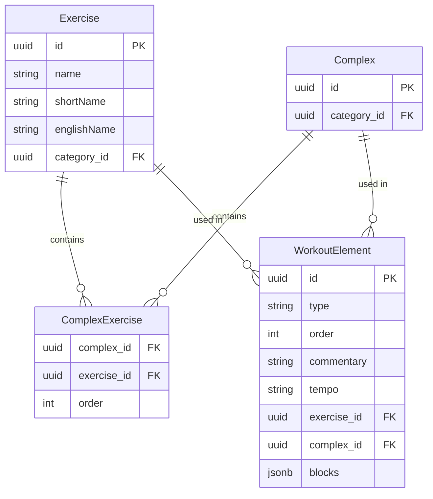

# Workout Programming Data Model

## Vue d'ensemble

Modèle de données séparant la **définition** (templates réutilisables) de l'**instanciation** (programmation spécifique dans un workout).

## Architecture

### Templates (Réutilisables)

```typescript
Exercise
├─ id, name, shortname, englishName 
└─ category, video, createdBy

Complex
├─ id, category
└─ exercises: ExerciseComplex[]
    ├─ exercise: Exercise
    └─ order: number
```

### Instances (Dans un workout)

```typescript
WorkoutElement
├─ type: 'exercise' | 'complex'
├─ order: number
├─ commentary?: string // coach specific information
├─ tempo?: string // optionnal tempo for exercise or complex
├─ exercise?: Exercise
├─ complex?: Complex
└─ blocks: BlockConfig[] (JSONB) // Series groups with specific parameters (reps, intensity, rest)

// Structure JSONB
type BlockConfig = {
  order: number
  numberOfSets: number
  rest?: number  // secondes
  intensity?: IntensityConfig
  exercises: ExerciseConfig[]
}

type IntensityConfig = {
  percentageOfMax?: number
  referenceExerciseId?: string
  type?: 'percentage' | 'rpe'
}

type ExerciseConfig = {
  exerciseId: string
  reps: number
  order: number
}
```

## Exemple concret

### Template réutilisable

```typescript
Complex {
  id: "complex-123",
  description: "Clean + Jerk",
  exercises: [
    { exercise: Clean, order: 1 },
    { exercise: Jerk, order: 2 }
  ]
}
```

### Instance dans un workout

**Scénario** : 4 séries de Clean + Jerk
- Séries 1-2 : 4 reps Clean + 2 reps Jerk à 70% du max Clean
- Séries 3-4 : 3 reps Clean + 1 rep Jerk à 80% du max Clean

```typescript
WorkoutElement {
  type: 'complex',
  complex: Complex("Clean + Jerk"),
  blocks: [
    {
      order: 1,
      numberOfSets: 2,
      rest: 180,
      intensity: {
        percentageOfMax: 70,
        referenceExerciseId: "clean-id",
        type: 'percentage'
      },
      exercises: [
        { exerciseId: "clean-id", reps: 4, order: 1 },
        { exerciseId: "jerk-id", reps: 2, order: 2 }
      ]
    },
    {
      order: 2,
      numberOfSets: 2,
      rest: 240,
      intensity: {
        percentageOfMax: 80,
        referenceExerciseId: "clean-id",
        type: 'percentage'
      },
      exercises: [
        { exerciseId: "clean-id", reps: 3, order: 1 },
        { exerciseId: "jerk-id", reps: 1, order: 2 }
      ]
    }
  ]
}
```

### Exercice simple

```typescript
WorkoutElement {
  type: 'exercise',
  exercise: BackSquat,
  blocks: [
    {
      order: 1,
      numberOfSets: 5,
      rest: 120,
      intensity: {
        percentageOfMax: 85,
        referenceExerciseId: "back-squat-id",
        type: 'percentage'
      },
      exercises: [
        { exerciseId: "back-squat-id", reps: 5, order: 1 }
      ]
    }
  ]
}
```

## Diagramme Entité-Relations (ERD)



## Changements par rapport au modèle actuel

| Ancien | Nouveau | Raison |
|--------|---------|--------|
| `ExerciseComplex.reps` | Supprimé | Les reps sont spécifiques à l'instance, pas au template |
| `Exercise.description` | Supprimé | Pas nécessaire pour un template d'exercice |
| `WorkoutElement.sets/reps/rest/duration` | → `WorkoutElement.blocks` (JSONB) | Support de configurations complexes par blocs |
| `WorkoutElement.startWeight_percent/endWeight_percent` | → `BlockConfig.intensity` | Plus flexible : % par bloc + exercice de référence |
| `WorkoutElement.description` | → `WorkoutElement.commentary` | Clarification du rôle |
| `Complex.description` | Supprimé | Pas nécessaire pour un template |
| `Workout.title` | Supprimé | Le workout est un template, les dates/noms sont dans TrainingSession |

## Avantages

- **Séparation claire** : Templates réutilisables vs instances configurées
- **Flexibilité** : Plusieurs blocs de séries avec paramètres différents
- **Précision** : Reps spécifiques par exercice dans chaque bloc
- **Référence** : % basé sur n'importe quel exercice du complexe
- **Extensibilité** : Ajout facile de nouveaux paramètres (RPE, tempo, etc.)

## Validation Zod

```typescript
export const exerciseConfigSchema = z.object({
  exerciseId: z.string().uuid(),
  reps: z.number().int().positive(),
  order: z.number().int().positive()
})

export const intensityConfigSchema = z.object({
  percentageOfMax: z.number().min(0).max(200).optional(),
  referenceExerciseId: z.string().uuid().optional(),
  type: z.enum(['percentage', 'rpe']).optional()
})

export const blockConfigSchema = z.object({
  order: z.number().int().positive(),
  numberOfSets: z.number().int().positive(),
  rest: z.number().int().positive().optional(),
  intensity: intensityConfigSchema.optional(),
  exercises: z.array(exerciseConfigSchema).min(1)
})

// Types inférés
export type ExerciseConfigDto = z.infer<typeof exerciseConfigSchema>;
export type IntensityConfigDto = z.infer<typeof intensityConfigSchema>;
export type BlockConfigDto = z.infer<typeof blockConfigSchema>;
```

## Exemples de Seeders basés sur de vrais entraînements

### Prérequis : Création des Exercices et Complexes

Avant de créer les workouts, il faut d'abord créer les exercices et complexes de base :

#### Exercices de base (exercise.seeder.ts)

```typescript
const exercisesToCreate = [
  // Arraché (Snatch) family
  { name: 'Arraché Flexion', englishName: 'Snatch Pull', shortName: 'Arr Flex', category: 'Arraché' },
  { name: 'Flexion d\'Arraché', englishName: 'Snatch Pull Hang', shortName: 'Flex Arr', category: 'Arraché' },
  { name: 'Arraché', englishName: 'Snatch', shortName: 'Arr', category: 'Arraché' },
  { name: 'Passage', englishName: 'Muscle Snatch', shortName: 'Pass', category: 'Arraché' },
  { name: 'Chute', englishName: 'Drop Snatch', shortName: 'Chute', category: 'Arraché' },

  // Epaulé (Clean) family
  { name: 'Epaulé Flexion', englishName: 'Clean Pull', shortName: 'Ep Flex', category: 'Epaulé' },
  { name: 'Epaulé Debout', englishName: 'Clean Standing', shortName: 'Ep Deb', category: 'Epaulé' },
  { name: 'Epaulé', englishName: 'Clean', shortName: 'Ep', category: 'Epaulé' },
  { name: 'Passage Epaulé', englishName: 'Muscle Clean', shortName: 'Pass Ep', category: 'Epaulé' },

  // Jeté (Jerk) family
  { name: 'Jeté Fente', englishName: 'Split Jerk', shortName: 'Jeté Fente', category: 'Jeté' },
  { name: 'Jeté Nuque', englishName: 'Jerk Behind Neck', shortName: 'Jeté Nuque', category: 'Jeté' },

  // Squat family
  { name: 'Squat Nuque', englishName: 'Back Squat', shortName: 'Sq Nuque', category: 'Squat' },
  { name: 'Squat Devant', englishName: 'Front Squat', shortName: 'Sq Devant', category: 'Squat' },
  { name: 'Squat (drop)', englishName: 'Drop Squat', shortName: 'Sq drop', category: 'Squat' },

  // Autres
  { name: 'Tirage Lourd d\'Arraché', englishName: 'Snatch High Pull', shortName: 'TLA', category: 'Tirage' },
  { name: 'Tirage Lourd d\'Epaulé', englishName: 'Clean High Pull', shortName: 'TLE', category: 'Tirage' },
  { name: 'Développé Militaire', englishName: 'Military Press', shortName: 'Dév Mil', category: 'Développé' },
];

// Dans le seeder
for (const exerciseData of exercisesToCreate) {
  const category = exerciseCategoriesMap[exerciseData.category];
  const exercise = new Exercise();
  exercise.name = exerciseData.name;
  exercise.englishName = exerciseData.englishName;
  exercise.shortName = exerciseData.shortName;
  exercise.exerciseCategory = category;
  exercise.createdBy = null;

  await em.persistAndFlush(exercise);
  exercisesMap[exerciseData.name] = exercise;
}
```

#### Complexes de base (complex.seeder.ts)

```typescript
const complexesToCreate = [
  {
    category: 'Arraché',
    exercises: [
      { name: 'Passage', order: 0 },
      { name: 'Chute', order: 1 },
      { name: 'Flexion d\'Arraché', order: 2 }
    ]
  },
  {
    category: 'Arraché',
    exercises: [
      { name: 'Arraché Flexion', order: 0 },
      { name: 'Flexion d\'Arraché', order: 1 }
    ]
  },
  {
    category: 'Epaulé-Jeté',
    exercises: [
      { name: 'Passage Epaulé', order: 0 },
      { name: 'Squat Devant', order: 1 }
    ]
  },
  {
    category: 'Epaulé-Jeté',
    exercises: [
      { name: 'Epaulé Flexion', order: 0 },
      { name: 'Jeté Fente', order: 1 }
    ]
  },
  {
    category: 'Epaulé-Jeté',
    exercises: [
      { name: 'Epaulé Debout', order: 0 },
      { name: 'Squat (drop)', order: 1 },
      { name: 'Epaulé Flexion', order: 2 },
      { name: 'Jeté Fente', order: 3 }
    ]
  },
  {
    category: 'Arraché',
    exercises: [
      { name: 'Tirage Lourd d\'Arraché', order: 0 },
      { name: 'Arraché Flexion', order: 1 }
    ]
  },
  {
    category: 'Epaulé-Jeté',
    exercises: [
      { name: 'Epaulé Flexion', order: 0 },
      { name: 'Squat Nuque', order: 1 },
      { name: 'Jeté Fente', order: 2 }
    ]
  }
];

// Dans le seeder
const complexesCreated: Complex[] = [];
for (const complexData of complexesToCreate) {
  const complex = new Complex();
  complex.complexCategory = complexCategoriesMap[complexData.category];
  complex.createdBy = null;

  await em.persistAndFlush(complex);

  for (let i = 0; i < complexData.exercises.length; i++) {
    const exerciseData = complexData.exercises[i];

    const exerciseComplex = new ExerciseComplex();
    exerciseComplex.complex = complex;
    exerciseComplex.exercise = exercisesMap[exerciseData.name];
    exerciseComplex.order = exerciseData.order;

    await em.persistAndFlush(exerciseComplex);
  }

  complexesCreated.push(complex);
}
```

### Mapping des exercices/complexes pour les workouts

```typescript
// Créer un map pour accès facile par nom
const exercisesMap: Record<string, Exercise> = {};
const exercises = await em.find(Exercise, {});
for (const exercise of exercises) {
  exercisesMap[exercise.name] = exercise;
}

// Créer un map des complexes (par index dans l'ordre de création)
const complexes = await em.find(Complex, {}, {
  populate: ['exercises.exercise'],
  orderBy: { createdAt: 'ASC' }
});
```

### Exemple 1 : Lundi 17 Novembre - Technique avec variations d'intensité

Basé sur : `Arraché Flexion + Flexion d'Arraché : 2 x 2+2 @ 60% / 2 x 1+1 @ 70%`

```typescript
// Complex: Arraché Flexion + Flexion d'Arraché
const complexSnatchPull = {
  type: 'complex' as const,
  complexId: 'snatch-pull-complex-id',
  order: 1,
  commentary: 'Rest 1min30',
  blocks: [
    {
      order: 1,
      numberOfSets: 2,
      rest: 90,
      intensity: {
        percentageOfMax: 60,
        referenceExerciseId: 'snatch-pull-id',
        type: 'percentage' as const
      },
      exercises: [
        { exerciseId: 'snatch-pull-id', reps: 2, order: 1 },
        { exerciseId: 'snatch-pull-hang-id', reps: 2, order: 2 }
      ]
    },
    {
      order: 2,
      numberOfSets: 2,
      rest: 90,
      intensity: {
        percentageOfMax: 70,
        referenceExerciseId: 'snatch-pull-id',
        type: 'percentage' as const
      },
      exercises: [
        { exerciseId: 'snatch-pull-id', reps: 1, order: 1 },
        { exerciseId: 'snatch-pull-hang-id', reps: 1, order: 2 }
      ]
    }
  ]
}
```

### Exemple 2 : Mercredi 19 Novembre - Montée progressive en intensité

Basé sur : `Arraché Flexion : Doublé Jusqu'a 75% / 1 x 1 @ 78% / 1 x 1 @ 82% / 1 x 1 @ 85% / 1 x 1 @ 90%`

```typescript
// Exercise simple avec montée progressive
const snatchFlexionProgressive = {
  type: 'exercise' as const,
  exerciseId: 'snatch-flexion-id',
  order: 1,
  commentary: 'Doublé Jusqu\'a 75%',
  blocks: [
    {
      order: 1,
      numberOfSets: 1,
      rest: 120,
      intensity: {
        percentageOfMax: 78,
        referenceExerciseId: 'snatch-flexion-id',
        type: 'percentage' as const
      },
      exercises: [
        { exerciseId: 'snatch-flexion-id', reps: 1, order: 1 }
      ]
    },
    {
      order: 2,
      numberOfSets: 1,
      rest: 120,
      intensity: {
        percentageOfMax: 82,
        referenceExerciseId: 'snatch-flexion-id',
        type: 'percentage' as const
      },
      exercises: [
        { exerciseId: 'snatch-flexion-id', reps: 1, order: 1 }
      ]
    },
    {
      order: 3,
      numberOfSets: 1,
      rest: 120,
      intensity: {
        percentageOfMax: 85,
        referenceExerciseId: 'snatch-flexion-id',
        type: 'percentage' as const
      },
      exercises: [
        { exerciseId: 'snatch-flexion-id', reps: 1, order: 1 }
      ]
    },
    {
      order: 4,
      numberOfSets: 1,
      rest: 120,
      intensity: {
        percentageOfMax: 90,
        referenceExerciseId: 'snatch-flexion-id',
        type: 'percentage' as const
      },
      exercises: [
        { exerciseId: 'snatch-flexion-id', reps: 1, order: 1 }
      ]
    }
  ]
}
```

### Exemple 3 : Mercredi 19 Novembre - Complex avec progression complexe

Basé sur : `Epaulé Flexion + Jeté Fente : 1 x 1+1 @ 75% / 1 x 1+1 @ 80% / 1 x 1+1 @ 85% / 1 x 1+1 @ 90% / 1 x 1+1 @ 93%`

```typescript
// Complex: Epaulé Flexion + Jeté Fente
const complexCleanJerk = {
  type: 'complex' as const,
  complexId: 'clean-jerk-id',
  order: 2,
  blocks: [
    {
      order: 1,
      numberOfSets: 1,
      rest: 180,
      intensity: {
        percentageOfMax: 75,
        referenceExerciseId: 'clean-flexion-id',
        type: 'percentage' as const
      },
      exercises: [
        { exerciseId: 'clean-flexion-id', reps: 1, order: 1 },
        { exerciseId: 'jerk-split-id', reps: 1, order: 2 }
      ]
    },
    {
      order: 2,
      numberOfSets: 1,
      rest: 180,
      intensity: {
        percentageOfMax: 80,
        referenceExerciseId: 'clean-flexion-id',
        type: 'percentage' as const
      },
      exercises: [
        { exerciseId: 'clean-flexion-id', reps: 1, order: 1 },
        { exerciseId: 'jerk-split-id', reps: 1, order: 2 }
      ]
    },
    {
      order: 3,
      numberOfSets: 1,
      rest: 180,
      intensity: {
        percentageOfMax: 85,
        referenceExerciseId: 'clean-flexion-id',
        type: 'percentage' as const
      },
      exercises: [
        { exerciseId: 'clean-flexion-id', reps: 1, order: 1 },
        { exerciseId: 'jerk-split-id', reps: 1, order: 2 }
      ]
    },
    {
      order: 4,
      numberOfSets: 1,
      rest: 180,
      intensity: {
        percentageOfMax: 90,
        referenceExerciseId: 'clean-flexion-id',
        type: 'percentage' as const
      },
      exercises: [
        { exerciseId: 'clean-flexion-id', reps: 1, order: 1 },
        { exerciseId: 'jerk-split-id', reps: 1, order: 2 }
      ]
    },
    {
      order: 5,
      numberOfSets: 1,
      rest: 180,
      intensity: {
        percentageOfMax: 93,
        referenceExerciseId: 'clean-flexion-id',
        type: 'percentage' as const
      },
      exercises: [
        { exerciseId: 'clean-flexion-id', reps: 1, order: 1 },
        { exerciseId: 'jerk-split-id', reps: 1, order: 2 }
      ]
    }
  ]
}
```

### Exemple 4 : Vendredi 21 Novembre - Variations de volume

Basé sur : `Tirage Lourd d'Arraché + Arraché Flexion : 4 x 3+1 @ 60% / 2 x 2+1 @ 70% / 1 x 1+1 @ 80%`

```typescript
// Complex: Tirage Lourd d'Arraché + Arraché Flexion
const complexTLASnatch = {
  type: 'complex' as const,
  complexId: 'tla-snatch-id',
  order: 1,
  blocks: [
    {
      order: 1,
      numberOfSets: 4,
      rest: 120,
      intensity: {
        percentageOfMax: 60,
        referenceExerciseId: 'snatch-flexion-id',
        type: 'percentage' as const
      },
      exercises: [
        { exerciseId: 'tirage-lourd-arrache-id', reps: 3, order: 1 },
        { exerciseId: 'snatch-flexion-id', reps: 1, order: 2 }
      ]
    },
    {
      order: 2,
      numberOfSets: 2,
      rest: 120,
      intensity: {
        percentageOfMax: 70,
        referenceExerciseId: 'snatch-flexion-id',
        type: 'percentage' as const
      },
      exercises: [
        { exerciseId: 'tirage-lourd-arrache-id', reps: 2, order: 1 },
        { exerciseId: 'snatch-flexion-id', reps: 1, order: 2 }
      ]
    },
    {
      order: 3,
      numberOfSets: 1,
      rest: 120,
      intensity: {
        percentageOfMax: 80,
        referenceExerciseId: 'snatch-flexion-id',
        type: 'percentage' as const
      },
      exercises: [
        { exerciseId: 'tirage-lourd-arrache-id', reps: 1, order: 1 },
        { exerciseId: 'snatch-flexion-id', reps: 1, order: 2 }
      ]
    }
  ]
}
```

### Exemple 5 : Exercice simple avec plage d'intensité

Basé sur : `BackSquat : 4 x 5 @ 72 - 74 % (Recherche de vitesse au redressement)`

```typescript
// Exercise simple: BackSquat
const backSquatSpeed = {
  type: 'exercise' as const,
  exerciseId: 'back-squat-id',
  order: 4,
  commentary: 'Recherche de vitesse au redressement',
  blocks: [
    {
      order: 1,
      numberOfSets: 4,
      rest: 180,
      intensity: {
        percentageOfMax: 73, // moyenne entre 72-74%
        referenceExerciseId: 'back-squat-id',
        type: 'percentage' as const
      },
      exercises: [
        { exerciseId: 'back-squat-id', reps: 5, order: 1 }
      ]
    }
  ]
}
```

### Exemple 6 : Complex large avec multiples exercices

Basé sur : `Epaulé Debout + Squat (drop) + Epaulé Flexion + Jeté Fente : 4x 1+1+1+1 @ 80%`

```typescript
// Complex: 4 exercices enchaînés
const complexFullSequence = {
  type: 'complex' as const,
  complexId: 'full-sequence-id',
  order: 3,
  blocks: [
    {
      order: 1,
      numberOfSets: 4,
      rest: 240,
      intensity: {
        percentageOfMax: 80,
        referenceExerciseId: 'clean-standing-id',
        type: 'percentage' as const
      },
      exercises: [
        { exerciseId: 'clean-standing-id', reps: 1, order: 1 },
        { exerciseId: 'squat-drop-id', reps: 1, order: 2 },
        { exerciseId: 'clean-flexion-id', reps: 1, order: 3 },
        { exerciseId: 'jerk-split-id', reps: 1, order: 4 }
      ]
    }
  ]
}
```

### Structure complète d'un Workout Seeder

```typescript
const workout_lundi17Nov = {
  title: 'Lundi 17 Novembre - Technique',
  category: 'Saison',
  description: 'Séance technique avec variations d\'intensité',
  elements: [
    {
      type: 'complex' as const,
      complexId: 'passage-chute-snatch-hang-id',
      order: 0,
      commentary: '@ BAV (Barre à Vide)',
      blocks: [
        {
          order: 1,
          numberOfSets: 2,
          exercises: [
            { exerciseId: 'passage-id', reps: 2, order: 1 },
            { exerciseId: 'chute-id', reps: 2, order: 2 },
            { exerciseId: 'snatch-hang-id', reps: 2, order: 3 }
          ]
        }
      ]
    },
    {
      type: 'complex' as const,
      complexId: 'snatch-pull-complex-id',
      order: 1,
      commentary: 'Rest 1min30',
      blocks: [
        {
          order: 1,
          numberOfSets: 2,
          rest: 90,
          intensity: {
            percentageOfMax: 60,
            referenceExerciseId: 'snatch-pull-id',
            type: 'percentage' as const
          },
          exercises: [
            { exerciseId: 'snatch-pull-id', reps: 2, order: 1 },
            { exerciseId: 'snatch-pull-hang-id', reps: 2, order: 2 }
          ]
        },
        {
          order: 2,
          numberOfSets: 2,
          rest: 90,
          intensity: {
            percentageOfMax: 70,
            referenceExerciseId: 'snatch-pull-id',
            type: 'percentage' as const
          },
          exercises: [
            { exerciseId: 'snatch-pull-id', reps: 1, order: 1 },
            { exerciseId: 'snatch-pull-hang-id', reps: 1, order: 2 }
          ]
        }
      ]
    },
    {
      type: 'exercise' as const,
      exerciseId: 'snatch-flexion-id',
      order: 2,
      commentary: 'Monté en gamme simple',
      blocks: [
        {
          order: 1,
          numberOfSets: 3,
          rest: 120,
          intensity: {
            percentageOfMax: 85,
            referenceExerciseId: 'snatch-flexion-id',
            type: 'percentage' as const
          },
          exercises: [
            { exerciseId: 'snatch-flexion-id', reps: 1, order: 1 }
          ]
        }
      ]
    },
    {
      type: 'exercise' as const,
      exerciseId: 'back-squat-id',
      order: 3,
      blocks: [
        {
          order: 1,
          numberOfSets: 5,
          rest: 180,
          intensity: {
            percentageOfMax: 76,
            referenceExerciseId: 'back-squat-id',
            type: 'percentage' as const
          },
          exercises: [
            { exerciseId: 'back-squat-id', reps: 4, order: 1 }
          ]
        }
      ]
    }
  ]
}
```

## Checklist d'implémentation

### Backend
- [x] Fusionner `SeriesConfig` dans `WorkoutElement` avec `blocks` (JSONB)
- [x] Supprimer `ExerciseComplex.reps`
- [x] Supprimer `Exercise.description`
- [x] Supprimer `Complex.description`
- [x] Supprimer `Workout.title`
- [x] Ajouter `WorkoutElement.commentary` et `tempo`
- [x] Mettre à jour les mappers (workout, complex, exercise)
- [x] Mettre à jour les schémas Zod
- [x] Mettre à jour les use cases (workout, complex, exercise)
- [x] Mettre à jour les seeders (exercise, complex, workout, training-session)
- [x] Mettre à jour les tests (unit + integration)
- [x] Drop et recréer la DB avec nouveaux seeds

### Frontend
- [x] Mettre à jour les types/interfaces (WorkoutDto)
- [x] Adapter l'affichage des workouts (workout-card, workout-detail, workout-editor)
- [x] Adapter les composants planning (calendar, session-detail, week-view)
- [x] Mettre à jour les queries/mutations TanStack Query
- [x] Migrer les composants mobile (TrainingScreen, TrainingDetailScreen)
- [ ] Adapter les formulaires de création de workout (stepper wizard)

## UI/UX - Création de Workout (Wizard Step 2)

### Structure visuelle d'un WorkoutElement

#### Pour un COMPLEX
```
┌─────────────────────────────────────────────────────────────┐
│ 🔷 COMPLEX - Squat Nuque + Chute d'Arraché            [×]   │
├─────────────────────────────────────────────────────────────┤
│ Block 1: [2] séries × [3]+[4] reps @ [75][%▾] - [90]s     │
│ Block 2: [2] séries × [2]+[3] reps @ [80][%▾] - [90]s     │
│ Block 3: [1] série  × [1]+[2] reps @ [85][%▾] - [120]s    │
│ + Ajouter un block                                          │
├─────────────────────────────────────────────────────────────┤
│ 💬 Commentaire: [Recherche de vitesse au redressement]     │
│ 🎯 Tempo: [3010] (optionnel)                               │
│ 📊 Référence max: [Squat Nuque ▾]                          │
└─────────────────────────────────────────────────────────────┘
```

#### Pour un EXERCISE
```
┌─────────────────────────────────────────────────────────────┐
│ 🏋️ EXERCISE - Back Squat                              [×]   │
├─────────────────────────────────────────────────────────────┤
│ Block 1: [5] séries × [5] reps @ [76][%▾] - [180]s        │
│ Block 2: [3] séries × [3] reps @ [85][%▾] - [180]s        │
│ + Ajouter un block                                          │
├─────────────────────────────────────────────────────────────┤
│ 💬 Commentaire: [Recherche de vitesse au redressement]     │
│ 🎯 Tempo: [2010] (optionnel)                               │
│ 📊 Référence max: [Back Squat ▾] (auto-sélectionné)       │
└─────────────────────────────────────────────────────────────┘
```

### Comportement de l'édition inline

#### Ajout de blocks
- **Premier block par défaut** : `1 série × [1 reps ou 1+1+... pour complex] @ 0% - pas de repos`
- **Blocks suivants** : Copie automatique des valeurs du block précédent
- Pas de drag & drop pour réorganiser les blocks (ordre fixe 1, 2, 3...)

#### Édition des reps
- **EXERCISE** : Un seul input `[5]`
- **COMPLEX** : Inputs séparés avec `+` entre
  - Exemple : `[3]` + `[4]` pour 3 reps Squat + 4 reps Chute
  - Un input par exercice du complex
  - Ordre = ordre des exercices dans le complex template

#### Type d'intensité
- **Jamais optionnel** : toujours un type sélectionné
- **Par défaut** : `%` (pourcentage du max)
- **Options disponibles** : `%` | `RPE`
- **Pas d'option `kg`** (charge absolue)
- Select petit dropdown à côté de la valeur

#### Référence max
- S'applique à **tout le WorkoutElement**, pas par block
- **EXERCISE** : Auto-sélectionné sur l'exercice lui-même
- **COMPLEX** : Dropdown avec tous les exercices du complex
- Utilisé pour calculer les charges quand intensity type = `%`

### Règles de validation

#### Minimum requis
- ✅ **Au moins 1 block** par WorkoutElement
- ✅ **Au moins 1 série** par block (`numberOfSets >= 1`)
- ✅ **Au moins 1 rep** par exercice dans le block (`reps >= 1`)
- ✅ **Intensité toujours définie** (jamais null/undefined)

#### Champs optionnels
- ⚪ `rest` (repos en secondes)
- ⚪ `commentary` (commentaire du coach)
- ⚪ `tempo` (notation tempo type "3010")

### Données de formulaire

#### Structure du state pour un block en édition
```typescript
{
  order: number              // Auto-incrémenté (1, 2, 3...)
  numberOfSets: number       // Input number, min 1
  rest?: number              // Input number (secondes), optionnel
  intensity: {
    percentageOfMax: number  // Input number, 0-200
    type: 'percentage' | 'rpe'  // Select dropdown
    referenceExerciseId: string  // Auto pour exercise, select pour complex
  }
  exercises: Array<{
    exerciseId: string       // ID de l'exercice (depuis le complex ou exercise)
    reps: number            // Input number, min 1
    order: number           // Ordre dans le complex (1, 2, 3...)
  }>
}
```

### Workflow de création

1. **Ajout d'un élément** (Exercise ou Complex)
   - Sélection depuis les tabs Exercise/Complex
   - Création automatique d'un block par défaut

2. **Édition du premier block**
   - Modifier les valeurs selon besoin
   - Ajuster séries, reps, intensité, repos

3. **Ajout de blocks supplémentaires**
   - Click sur "+ Ajouter un block"
   - Nouveau block pré-rempli avec valeurs du block précédent
   - Modifier les valeurs si nécessaire

4. **Configuration finale**
   - Ajouter commentaire (optionnel)
   - Définir tempo (optionnel)
   - Sélectionner référence max (pour complex)

5. **Validation et sauvegarde**
   - Vérification des règles minimales
   - Transformation vers format API
   - Envoi avec `createWorkout` mutation

